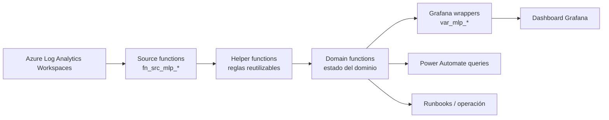

# Plataforma Monitoreo AMG — Documentación definitiva del modelo de monitoreo

**Versión:** 1.0  
**Fecha:** Mayo 2026  
**Audiencia:** Soporte Data & Analítica Avanzada, líderes técnicos, equipos de producto, arquitectura y operación.  
**Propósito:** Definir la documentación técnica oficial del modelo de funciones KQL para monitoreo de productos en Azure Log Analytics y Grafana.

---

## 1. Resumen ejecutivo

La **Plataforma Monitoreo AMG** es un modelo de observabilidad operativa diseñado para estandarizar cómo el equipo de soporte monitorea productos digitales basados en logs, pipelines, jobs, fuentes de datos y dashboards.

El modelo busca resolver un problema recurrente: lógica de monitoreo distribuida en consultas extensas, variables de Grafana difíciles de mantener, reglas duplicadas y baja trazabilidad entre una alerta visual y la causa técnica que la genera.

La solución propuesta organiza el monitoreo por capas:

```text
Source -> Helper -> Domain -> Wrapper Grafana -> Dashboard / Automatización
```

Esta arquitectura permite que la lógica crítica viva en funciones KQL versionadas, reutilizables y auditables. Grafana y Power Automate quedan como consumidores de resultados, no como el lugar principal donde se codifica la regla de negocio.

---

## 2. Objetivos del modelo

El modelo tiene los siguientes objetivos:

| Objetivo | Descripción |
|---|---|
| Estandarizar monitoreo | Usar una estructura común para productos, dominios, jobs, fuentes, wrappers y dashboards. |
| Mejorar trazabilidad | Permitir recorrer desde un panel en alerta hasta la fuente exacta de datos que generó la condición. |
| Reducir duplicación | Evitar que la misma regla KQL viva en múltiples variables o paneles. |
| Mejorar mantenibilidad | Separar acceso a fuentes, reglas intermedias, estado final y presentación visual. |
| Facilitar soporte | Entregar una guía clara para diagnosticar, adaptar e implementar monitoreo sin depender de conocimiento tribal. |
| Preparar escalabilidad | Permitir que el patrón se replique en nuevos productos sin rehacer la arquitectura. |

---

## 3. Alcance funcional actual

El modelo documentado cubre principalmente productos de MLP y sus dominios operativos.

| Producto / paquete | Alcance observado | Uso esperado |
|---|---|---|
| **ADA** | Dispatch, Drillit, Blockgrade, PI, Plans, Meteodata, KPI, Alarmas, Front, Optimizador Mezcla, Settings y estado global. | Producto base para entender y reutilizar el patrón completo. |
| **ADA AMG** | Variante paralela de dominios similares a ADA. | Debe normalizarse antes de considerarse referencia productiva. |
| **NOTPII** | Autoloader DEV/UAT, ingesta PI y estado global. | Referencia para monitoreo por ambiente y jobs Databricks. |
| **SIROSAG** | Resumen basado en ejecución, desfase y desactualización. | Referencia para consolidar múltiples señales en dimensiones operativas. |
| **Dashboard Grafana** | Dashboard exportado con resumen ejecutivo y detalle de productos. | Capa visual que debe consumir wrappers livianos. |
| **Power Automate queries** | Consultas auxiliares para alertas o resúmenes externos. | Integración opcional para notificaciones o flujos operativos. |

---

## 4. Fuera de alcance o pendiente de confirmar

Los documentos base no confirman formalmente lo siguiente:

| Elemento | Estado |
|---|---|
| Reglas nativas de alerta en Grafana o Azure Monitor | No identificadas como parte cerrada del repositorio. |
| Pipeline CI/CD para despliegue automático | No identificado. |
| Infraestructura como código para LAW, Grafana o permisos | No identificada. |
| Procedimiento oficial automatizado de creación/actualización de funciones LAW | Parcial; existen recomendaciones y ejemplos manuales. |
| Matriz oficial de RBAC y permisos mínimos | Pendiente de formalizar. |
| Matriz oficial de severidades y escalamiento | Pendiente de validar con la operación. |

---

## 5. Arquitectura lógica



### 5.1 Principio central

Cada capa debe tener una única responsabilidad. Si una función o panel empieza a mezclar responsabilidades, el modelo pierde mantenibilidad.

| Capa | Responsabilidad | Qué no debe hacer |
|---|---|---|
| **Source** | Acceder a workspaces/tablas y filtrar por tiempo. | No debe decidir si existe alerta funcional. |
| **Helper** | Calcular señales reutilizables: lag, expected-vs-real, desfase, parsing, fallas. | No debe depender de un panel específico. |
| **Domain** | Consolidar señales y emitir estado operativo de un dominio. | No debe contener HTML ni lógica visual. |
| **Wrapper Grafana** | Adaptar la salida del domain a una variable o panel. | No debe duplicar lógica pesada. |
| **Dashboard** | Mostrar estado, color, detalle y evidencia. | No debe ser el lugar principal de la regla KQL. |
| **Power Automate** | Ejecutar consultas de estado y notificar. | No debe redefinir la lógica de alerta. |

---

## 6. Estructura recomendada del repositorio

```text
.
├── README.md
├── Plataforma_Monitoreo_AMG.json
├── docs/
│   └── modelo-monitoreo/
│       └── README.md
├── refactor_ada_optimized/
│   ├── README.md
│   ├── INVENTORY.md
│   ├── law_functions/prd/mlp/
│   │   ├── sources/
│   │   ├── cross_product/helpers/
│   │   ├── ada/
│   │   │   ├── domains/
│   │   │   └── helpers/
│   │   ├── ada_amg/
│   │   │   └── domains/              # recomendado; normalizar si existe como domain/
│   │   ├── notpii/
│   │   │   ├── domains/
│   │   │   └── helpers/
│   │   └── sirosag/
│   │       ├── domains/
│   │       └── helpers/
│   ├── grafana_wrappers/prd/mlp/
│   │   ├── ada/
│   │   ├── ada_amg/
│   │   ├── notpii/
│   │   └── sirosag/
│   ├── power_automate_queries/prd/mlp/
│   │   ├── ada/
│   │   ├── notpii/
│   │   └── sirosag/
│   ├── docs/
│   ├── validate_kql_references.py
│   ├── check_conflict_markers.py
│   └── analyze_source_catalog.py
└── docs generados de traspaso
```

### 6.1 Consideración sobre `law_functions_body_only`

Algunos documentos mencionan una carpeta `law_functions_body_only`, usada para pegar funciones directamente en la UI de Log Analytics. Sin embargo, también existe evidencia documental de que esa carpeta puede estar ausente o desalineada con el validador.

Por lo tanto, este documento define la regla así:

| Situación | Criterio oficial |
|---|---|
| Existe `law_functions_body_only` y está sincronizada | Puede usarse para despliegue manual por UI. |
| No existe o está incompleta | No se debe declarar como fuente confiable; debe restaurarse o eliminarse del validador. |
| Se usa despliegue por CLI/IaC | Preferir `law_functions` con declaración completa o un mecanismo controlado de generación de body-only. |

---

## 7. Convenciones de nombres

| Elemento | Patrón | Ejemplo |
|---|---|---|
| Source por workspace | `fn_src_mlp_ws_<workspace_logico>` | `fn_src_mlp_ws_ada` |
| Source agregador | `fn_src_mlp_<dominio>_all` | `fn_src_mlp_systemlogs_all` |
| Helper cross-product | `fn_mon_<regla>` | `fn_mon_status_to_color` |
| Helper de producto | `fn_prd_mlp_<producto>_<regla>` | `fn_prd_mlp_ada_lag_helpers` |
| Domain | `fn_prd_mlp_<producto>_dom_<dominio>_status` | `fn_prd_mlp_ada_dom_dispatch_status` |
| Domain global | `fn_prd_mlp_<producto>_dom_global_status` | `fn_prd_mlp_notpii_dom_global_status` |
| Wrapper Grafana | `var_mlp_<producto>_<dominio>.kql` | `var_mlp_ada_dispatch.kql` |
| Query Power Automate | Nombre funcional y explícito | `resumen_estado.kql` |

Regla recomendada: cada archivo `.kql` debe tener el mismo nombre que la función principal que contiene.

---

## 8. Contratos técnicos por capa

### 8.1 Contrato de un Source

Un source representa el contrato de acceso a datos.

| Campo | Recomendación |
|---|---|
| Nombre | `fn_src_mlp_ws_*` o `fn_src_mlp_*_all`. |
| Entradas | `startTime:datetime`, `endTime:datetime` y opcionalmente `sourceType:string`, `tableName:string` o `env:string`. |
| Salida | Tabla con columnas necesarias para helpers/domains. |
| Responsabilidad | Acceder a workspace/tabla, filtrar por tiempo y estandarizar columnas si corresponde. |
| Prohibición | No incluir reglas de alerta funcional. |

Template conceptual:

```kusto
let fn_src_mlp_ws_producto = (sourceType:string, startTime:datetime, endTime:datetime) {
    union isfuzzy=true
        (
            workspace("<WORKSPACE_RESOURCE_ID>").table("<TABLE_NAME>")
            | where TimeGenerated between (startTime .. endTime)
            | where sourceType == "<TABLE_NAME>"
            | extend source_table = "<TABLE_NAME>"
        )
};
```

### 8.2 Contrato de un Helper

Un helper contiene lógica reutilizable.

| Campo | Recomendación |
|---|---|
| Nombre | `fn_prd_mlp_<producto>_<regla>` |
| Entrada | Parámetros específicos de la regla; normalmente tiempo, job, tablas, umbral o ambiente. |
| Salida | `OK/ALERT`, `OK/NOOK`, `Alertar/No Alertar` o tabla diagnóstica. |
| Responsabilidad | Calcular señales, no decidir presentación visual. |
| Uso | Puede ser llamado por uno o varios domains. |

### 8.3 Contrato de un Domain

Para nuevas implementaciones, el contrato recomendado de salida es:

| Campo | Tipo recomendado | Descripción |
|---|---|---|
| `domain` | `string` | Nombre funcional del dominio. |
| `status` | `string` | `OK`, `ALERT` o `WARN`. |
| `color` | `string` | Color HEX estándar para Grafana. |
| `reason` | `string` | Motivo resumido del estado. |
| `startTime` | `datetime` | Inicio de la evaluación. |
| `endTime` | `datetime` | Fin de la evaluación. |
| `evidence` | `dynamic` o `string` | Evidencia técnica: job, tabla, conteo, último timestamp, error. |
| `severity` | `string` | `info`, `warning`, `critical`. |

Template recomendado:

```kusto
let fn_prd_mlp_producto_dom_dominio_status = (startTime:datetime, endTime:datetime) {
    let has_alert = toscalar(
        fn_prd_mlp_producto_helper_regla(startTime, endTime)
        | summarize countif(isAlert == true)
    ) > 0;

    print
        domain = "Dominio",
        status = iff(has_alert, "ALERT", "OK"),
        color = iff(has_alert, "#E53935", "#EAF4EA"),
        reason = iff(has_alert, "Se detectó condición de alerta", "Sin alerta detectada"),
        startTime = startTime,
        endTime = endTime,
        evidence = dynamic({"has_alert": has_alert}),
        severity = iff(has_alert, "critical", "info")
};
```

### 8.4 Contrato de un Wrapper Grafana

| Campo | Recomendación |
|---|---|
| Nombre | `var_mlp_<producto>_<dominio>.kql`. |
| Entrada temporal | `bin($__timeFrom, 1m)` y `bin($__timeTo, 1m)`. |
| Lógica | Debe llamar una función principal. |
| Salida | Una columna que el panel espera: `color`, `status` o tabla. |
| Prohibición | No copiar lógica completa del domain. |

Ejemplo:

```kusto
fn_prd_mlp_ada_dom_dispatch_status(bin($__timeFrom, 1m), bin($__timeTo, 1m))
| project color
| take 1
```

---

## 9. Productos y dominios documentados

### 9.1 ADA

| Dominio | Función domain | Regla de alto nivel |
|---|---|---|
| Global | `fn_prd_mlp_ada_dom_global_status` | Consolida dominios ADA. |
| Dispatch | `fn_prd_mlp_ada_dom_dispatch_status` | Lag clásico, lag NRT y fallas consecutivas job17. |
| Drillit | `fn_prd_mlp_ada_dom_drillit_status` | Estado de pipelines y lag asociado. |
| Blockgrade | `fn_prd_mlp_ada_dom_blockgrade_status` | Estado de pipeline y lag `blockgrade`. |
| PI | `fn_prd_mlp_ada_dom_pi_status` | Expected-vs-real y frescura de datos PI. |
| Plans | `fn_prd_mlp_ada_dom_plans_status` | Expected-vs-real y lag de tablas de planes. |
| Meteodata | `fn_prd_mlp_ada_dom_meteodata_status` | Ejecuciones esperadas y datos meteo. |
| KPI | `fn_prd_mlp_ada_dom_kpi_status` | Errores KPI con exclusiones y ventanas. |
| Alarmas | `fn_prd_mlp_ada_dom_alarm_status` | Incidentes, alarmas o errores persistentes. |
| Front | `fn_prd_mlp_ada_dom_front_status` | Errores de aplicación/token. |
| Optimizador | `fn_prd_mlp_ada_dom_optimizador_status` | Ejecución y estado de optimizador/genshare. |
| Settings | `fn_prd_mlp_ada_dom_settings_status` | Expected-vs-real de jobs PRFCI. |

### 9.2 NOTPII

| Dominio | Función domain | Regla de alto nivel |
|---|---|---|
| Autoloader DEV | `fn_prd_mlp_notpii_dom_autoloader_dev_status` | SLA jobs Databricks DEV. |
| Autoloader UAT | `fn_prd_mlp_notpii_dom_autoloader_uat_status` | SLA jobs Databricks UAT. |
| Ingesta | `fn_prd_mlp_notpii_dom_ingesta_status` | Estado job04 PI / warnings / errores. |
| Global | `fn_prd_mlp_notpii_dom_global_status` | Consolida autoloader e ingesta. |

### 9.3 SIROSAG

| Dominio | Función domain | Regla de alto nivel |
|---|---|---|
| Resumen | `fn_prd_mlp_ssag_dom_resumen_status` | Consolida ejecución, desfase y desactualización de jobs SIROSAG. |

### 9.4 ADA AMG

ADA AMG aparece como variante paralela del patrón ADA. Antes de usarla como base productiva, se recomienda normalizar:

| Brecha | Recomendación |
|---|---|
| Carpeta `domain` singular | Usar `domains` plural para mantener estándar. |
| Archivo sin extensión `.kql` reportado en documentos base | Corregir nombre/extensión. |
| Validador no contempla completamente ADA AMG | Ajustar validador o dejar ADA AMG fuera del alcance formal hasta normalizar. |

---

## 10. Fuentes de datos y workspaces lógicos

El modelo consume principalmente tablas de Azure Log Analytics.

| Tipo de fuente | Tablas frecuentes | Uso |
|---|---|---|
| Logs de sistema Container Apps | `ContainerAppSystemLogs_CL` | Estado de ejecución de jobs, fallas, warnings, eventos. |
| Logs de consola Container Apps | `ContainerAppConsoleLogs_CL` | Mensajes de jobs, timestamps de tablas, errores funcionales. |
| Diagnóstico Azure | `AzureDiagnostics` | Pipelines, ADF u otros servicios con diagnóstico habilitado. |
| App Service logs | `AppServiceConsoleLogs` | Front-end o servicios web. |
| Databricks jobs | `DatabricksJobs` | Autoloaders y jobs Databricks. |
| Logs propios de producto | Ejemplo: `Logs_MLP_ADA_CL` | Condiciones operacionales o catálogos específicos. |

Regla importante: los ejemplos de despliegue y documentación deben usar placeholders para resource IDs, subscription IDs, nombres de grupos y recursos cuando no sea necesario exponerlos.

---

## 11. Estados y colores estándar

| Estado | Significado | Color recomendado | Uso |
|---|---|---|---|
| `OK` | Operación saludable. | `#EAF4EA` | Estado normal. |
| `ALERT` | Condición que requiere revisión. | `#E53935` | Alerta operacional. |
| `WARN` / `WARNING` | Riesgo o condición preventiva. | `#FFF4CC` | Advertencia. |
| `NOOK` | No OK interno. | Convertir a `ALERT` o `WARN`. | Helpers SIROSAG u otros. |
| `Alertar` | Alerta activa. | Convertir a `ALERT` o rojo en wrapper. | Dominios existentes. |
| `No Alertar` | Sin alerta. | Convertir a `OK` o verde. | Dominios existentes. |

Para nuevas implementaciones, se recomienda normalizar siempre a `OK`, `WARN` y `ALERT` en la salida final del domain.

---

## 12. Patrones de monitoreo

### 12.1 Lag de datos

Detecta si una tabla o fuente dejó de actualizarse dentro del umbral permitido.

**Señales típicas:** último timestamp, diferencia en minutos, umbral por tabla, default threshold.

### 12.2 Expected-vs-real

Compara ejecuciones esperadas contra ejecuciones reales en una ventana.

**Señales típicas:** ejecuciones esperadas, ejecuciones exitosas, porcentaje mínimo aceptado, ventana de evaluación.

### 12.3 Fallas consecutivas

Detecta si un job falló varias veces seguidas, condición más crítica que fallas aisladas.

### 12.4 Desfase

Evalúa si un proceso demora más que lo esperado respecto de su frecuencia o ventana operacional.

### 12.5 Desactualización

Evalúa si los datos procesados o publicados están obsoletos.

### 12.6 Errores funcionales

Busca patrones de error en logs de aplicación, token, storage, conexión, incidentes o negocio.

---

## 13. Modelo de trazabilidad para soporte

Todo panel o alerta debe poder explicarse con la siguiente cadena:

```text
Panel / Variable Grafana
  -> Wrapper var_mlp_*
    -> Domain fn_prd_mlp_*_dom_*
      -> Helper fn_prd_mlp_*
        -> Source fn_src_mlp_*
          -> Workspace / Tabla
```

Plantilla mínima:

| Campo | Ejemplo |
|---|---|
| Producto | ADA |
| Dominio | Dispatch |
| Variable Grafana | `var_mlp_ada_dispatch` |
| Wrapper | `grafana_wrappers/prd/mlp/ada/var_mlp_ada_dispatch.kql` |
| Domain | `fn_prd_mlp_ada_dom_dispatch_status` |
| Helpers | `fn_prd_mlp_ada_lag_helpers`, `fn_prd_mlp_ada_alert_from_dispatch_nrt_logs` |
| Source | `fn_src_mlp_ws_ada` |
| Workspace/Tabla | `mlp-prd-law-ada / ContainerAppSystemLogs_CL` |
| Regla | Lag, NRT o fallas consecutivas. |
| Acción soporte | Revisar job, fuente, tabla y evidencia del helper. |

---

## 14. Madurez y brechas actuales

| Área | Madurez | Riesgo | Acción recomendada |
|---|---|---|---|
| Arquitectura por capas | Alta | Bajo si se respeta el patrón. | Usarla como estándar para nuevos productos. |
| ADA | Media/alta | Posible desalineación `status/color`. | Validar contratos antes de producción formal. |
| NOTPII | Media | Requiere validar reglas por ambiente. | Documentar job IDs, SLA y responsables. |
| SIROSAG | Media | Diferencias de estados (`NOOK`, `Alertar`). | Normalizar salida en wrapper o domain. |
| ADA AMG | Baja/media | Inconsistencias de carpeta, extensión y validador. | Normalizar antes de entregar a soporte. |
| Dashboard Grafana | Media | JSON conserva lógica legacy. | Migrar gradualmente a wrappers. |
| Validación KQL | Media/baja | Validador puede fallar por brechas conocidas. | Corregir o ajustar alcance del validador. |
| Despliegue | Baja | Manualidad e inconsistencias entre repo y LAW. | Crear checklist/pipeline de despliegue. |
| RBAC/permisos | Pendiente | Soporte podría no poder consultar o desplegar. | Formalizar roles mínimos. |

---

## 15. Reglas de documentación oficial

Cada nuevo producto o dominio debe documentar:

| Elemento | Obligatorio |
|---|---|
| Nombre del producto | Sí |
| Dominio monitoreado | Sí |
| Pregunta operacional que responde | Sí |
| Source usado | Sí |
| Workspace lógico y tabla | Sí |
| Helper principal | Sí, si aplica |
| Domain | Sí |
| Wrapper | Sí, si consume Grafana |
| Estado/colores devueltos | Sí |
| Umbral o SLA | Sí |
| Acción de soporte ante alerta | Sí |
| Responsable técnico / equipo escalamiento | Por validar con organización |
| Evidencia o query de diagnóstico | Sí |

---

## 16. Reglas de cambio

Antes de modificar el modelo, aplicar estos criterios:

1. **No modificar sources sin evaluar impacto.** Un cambio de source puede afectar múltiples productos.
2. **No agregar lógica pesada al dashboard.** Si la regla es importante, debe ir en helper/domain.
3. **No romper contratos de salida.** Si un wrapper espera `color`, el domain debe devolver `color` o el wrapper debe transformar correctamente.
4. **No usar datos sensibles en documentación.** Usar placeholders.
5. **Actualizar inventario y documentación.** Cada nueva función debe quedar trazada.
6. **Ejecutar validaciones.** Revisar referencias KQL y conflictos antes de entregar.
7. **Validar con datos reales.** No basta con que la query compile.

---

## 17. Criterios de aceptación para declarar un producto “monitoreable”

| Criterio | Aceptación |
|---|---|
| Sources creados | Existen y devuelven datos o ausencia justificada. |
| Helpers validados | Entregan señales correctas para ventanas reales. |
| Domains validados | Devuelven estado interpretable y estable. |
| Wrappers creados | Funcionan con macros de Grafana. |
| Dashboard actualizado | Muestra global, dominios y detalle. |
| Trazabilidad documentada | Existe cadena panel -> workspace. |
| Brechas registradas | Todo pendiente queda explícito. |
| Soporte capacitado | Equipo puede interpretar estados y ejecutar diagnóstico básico. |
| Escalamiento definido | Existe responsable o ruta de derivación. |

---

## 18. Glosario

| Término | Definición |
|---|---|
| KQL | Kusto Query Language, lenguaje usado para consultar Azure Log Analytics. |
| LAW | Log Analytics Workspace. |
| Source | Función KQL que encapsula acceso a datos. |
| Helper | Función KQL que calcula una regla reutilizable. |
| Domain | Función KQL que emite estado final de un dominio. |
| Wrapper | Query liviana que adapta un domain para Grafana. |
| Dashboard | Vista visual del monitoreo. |
| Lag | Desfase entre dato esperado y último dato disponible. |
| Expected-vs-real | Patrón que compara ejecuciones esperadas contra reales. |
| NRT | Near Real Time. |
| SLA | Compromiso o umbral esperado de operación. |
| Estado global | Consolidación de varios dominios. |
| Runbook | Guía operativa para diagnóstico y acción. |

---

## 19. Conclusión

La Plataforma Monitoreo AMG debe mantenerse como un modelo de monitoreo por capas, donde la lógica de evaluación viva en funciones KQL y la visualización sea liviana, trazable y accionable.

El modelo está suficientemente avanzado para usarse como referencia, especialmente en ADA, NOTPII y SIROSAG. Sin embargo, antes de declararlo como estándar productivo formal, deben cerrarse brechas críticas: validación KQL, consistencia `status/color`, normalización de ADA AMG, estrategia de despliegue y matriz de permisos/escalamiento.
