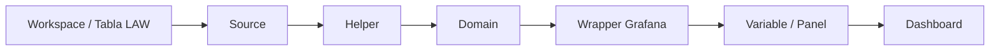

# Guía operativa de traspaso a soporte — Implementación del modelo de funciones KQL para monitoreo

**Versión:** 1.0  
**Fecha:** Mayo 2026  
**Audiencia:** Equipo de Soporte Data & Analítica Avanzada.  
**Propósito:** Entregar una guía práctica para que soporte pueda implementar, validar, desplegar, consumir y operar el modelo de funciones KQL en dashboards de monitoreo.

---

## 1. Objetivo de la guía

Esta guía explica cómo llevar el modelo desde el repositorio hasta la operación diaria:

```text
1. Levantar fuentes
2. Crear sources
3. Crear helpers
4. Crear domains
5. Crear wrappers
6. Desplegar funciones en LAW
7. Configurar Grafana
8. Validar resultados
9. Operar y diagnosticar alertas
```

El objetivo no es que soporte modifique la lógica de negocio sin control, sino que pueda entender, implementar, validar y mantener el patrón de monitoreo con trazabilidad.

---

## 2. Qué debe dominar soporte

| Competencia | Qué debe saber hacer | Resultado esperado |
|---|---|---|
| Leer la estructura del repositorio | Ubicar `law_functions`, `grafana_wrappers` y `power_automate_queries`. | Puede encontrar dónde vive cada función. |
| Entender sources | Saber qué workspace/tabla consume cada función. | Puede validar si hay datos o problemas de permisos. |
| Entender helpers | Leer reglas de lag, ejecución, desfase o errores. | Puede explicar por qué una señal está en alerta. |
| Entender domains | Interpretar estado final de un dominio. | Puede relacionar una alerta visual con una causa probable. |
| Crear wrappers | Adaptar domains a variables/paneles Grafana. | Puede construir dashboards livianos. |
| Validar por capas | Probar source -> helper -> domain -> wrapper. | Puede aislar rápidamente dónde falla. |
| Documentar trazabilidad | Completar matriz panel -> workspace. | Puede mantener el monitoreo en el tiempo. |

---

## 3. Modelo mental básico

El modelo se entiende de abajo hacia arriba:



| Nivel | Pregunta que responde |
|---|---|
| Source | ¿Dónde están los datos? |
| Helper | ¿Qué señal técnica indica problema? |
| Domain | ¿El dominio está OK o en ALERT? |
| Wrapper | ¿Cómo lo consume Grafana? |
| Dashboard | ¿Qué debe ver y hacer soporte? |

---

## 4. Estructura de carpetas que debe usar soporte

```text
refactor_ada_optimized/
├── law_functions/prd/mlp/
│   ├── sources/
│   ├── cross_product/helpers/
│   ├── <producto>/
│   │   ├── domains/
│   │   └── helpers/
├── grafana_wrappers/prd/mlp/<producto>/
└── power_automate_queries/prd/mlp/<producto>/
```

| Carpeta | Uso operativo |
|---|---|
| `law_functions/prd/mlp/sources` | Crear funciones de acceso a workspaces/tablas. |
| `law_functions/prd/mlp/<producto>/helpers` | Crear reglas reutilizables de evaluación. |
| `law_functions/prd/mlp/<producto>/domains` | Crear estados finales de dominios. |
| `law_functions/prd/mlp/cross_product/helpers` | Crear helpers comunes a varios productos. |
| `grafana_wrappers/prd/mlp/<producto>` | Crear queries livianas para Grafana. |
| `power_automate_queries/prd/mlp/<producto>` | Crear consultas para alertas externas o resúmenes. |

---

## 5. Checklist previo antes de implementar un nuevo producto

Antes de escribir KQL, completar este levantamiento:

| Pregunta | Respuesta esperada |
|---|---|
| ¿Qué producto se monitoreará? | Nombre corto y nombre funcional. |
| ¿Qué dominios/componentes son críticos? | Ejemplo: ingesta, procesamiento, front, KPI, alarmas. |
| ¿Qué jobs existen? | Nombres exactos en logs. |
| ¿Dónde viven los logs? | Workspace, tabla, columnas clave. |
| ¿Cuál es la frecuencia esperada? | Cada 5 min, 10 min, horario fijo, batch diario, continuo, etc. |
| ¿Qué significa alerta? | Falla, ausencia, lag, warning, error, desfase, dato obsoleto. |
| ¿Existen mantenimientos o ventanas de exclusión? | Horarios, días, reglas especiales. |
| ¿Quién recibe escalamiento? | Equipo, responsable, canal o cola. |
| ¿Habrá dashboard, Power Automate o ambos? | Definir consumidores. |

---

## 6. Paso 1 — Crear o validar Sources

### 6.1 Objetivo

Un source permite que todo el modelo acceda a datos de forma controlada. Soporte debe evitar que helpers o domains consulten directamente `workspace()` si puede centralizarse en un source.

### 6.2 Archivo recomendado

```text
refactor_ada_optimized/law_functions/prd/mlp/sources/fn_src_mlp_ws_<producto>.kql
```

### 6.3 Template base

```kusto
let fn_src_mlp_ws_<producto> = (sourceType:string, startTime:datetime, endTime:datetime) {
    union isfuzzy=true
        (
            workspace("<WORKSPACE_RESOURCE_ID>").table("ContainerAppSystemLogs_CL")
            | where TimeGenerated between (startTime .. endTime)
            | where sourceType == "ContainerAppSystemLogs_CL"
            | extend source_table = "ContainerAppSystemLogs_CL"
        ),
        (
            workspace("<WORKSPACE_RESOURCE_ID>").table("ContainerAppConsoleLogs_CL")
            | where TimeGenerated between (startTime .. endTime)
            | where sourceType == "ContainerAppConsoleLogs_CL"
            | extend source_table = "ContainerAppConsoleLogs_CL"
        )
};
```

### 6.4 Validación del source

Ejecutar en Log Analytics:

```kusto
fn_src_mlp_ws_<producto>("ContainerAppSystemLogs_CL", ago(1h), now())
| summarize rows=count(), last=max(TimeGenerated)
```

Criterios de aceptación:

| Validación | Resultado esperado |
|---|---|
| Función existe | No aparece error de función inexistente. |
| Tabla existe | No aparece error de tabla inexistente. |
| Usuario tiene permisos | No aparece error de autorización. |
| Hay datos o ausencia justificada | `rows > 0` o se documenta que no hubo eventos en la ventana. |
| Tiempo correcto | `last` está dentro de una ventana razonable. |

---

## 7. Paso 2 — Crear Helpers

### 7.1 Objetivo

Los helpers calculan señales técnicas reutilizables. Ejemplos: lag de tablas, expected-vs-real, fallas consecutivas, desfase o errores en logs.

### 7.2 Archivo recomendado

```text
refactor_ada_optimized/law_functions/prd/mlp/<producto>/helpers/fn_prd_mlp_<producto>_<regla>.kql
```

### 7.3 Cuándo crear un helper

Crear un helper cuando:

- La regla se usará en más de un domain.
- La regla tiene umbrales o excepciones.
- La query es larga y afectaría la legibilidad del domain.
- Se necesita tabla diagnóstica.
- Se quiere separar cálculo técnico de estado final.

### 7.4 Template de helper de fallas

```kusto
let fn_prd_mlp_<producto>_eval_fallas = (job_name:string, endTime:datetime, ventana_min:int, max_fallas:int) {
    let startTime = endTime - totimespan(ventana_min * 60s);
    let fallas = toscalar(
        fn_src_mlp_ws_<producto>("ContainerAppSystemLogs_CL", startTime, endTime)
        | where JobName_s == job_name
        | where Type_s == "Warning" or Reason_s in ("FailedCreate", "DeadlineExceeded", "BackoffLimitExceeded")
        | summarize Fallas=count()
    );
    print Status = iff(fallas <= max_fallas, "OK", "NOOK"), Fallas=fallas
};
```

### 7.5 Validación del helper

```kusto
fn_prd_mlp_<producto>_eval_fallas("<JOB_NAME>", now(), 60, 2)
```

Validar:

| Pregunta | Resultado esperado |
|---|---|
| ¿Compila? | Sí. |
| ¿Devuelve columnas esperadas? | `Status`, `Fallas` u otras documentadas. |
| ¿La regla representa el negocio? | Umbral y ventana validados. |
| ¿Puede usarse para diagnóstico? | Entrega evidencia suficiente. |

---

## 8. Paso 3 — Crear Domains

### 8.1 Objetivo

Un domain convierte señales técnicas en estado operativo: `OK`, `WARN` o `ALERT`.

### 8.2 Archivo recomendado

```text
refactor_ada_optimized/law_functions/prd/mlp/<producto>/domains/fn_prd_mlp_<producto>_dom_<dominio>_status.kql
```

### 8.3 Template recomendado

```kusto
let fn_prd_mlp_<producto>_dom_<dominio>_status = (startTime:datetime, endTime:datetime) {
    let eval = fn_prd_mlp_<producto>_eval_fallas("<JOB_NAME>", endTime, 60, 2);
    let status = toscalar(eval | project Status);
    let final_status = iff(status == "NOOK", "ALERT", "OK");

    print
        domain = "<dominio>",
        status = final_status,
        color = case(final_status == "ALERT", "#E53935", final_status == "WARN", "#FFF4CC", "#EAF4EA"),
        reason = iff(final_status == "ALERT", "Se detectaron fallas sobre el umbral", "Sin alerta detectada"),
        startTime = startTime,
        endTime = endTime,
        severity = iff(final_status == "ALERT", "critical", "info")
};
```

### 8.4 Validación del domain

```kusto
fn_prd_mlp_<producto>_dom_<dominio>_status(ago(1h), now())
```

Validar:

| Validación | Resultado esperado |
|---|---|
| Compila | Sin referencias indefinidas. |
| Devuelve estado | `status` existe y es interpretable. |
| Devuelve color | `color` existe si Grafana lo usará. |
| Entrega motivo | `reason` o evidencia mínima. |
| Escalable | Permite bajar a helper/source. |

---

## 9. Paso 4 — Crear Wrappers Grafana

### 9.1 Objetivo

Un wrapper es la query que Grafana ejecuta. Debe ser liviana y estable.

### 9.2 Archivo recomendado

```text
refactor_ada_optimized/grafana_wrappers/prd/mlp/<producto>/var_mlp_<producto>_<dominio>.kql
```

### 9.3 Wrapper de color

```kusto
fn_prd_mlp_<producto>_dom_<dominio>_status(bin($__timeFrom, 1m), bin($__timeTo, 1m))
| project color
| take 1
```

### 9.4 Wrapper de status

```kusto
fn_prd_mlp_<producto>_dom_<dominio>_status(bin($__timeFrom, 1m), bin($__timeTo, 1m))
| project status
| take 1
```

### 9.5 Wrapper de detalle

```kusto
fn_prd_mlp_<producto>_detalle_jobs(bin($__timeFrom, 1m), bin($__timeTo, 1m))
```

### 9.6 Errores comunes

| Error | Causa probable | Corrección |
|---|---|---|
| `Failed to resolve scalar expression named 'color'` | El domain no devuelve `color`. | Ajustar wrapper o normalizar domain. |
| Función no encontrada | No está desplegada o nombre incorrecto. | Verificar deploy y nombre exacto. |
| Sin datos | Ventana corta, source sin datos o permisos. | Probar source con más ventana. |
| Múltiples filas en variable | Falta `take 1` o agregación. | Ajustar wrapper. |
| Query lenta | Lógica pesada en wrapper o rango amplio. | Mover lógica a domain/helper y acotar tiempo. |

---

## 10. Paso 5 — Desplegar funciones en Azure Log Analytics

### 10.1 Orden de despliegue

Desplegar siempre desde la base hacia arriba:

```text
1. Sources
2. Helpers cross-product
3. Helpers de producto
4. Domains
5. Wrappers / queries consumidoras
```

Si un domain se despliega antes que el helper que utiliza, puede compilar como archivo pero fallará al ejecutarse.

### 10.2 Despliegue manual por UI

1. Entrar al workspace de Log Analytics.
2. Ir a **Logs**.
3. Crear una función nueva.
4. Usar el nombre exacto de la función.
5. Definir parámetros según el archivo KQL.
6. Pegar el cuerpo de la función.
7. Guardar.
8. Ejecutar prueba básica.

> Si existe una carpeta `law_functions_body_only` sincronizada, puede usarse como fuente para pegar solo el cuerpo en la UI. Si no existe o no está sincronizada, usar el archivo completo como base y adaptar manualmente con cuidado.

### 10.3 Despliegue por CLI — plantilla conceptual

```bash
az monitor log-analytics workspace saved-search create \
  --resource-group "<RESOURCE_GROUP>" \
  --workspace-name "<WORKSPACE_NAME>" \
  --name "<FUNCTION_NAME>" \
  --display-name "<FUNCTION_NAME>" \
  --category "<CATEGORY>" \
  --saved-query "$(cat <PATH_TO_KQL_BODY>)"
```

No guardar subscription IDs, tokens ni credenciales en el repositorio ni en documentos de traspaso.

### 10.4 Validación post-despliegue

Ejecutar cada función crítica:

```kusto
fn_prd_mlp_<producto>_dom_<dominio>_status(ago(1h), now())
```

Resultado esperado:

| Validación | OK |
|---|---|
| La función existe | Sí |
| No hay referencias indefinidas | Sí |
| Devuelve una fila o tabla esperada | Sí |
| Estado interpretable | Sí |
| Tiempo de ejecución razonable | Sí |

---

## 11. Paso 6 — Configurar Grafana

### 11.1 Prerrequisitos

- Grafana con datasource Azure Monitor / Log Analytics configurado.
- Permisos de lectura al workspace donde se ejecutarán las funciones.
- Funciones LAW desplegadas y validadas.
- Definido el rango de tiempo del dashboard.

### 11.2 Crear variable

1. Abrir dashboard.
2. Ir a **Settings** -> **Variables**.
3. Crear variable tipo `Query`.
4. Nombre: `var_mlp_<producto>_<dominio>`.
5. Data source: Azure Log Analytics.
6. Query: contenido del wrapper.
7. Refresh: recomendado `On time range change` o según necesidad operacional.
8. Guardar y probar.

### 11.3 Uso visual recomendado

| Salida wrapper | Uso visual |
|---|---|
| `color` | Fondo/borde de tarjeta, chip o bloque HTML. |
| `status` | Texto visible `OK/ALERT/WARN`. |
| `reason` | Tooltip o descripción. |
| Tabla detalle | Panel tipo table para diagnóstico. |

### 11.4 Buenas prácticas de dashboard

- Arriba: estado global por producto.
- Debajo: dominios o componentes críticos.
- Más abajo: tabla de detalle por job/fuente.
- Evitar paneles que no generen acción.
- Mantener nombres de variables iguales a los wrappers.
- Evitar duplicar KQL extenso en variables.

---

## 12. Paso 7 — Integrar con Power Automate

Power Automate debe consumir el resultado de domains o queries auxiliares, no reconstruir la lógica de alerta.

### 12.1 Flujo recomendado

```text
Recurrence
  -> Run query and list results
    -> Condition: existe estado ALERT
      -> Enviar Teams / correo / ticket
```

### 12.2 Query conceptual

```kusto
let lookback = 3h;
fn_prd_mlp_<producto>_dom_global_status(ago(lookback), now())
| extend color = case(status == "ALERT", "#E53935", status == "WARN", "#FFF4CC", "#EAF4EA")
| project producto="<producto>", status, color, reason
```

### 12.3 Condición conceptual

```text
Si alguna fila contiene status = "ALERT", entonces notificar.
```

### 12.4 Consideraciones

| Tema | Recomendación |
|---|---|
| Frecuencia | No consultar más seguido que la frecuencia real del dato. |
| Time range | Alinear con lookback del domain. |
| Ruido | Evitar alertar por estados transitorios no accionables. |
| Evidencia | Incluir producto, dominio, estado, motivo, ventana y link al dashboard. |

---

## 13. Procedimiento completo para implementar un nuevo producto

### 13.1 Paso a paso resumido

| Paso | Acción | Entregable |
|---|---|---|
| 1 | Levantar fuentes y jobs | Matriz de fuentes. |
| 2 | Crear sources | `fn_src_mlp_ws_<producto>.kql`. |
| 3 | Validar sources | Query con conteo y último timestamp. |
| 4 | Crear helpers | Funciones de reglas técnicas. |
| 5 | Validar helpers | Salidas `OK/NOOK`, `OK/ALERT` o tabla. |
| 6 | Crear domains | Estado por dominio. |
| 7 | Crear domain global | Estado consolidado. |
| 8 | Crear wrappers | `var_mlp_<producto>_*`. |
| 9 | Configurar Grafana | Variables y paneles. |
| 10 | Crear queries Power Automate | Si aplica. |
| 11 | Documentar trazabilidad | Matriz panel -> workspace. |
| 12 | Ejecutar revisión | Checklist final. |

### 13.2 Matriz de levantamiento

| Dominio | Job/Pipeline | Workspace | Tabla | Frecuencia esperada | Regla de alerta | Responsable |
|---|---|---|---|---|---|---|
| Pendiente | Pendiente | Pendiente | Pendiente | Pendiente | Pendiente | Pendiente |

### 13.3 Matriz de trazabilidad

| Producto | Dominio | Variable Grafana | Wrapper | Domain | Helper | Source | Workspace/Tabla | Acción soporte |
|---|---|---|---|---|---|---|---|---|
| Pendiente | Pendiente | Pendiente | Pendiente | Pendiente | Pendiente | Pendiente | Pendiente | Pendiente |

---

## 14. Operación diaria de soporte

### 14.1 Revisión diaria recomendada

1. Revisar dashboard global.
2. Identificar productos o dominios en rojo/amarillo.
3. Abrir detalle del dominio.
4. Validar si la alerta es real o falso positivo.
5. Revisar helper/source asociado.
6. Registrar evidencia: hora, dominio, estado, job/tabla, último log.
7. Escalar según matriz definida.
8. Actualizar bitácora o ticket.

### 14.2 Flujo de diagnóstico ante alerta

```text
Alerta visual en Grafana
  -> Identificar variable/panel
  -> Abrir wrapper
  -> Ejecutar domain en LAW
  -> Ejecutar helper asociado
  -> Ejecutar source base
  -> Revisar job/pipeline/tabla
  -> Confirmar causa probable
  -> Escalar o cerrar como falso positivo documentado
```

### 14.3 Evidencia mínima para reportar una alerta

| Campo | Ejemplo |
|---|---|
| Fecha/hora | 2026-05-27 15:30 |
| Producto | ADA |
| Dominio | Dispatch |
| Estado | ALERT |
| Ventana evaluada | Última 1h / 3h / 6h |
| Función domain | `fn_prd_mlp_ada_dom_dispatch_status` |
| Helper o señal | Lag NRT / fallas job17 / lag tabla |
| Fuente | Workspace y tabla |
| Evidencia | Último timestamp, conteo, error o job fallido |
| Acción | Escalado / en revisión / falso positivo / resuelto |

---

## 15. Troubleshooting común

| Síntoma | Posible causa | Qué revisar |
|---|---|---|
| Grafana muestra vacío | Wrapper no retorna filas, datasource mal configurado o sin permisos. | Probar wrapper en Explore y luego domain en LAW. |
| Error de función no encontrada | Función no desplegada en el workspace correcto. | Verificar deploy y workspace de ejecución. |
| Error `color` inexistente | Domain devuelve solo `status`. | Ajustar wrapper o agregar `color` al domain. |
| Source sin datos | Ventana corta, tabla sin eventos o workspace incorrecto. | Aumentar ventana y validar tabla directa. |
| Query muy lenta | Lógica pesada en wrapper o union amplio. | Mover lógica a helper/domain y filtrar temprano. |
| Alerta permanente | Umbral mal definido, source obsoleto o job realmente fallando. | Validar regla contra negocio y últimos logs. |
| Falso positivo por horario | Faltan exclusiones de mantenimiento. | Agregar/validar calendario o ventana de exclusión. |
| Power Automate falla por esquema | Query devuelve columnas dinámicas o cambiantes. | Proyectar columnas fijas. |

---

## 16. Checklist de calidad antes de entregar a soporte

| Validación | Estado |
|---|---|
| Sources creados y probados | Pendiente / OK |
| Helpers creados y probados | Pendiente / OK |
| Domains creados y probados | Pendiente / OK |
| Wrappers creados y probados | Pendiente / OK |
| Dashboard actualizado | Pendiente / OK |
| Variables Grafana validadas | Pendiente / OK |
| Queries Power Automate validadas, si aplica | Pendiente / OK |
| Trazabilidad documentada | Pendiente / OK |
| Acciones de soporte definidas | Pendiente / OK |
| Responsables de escalamiento definidos | Pendiente / OK |
| Brechas registradas | Pendiente / OK |
| Evidencia de pruebas guardada | Pendiente / OK |

---

## 17. Checklist de despliegue controlado

### Antes del despliegue

- [ ] Confirmar alcance del cambio.
- [ ] Revisar impacto en sources compartidos.
- [ ] Validar KQL en ambiente de prueba o ventana acotada.
- [ ] Confirmar permisos.
- [ ] Respaldar versión anterior si se modifican funciones productivas.
- [ ] Avisar a soporte si el cambio puede alterar estados del dashboard.

### Durante el despliegue

- [ ] Desplegar en orden: sources -> helpers -> domains -> wrappers.
- [ ] Ejecutar prueba mínima por función.
- [ ] Validar variables Grafana.
- [ ] Validar dashboard con rango estándar.

### Después del despliegue

- [ ] Monitorear errores en dashboard.
- [ ] Revisar tiempos de query.
- [ ] Confirmar que no aumentó ruido de alertas.
- [ ] Documentar cambios.
- [ ] Actualizar inventario.

---

## 18. Plan de traspaso recomendado al equipo

### Sesión 1 — Modelo conceptual

| Tema | Resultado esperado |
|---|---|
| Por qué existe el modelo | Soporte entiende el problema que resuelve. |
| Capas source/helper/domain/wrapper | Soporte entiende responsabilidades. |
| Trazabilidad | Soporte sabe bajar desde Grafana a LAW. |

### Sesión 2 — Implementación técnica

| Tema | Resultado esperado |
|---|---|
| Crear source | Soporte puede conectar una fuente. |
| Crear helper/domain | Soporte entiende una regla y estado final. |
| Crear wrapper | Soporte puede llevarlo a Grafana. |
| Validación por capas | Soporte puede aislar fallas. |

### Sesión 3 — Operación diaria

| Tema | Resultado esperado |
|---|---|
| Revisión de dashboard | Soporte interpreta estados. |
| Diagnóstico de alerta | Soporte obtiene evidencia. |
| Escalamiento | Soporte sabe cuándo y a quién derivar. |
| Registro de evidencias | Soporte deja trazabilidad operativa. |

---

## 19. Reglas para nuevas implementaciones

1. Crear primero la matriz de fuentes y dominios.
2. No escribir KQL directamente en Grafana si debe ser reutilizable.
3. Usar nombres consistentes.
4. Mantener `domains` plural como estándar.
5. Estandarizar salida final con `status`, `color` y `reason`.
6. Documentar cada variable o panel nuevo.
7. No incluir secretos ni IDs sensibles en ejemplos.
8. Validar con datos reales.
9. Registrar brechas y supuestos.
10. Capacitar a soporte antes de declarar operativo.

---

## 20. Definición de terminado para traspaso operativo

Un modelo queda traspasado a soporte cuando se cumple todo lo siguiente:

| Criterio | Cumplido |
|---|---|
| Soporte sabe qué monitorea cada dominio. | Sí / No |
| Soporte puede ejecutar el domain en LAW. | Sí / No |
| Soporte puede identificar helper/source asociado. | Sí / No |
| Soporte conoce acción ante alerta. | Sí / No |
| Dashboard refleja estados esperados. | Sí / No |
| Existe matriz de trazabilidad. | Sí / No |
| Existe matriz de escalamiento. | Sí / No |
| Quedan brechas documentadas. | Sí / No |
| Existe evidencia de validación. | Sí / No |

---

## 21. Anexos

### 21.1 Plantilla de ficha por dominio

```markdown
## Dominio: <nombre>

| Campo | Detalle |
|---|---|
| Producto | <producto> |
| Dominio | <dominio> |
| Pregunta operacional | ¿Qué valida? |
| Variable Grafana | `var_mlp_<producto>_<dominio>` |
| Wrapper | `<ruta>` |
| Domain | `<función>` |
| Helpers | `<funciones>` |
| Sources | `<funciones>` |
| Workspace/Tabla | `<workspace>/<tabla>` |
| Estado esperado | `OK/WARN/ALERT` |
| Umbral | `<umbral>` |
| Acción soporte | `<acción>` |
| Escalamiento | `<equipo/responsable>` |
| Evidencia esperada | `<logs, timestamp, conteos>` |
```

### 21.2 Plantilla de bitácora de alerta

```markdown
## Registro de alerta

- Fecha/hora:
- Producto:
- Dominio:
- Estado:
- Ventana evaluada:
- Dashboard/panel:
- Domain ejecutado:
- Helper/source revisado:
- Evidencia:
- Diagnóstico preliminar:
- Acción tomada:
- Escalamiento:
- Estado final:
```

---

## 22. Cierre

Esta guía debe usarse como runbook de implementación y traspaso. La documentación definitiva explica el modelo; esta guía indica cómo aplicarlo en la práctica.

El equipo de soporte no necesita memorizar todas las funciones, pero sí debe dominar la cadena de trazabilidad y la validación por capas. Ese es el punto clave para que el modelo sea mantenible, escalable y útil operacionalmente.
