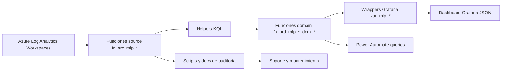

# Plataforma Monitoreo AMG — documentación técnica del repositorio

## 1. Título del proyecto

**Plataforma Monitoreo AMG** es un repositorio de artefactos de monitoreo para productos MLP, compuesto por un modelo JSON de Grafana, funciones y consultas KQL para Azure Log Analytics, wrappers para variables de Grafana, queries auxiliares para Power Automate, scripts de auditoría estática y documentación técnica de refactorización.

El foco observado del repositorio es monitorear estados operativos de productos y dominios asociados a **ADA**, **ADA AMG**, **NOTPII** y **SIROSAG**, principalmente sobre Log Analytics Workspaces de Azure y paneles de Grafana.

> **Criterio de esta documentación:** todo lo descrito proviene de archivos existentes en el repositorio. Cuando el repositorio no entrega evidencia suficiente, se marca como **Pendiente de confirmar** o **No identificado en el repositorio**.

## 2. Propósito del repositorio

Este repositorio existe para centralizar y versionar un modelo de monitoreo que permite:

- Consultar logs, ejecuciones de pipelines y eventos operativos desde Azure Log Analytics.
- Encapsular accesos a fuentes en funciones KQL de tipo `source`.
- Separar reglas de evaluación en funciones `helper` y funciones de dominio.
- Exponer resultados a Grafana mediante wrappers de variables.
- Soportar integraciones externas, especialmente queries listas para Power Automate.
- Mantener documentación de auditoría, equivalencia legacy, fuentes y dependencias.

El problema que resuelve es la dispersión de lógica pesada en variables y paneles. El repositorio propone una estructura más mantenible: **Grafana wrapper → Domain → Helper → Source → Workspace table**. Esto entrega al equipo de soporte un camino claro para entender por qué un producto está en estado normal o en alerta, y para replicar el patrón en otros productos.

## 3. Alcance funcional

### 3.1 Productos y dominios cubiertos

| Producto / paquete | Evidencia en repositorio | Alcance observado |
|---|---|---|
| ADA | `law_functions/prd/mlp/ada`, `grafana_wrappers/prd/mlp/ada`, queries Power Automate | Monitoreo de Dispatch, Drillit, Blockgrade, PI, Plans, Meteodata, Alarmas, Front, KPI, Optimizador Mezcla, Settings y estado global. |
| ADA AMG | `law_functions/prd/mlp/ada_amg`, `grafana_wrappers/prd/mlp/ada_amg` | Variante de funciones y wrappers para dominios similares a ADA. Presenta brechas de validación estática descritas más abajo. |
| NOTPII | `law_functions/prd/mlp/notpii`, `grafana_wrappers/prd/mlp/notpii`, queries Power Automate | Monitoreo de autoloader DEV/UAT, ingesta y estado global de difusión/NOTPII. |
| SIROSAG | `law_functions/prd/mlp/sirosag`, `grafana_wrappers/prd/mlp/sirosag`, queries Power Automate | Monitoreo resumido basado en ejecución, desfase y desactualización. |
| Dashboard Grafana | `Plataforma_Monitoreo_AMG.json` | Dashboard “Plataforma Monitoreo Prod” con secciones de resumen ejecutivo y detalle de productos MLP. |

### 3.2 Fuera de alcance o no identificado

- **Alert rules nativas de Grafana o Azure Monitor:** no identificadas en el repositorio.
- **Pipeline de CI/CD para despliegue automático:** no identificado en el repositorio.
- **Infraestructura como código para workspaces, dashboards o permisos:** no identificada en el repositorio.
- **Procedimiento formal de creación/alteración de funciones en LAW:** documentado parcialmente como recomendación, pero no automatizado.
- **Credenciales, service principals o RBAC:** no identificados en el repositorio.

## 4. Visión general de la arquitectura

El modelo está organizado por capas:

1. **Fuentes (`sources`)**: encapsulan workspaces y tablas de Log Analytics.
2. **Helpers**: calculan reglas reutilizables, como lag, ejecución esperada, desfase, alertas por logs o catálogos KPI.
3. **Domains**: consolidan una regla funcional por dominio de negocio/técnico y devuelven estado o color.
4. **Wrappers Grafana**: consultas pequeñas pensadas para variables/paneles, usando macros de tiempo de Grafana.
5. **Dashboard JSON**: modelo visual de Grafana que consume variables y renderiza resumen/detalle.
6. **Power Automate queries**: consultas listas para flujos externos o validaciones.
7. **Scripts de auditoría**: validan referencias KQL, marcadores de conflicto e inventarios.



### Relación entre componentes

- Los wrappers de Grafana no deberían contener lógica pesada; su rol es llamar una función de dominio y proyectar la salida que necesita el panel.
- Las funciones de dominio definen la semántica del estado operativo: `OK`, `ALERT`, `NOOK`, `Alertar`, color o columnas de detalle según producto.
- Los helpers concentran reglas repetibles y evitan duplicar lógica en múltiples dominios.
- Los sources concentran el acoplamiento con nombres de workspaces y tablas.
- El dashboard JSON representa la capa visual y conserva variables históricas embebidas; la carpeta `refactor_ada_optimized` contiene el modelo refactorizado que debería reemplazar gradualmente la lógica pesada.

## 5. Estructura del repositorio

```text
.
├── Plataforma_Monitoreo_AMG.json
├── docs/
│   └── analisis_ada_variables.md
├── refactor_ada_optimized/
│   ├── README.md
│   ├── INVENTORY.md
│   ├── KQL_SOURCES_TECH_AUDIT_2026-04-28.md
│   ├── analyze_source_catalog.py
│   ├── check_conflict_markers.py
│   ├── resolve_required_resources.py
│   ├── validate_kql_references.py
│   ├── docs/
│   ├── grafana_wrappers/prd/mlp/
│   │   ├── ada/
│   │   ├── ada_amg/
│   │   ├── notpii/
│   │   └── sirosag/
│   ├── law_functions/prd/mlp/
│   │   ├── ada/{domains,helpers}/
│   │   ├── ada_amg/domain/
│   │   ├── cross_product/helpers/
│   │   ├── notpii/{domains,helpers}/
│   │   ├── sirosag/{domains,helpers}/
│   │   └── sources/
│   └── power_automate_queries/prd/mlp/
│       ├── ada/
│       ├── notpii/
│       └── sirosag/
├── readme_codex.md
└── traspaso_codex.md
```

| Ruta | Propósito operativo | Consideraciones para soporte |
|---|---|---|
| `Plataforma_Monitoreo_AMG.json` | Modelo exportado de Grafana. Contiene el dashboard, variables, paneles HTML/text y metadatos. | Antes de importarlo, validar datasource, permisos y variables. El JSON contiene queries embebidas legacy además del refactor. |
| `docs/` | Documentación histórica o propuesta técnica. | Útil para entender decisiones de performance y centralización; no necesariamente representa el estado final desplegado. |
| `refactor_ada_optimized/law_functions/` | Funciones KQL organizadas por ambiente/faena/producto. | Es la capa principal del modelo reutilizable. Cambios aquí afectan wrappers y dashboards. |
| `refactor_ada_optimized/grafana_wrappers/` | Entrypoints livianos para Grafana. | Deben mantenerse alineados con variables del dashboard y salidas de funciones de dominio. |
| `refactor_ada_optimized/power_automate_queries/` | Queries listas para flujos, resumen de estado y validaciones legacy. | Útiles para automatizar notificaciones o comparar paridad. |
| `refactor_ada_optimized/docs/` | Catálogos, mapas de dependencia, validaciones y troubleshooting. | Deben actualizarse cuando cambien sources, domains o reglas. |
| Scripts Python | Auditoría estática, resolución de recursos requeridos y chequeo de conflictos. | Ejecutar antes de entregar cambios; actualmente `validate_kql_references.py` detecta brechas. |

## 6. Componentes principales

### 6.1 Dashboard Grafana

| Componente | Ubicación | Objetivo | Dependencias | Consideraciones |
|---|---|---|---|---|
| Dashboard `Plataforma Monitoreo Prod` | `Plataforma_Monitoreo_AMG.json` | Visualizar resumen y detalle de monitoreo de productos MLP. | Grafana, datasource Azure Monitor / Azure Log Analytics, variables `var_mlp_*`. | El JSON tiene 24 variables de tipo query y 4 paneles/filas principales. Pendiente confirmar datasource real y proceso de importación. |

### 6.2 Funciones KQL por producto

| Producto | Ubicación | Objetivo | Relación |
|---|---|---|---|
| ADA | `refactor_ada_optimized/law_functions/prd/mlp/ada` | Estados por dominio y helpers compartidos de ADA. | Consumido por wrappers `var_mlp_ada_*` y queries de Power Automate. |
| ADA AMG | `refactor_ada_optimized/law_functions/prd/mlp/ada_amg` | Variante de dominios ADA AMG. | Consumido por wrappers `var_mlp_ada_amg_*`; presenta brechas de naming/directorio frente al validador. |
| NOTPII | `refactor_ada_optimized/law_functions/prd/mlp/notpii` | Evaluar autoloader e ingesta. | Consumido por wrappers `var_mlp_notpii_*` y Power Automate. |
| SIROSAG | `refactor_ada_optimized/law_functions/prd/mlp/sirosag` | Evaluar resumen SIROSAG con helpers de ejecución, desfase y desactualización. | Consumido por wrapper `var_mlp_sirosag_resumen` y query de Power Automate. |
| Cross-product | `refactor_ada_optimized/law_functions/prd/mlp/cross_product/helpers` | Helpers transversales de color y estado global. | Potencialmente reutilizable en varios productos. |

### 6.3 Sources

Los sources son el contrato de acceso a datos. Encapsulan `workspace("...").table("...")`, filtros por `TimeGenerated`, `sourceType` y proyecciones comunes. El repositorio tiene sources workspace-genéricos y agregadores multi-workspace.

### 6.4 Wrappers Grafana

Los wrappers usan macros de Grafana: `bin($__timeFrom, 1m)` y `bin($__timeTo, 1m)`. Su objetivo es reducir lógica duplicada en variables/paneles, exponer color, estado o detalle tabular y conservar nombres esperados por el dashboard.

### 6.5 Scripts de validación

| Script | Objetivo | Uso operativo |
|---|---|---|
| `validate_kql_references.py` | Verifica wrappers requeridos, funciones requeridas, referencias indefinidas, duplicados, mirrors body-only y reglas de layout. | Ejecutar antes de entregar cambios KQL. Actualmente falla por brechas existentes. |
| `check_conflict_markers.py` | Busca marcadores de merge conflict en archivos de texto relevantes. | Ejecutar antes de PR o despliegue. |
| `analyze_source_catalog.py` | Analiza sources, consumidores y referencias de workspace. | Útil para impacto ante cambios de fuentes. |
| `resolve_required_resources.py` | Resuelve recursos requeridos. | Pendiente de confirmar flujo exacto de uso; revisar script antes de usarlo en despliegues. |

## 7. Dashboards y paneles

### 7.1 Dashboard identificado

| Dashboard | Archivo | Título interno | UID | Tags | Ventana default |
|---|---|---|---|---|---|
| Plataforma Monitoreo AMG | `Plataforma_Monitoreo_AMG.json` | `Plataforma Monitoreo Prod` | `df5way4eopgjkb` | `monitoring`, `cross`, `ingestas` | `now-6h` a `now` |

### 7.2 Paneles identificados

| ID | Tipo | Título | Objetivo operativo inferido desde el JSON |
|---:|---|---|---|
| 20 | `row` | `Resumen Ejecutivo` | Agrupar paneles ejecutivos. |
| 17 | `text` | `Resumen Productos MLP` | Mostrar resumen visual de productos MLP mediante HTML/text y variables. |
| 13 | `row` | `MONITOREO ANALITICA AVANZADA  Productos` | Agrupar detalle de productos. |
| 10 | `text` | `Detalle Productos MLP` | Mostrar detalle visual de productos/dominios mediante HTML/text y variables. |

### 7.3 Variables del dashboard

El JSON contiene variables embebidas para ADA, SIROSAG y NOTPII. Las variables del refactor tienen equivalentes en `grafana_wrappers/prd/mlp/*`, pero el JSON todavía conserva lógica KQL extensa en `templating.list` para varias variables.

| Grupo | Variables observadas | Uso esperado |
|---|---|---|
| ADA | `var_mlp_ada_global`, `var_mlp_ada_pi`, `var_mlp_ada_meteodata`, `var_mlp_ada_kpi`, `var_mlp_ada_alarm`, `var_mlp_ada_front`, `var_mlp_ada_dispatch`, `var_mlp_ada_drillit`, `var_mlp_ada_blockgrade`, `var_mlp_ada_plans`, `var_mlp_ada_ingestas_global` | Colores/estados para chips o bloques del dashboard. |
| SIROSAG | `var_mlp_sirosag_ing_pi`, `var_mlp_sirosag_ing_pdmsag`, `var_mlp_sirosag_ing_planes`, `var_mlp_sirosag_proc_pi`, `var_mlp_sirosag_salud_itot`, `var_mlp_sirosag_restricciones`, `var_mlp_sirosag_celdas`, `var_mlp_sirosag_solidos`, `var_mlp_sirosag_global` | Variables legacy granulares de SIROSAG en el JSON. El refactor expone un wrapper resumen `var_mlp_sirosag_resumen`. |
| NOTPII | `var_mlp_notpii_ingesta`, `var_mlp_notpii_autoloader_uat`, `var_mlp_notpii_autoloader_dev`, `var_mlp_notpii_difusion_global` | Estados/colores para ingesta, autoloader y global. |

### 7.4 Preguntas operativas que responde

- ¿Cuál es el estado general de los productos MLP monitoreados?
- ¿Qué dominio específico está en alerta: Dispatch, PI, Drillit, Blockgrade, Plans, Meteodata, KPI, Alarmas, Front, Optimizador o Settings?
- ¿Hay evidencia de fallas consecutivas, desactualización o desfase?
- ¿El problema viene de una fuente de datos, un job, una tabla con lag o una capa visual?
- ¿Las variables del dashboard están devolviendo color/estado esperado?

### 7.5 Consideraciones para adaptar a otros productos

- Duplicar primero el patrón de carpetas `prd/mlp/<producto>/{domains,helpers}` y `grafana_wrappers/prd/mlp/<producto>`.
- Crear sources explícitos para workspaces reales del nuevo producto.
- Mantener wrappers livianos y no reintroducir KQL pesado en el JSON.
- Confirmar que el dashboard consuma exactamente la columna proyectada por el wrapper (`color`, `status` o tabla de detalle).
- Documentar las variables nuevas y su relación con paneles.

## 8. Funciones, queries y lógica KQL

### 8.1 Organización lógica

| Capa | Patrón de nombre | Rol |
|---|---|---|
| Source | `fn_src_mlp_ws_*`, `fn_src_mlp_*_all` | Acceso a workspaces/tablas y agregación multi-workspace. |
| Domain | `fn_prd_mlp_<producto>_dom_<dominio>_status` | Estado final de un dominio. |
| Helper | `fn_prd_mlp_<producto>_*` | Reglas reutilizables de lag, expected-vs-real, alertas y catálogos. |
| Wrapper | `var_mlp_<producto>_<dominio>.kql` | Entrada para Grafana. |
| Power Automate | `resumen_estado.kql`, `legacy_*`, `dispatch_validacion.kql` | Resúmenes y validaciones para flujos o paridad. |

### 8.2 ADA

| Dominio | Función | Regla de alto nivel documentada/observada |
|---|---|---|
| Dispatch | `fn_prd_mlp_ada_dom_dispatch_status` | Alerta por lag clásico de tablas Dispatch, lag NRT o dos fallas consecutivas recientes de job17. |
| Drillit | `fn_prd_mlp_ada_dom_drillit_status` | Alerta si no hay pipeline OK o hay lag en tablas Drillit. |
| Blockgrade | `fn_prd_mlp_ada_dom_blockgrade_status` | Alerta si no hay ingesta ADF OK o hay lag `blockgrade_bybucket`; considera mantención. |
| PI | `fn_prd_mlp_ada_dom_pi_status` | Alerta por expected-vs-real de jobs PI o lag `pisystem_interpolated`. |
| Plans | `fn_prd_mlp_ada_dom_plans_status` | Alerta por expected-vs-real de job de planes o lag en tablas de planes. |
| Meteodata | `fn_prd_mlp_ada_dom_meteodata_status` | Alerta por faltas de jobs meteo o lag `meteodata`. |
| KPI | `fn_prd_mlp_ada_dom_kpi_status` | Alerta por jobs KPI o filas KPI no esperadas, con excepciones por horarios/mantención. |
| Alarmas | `fn_prd_mlp_ada_dom_alarm_status` | Alerta por jobs de alarmas, incidentes largos o error de storage. |
| Front | `fn_prd_mlp_ada_dom_front_status` | Alerta por errores de aplicación/token en AppServiceConsoleLogs. |
| Optimizador Mezcla | `fn_prd_mlp_ada_dom_optimizador_status` | Alerta por `runFailed`, falta de job01 genshare o lag optimizador. |
| Settings | `fn_prd_mlp_ada_dom_settings_status` | Alerta por expected-vs-real sobre jobs PRFCI. |
| Global | `fn_prd_mlp_ada_dom_global_status` | Consolida los dominios y marca global si cualquiera está en `ALERT`. |

Helpers ADA relevantes:

- `fn_prd_mlp_ada_lag_helpers`: evalúa lag por tabla con umbrales.
- `fn_prd_mlp_ada_alert_from_dispatch_nrt_logs`: evalúa desfase NRT de Dispatch.
- `fn_prd_mlp_ada_kpi_alert_rows`: detecta KPIs no esperados y aplica exclusiones/ventanas.
- `fn_prd_mlp_ada_jobs_status_detail`: entrega diagnóstico tabular de jobs.
- `fn_prd_mlp_ada_en_mantencion`: identifica mantención desde condición operacional en `Logs_MLP_ADA_CL`.
- `fn_prd_mlp_ada_kpi_catalogs` y `fn_prd_mlp_ada_lag_thresholds`: catálogos/umbrales usados por helpers.

### 8.3 ADA AMG

ADA AMG replica dominios equivalentes a ADA en `ada_amg/domain`, con wrappers `var_mlp_ada_amg_*`. Se detectan estas particularidades:

- La carpeta usa `domain` singular, mientras ADA usa `domains` plural.
- Existe un archivo sin extensión `.kql`: `fn_prd_mlp_ada_amg_jobs_status_detail`, por lo que el validador no lo reconoce como definición KQL.
- Los wrappers ADA AMG son marcados por el validador como apuntando a funciones no requeridas, porque `validate_kql_references.py` no contempla ADA AMG en su set requerido.
- Algunas funciones ADA AMG proyectan `status`; el global proyecta `color`.

**Pendiente de confirmar:** si ADA AMG está en producción, si debe incorporarse formalmente al validador y si la carpeta `domain` debe renombrarse a `domains`.

### 8.4 NOTPII

| Componente | Función | Objetivo |
|---|---|---|
| Autoloader DEV | `fn_prd_mlp_notpii_dom_autoloader_dev_status` | Evalúa jobs Databricks del autoloader DEV. |
| Autoloader UAT | `fn_prd_mlp_notpii_dom_autoloader_uat_status` | Evalúa jobs Databricks del autoloader UAT. |
| Ingesta | `fn_prd_mlp_notpii_dom_ingesta_status` | Evalúa job04 PI System por errores, warnings o ejecución. |
| Global | `fn_prd_mlp_notpii_dom_global_status` | Consolida autoloader DEV/UAT e ingesta. |

### 8.5 SIROSAG

| Componente | Función | Objetivo |
|---|---|---|
| Resumen | `fn_prd_mlp_ssag_dom_resumen_status` | Consolida reglas SIROSAG. |
| Ejecución | `fn_prd_mlp_ssag_eval_ejecucion` | Evalúa cumplimiento de ejecución de jobs. |
| Desfase | `fn_prd_mlp_ssag_eval_desfase` | Evalúa desfase temporal. |
| Desactualización | `fn_prd_mlp_ssag_eval_desactualizacion` | Evalúa frescura/desactualización de datos o logs. |

### 8.6 Consideraciones de performance KQL

- Filtrar por `TimeGenerated` dentro de sources reduce volumen temprano.
- Evitar repetir lógica pesada en variables de Grafana; preferir funciones LAW y wrappers livianos.
- Cuidar `union isfuzzy=true` en sources agregadores: facilita resiliencia ante esquemas, pero puede ocultar problemas de disponibilidad o cambios de tabla.
- Usar `bin($__timeFrom, 1m)` y `bin($__timeTo, 1m)` estabiliza rangos de consulta, pero soporte debe validar timezone y ventana.
- Los expected-vs-real con `range` y `mv-expand` pueden crecer si se amplía demasiado la ventana; validar costos antes de aumentar rangos.

## 9. Fuentes de datos

### 9.1 Workspaces y tablas observadas

| Source | Workspace lógico / real documentado | Tablas observadas |
|---|---|---|
| `fn_src_mlp_ws_ada` | `mlp-prd-law-ada` | `ContainerAppConsoleLogs_CL`, `ContainerAppSystemLogs_CL`, `AppServiceConsoleLogs` |
| `fn_src_mlp_ws_dataplatform` | `ams-dev-dataplatform-laws` | `Logs_MLP_ADA_CL` |
| `fn_src_mlp_ws_pisystem` | `mlp-prd-law-pisystem` | `ContainerAppSystemLogs_CL`, `ContainerAppConsoleLogs_CL` |
| `fn_src_mlp_ws_ssag` | `mlp-prd-law-ssag` | `ContainerAppConsoleLogs_CL`, `ContainerAppSystemLogs_CL` |
| `fn_src_mlp_ws_dispatch` | `mlp-prd-law-dispatch` | `AzureDiagnostics` |
| `fn_src_mlp_ws_drillit` | `mlp-prd-law-drillit` | `AzureDiagnostics` |
| `fn_src_mlp_ws_blkgrde` | `mlp-prd-law-blkgrde` | `AzureDiagnostics` |
| `fn_src_mlp_ws_meteo` | `mlp-prd-law-meteo` | `ContainerAppSystemLogs_CL` |
| `fn_src_mlp_ws_plans` | `mlp-prd-law-plans` | `ContainerAppSystemLogs_CL` |
| `fn_src_mlp_ws_pdmsagi` | `mlp-prd-law-pdmsagi` | `ContainerAppSystemLogs_CL` |
| `fn_src_mlp_ws_notpii_databricksjobs` | `ams-dev-dataplatform-laws`, `ams-uat-dataplatform-laws` | `DatabricksJobs` |
| `fn_src_mlp_ws_genshare` | `ams-prd-law-genshare` | `ContainerAppSystemLogs_CL` |
| `fn_src_mlp_ws_prfci` | `mlp-prd-law-prfci` | `ContainerAppSystemLogs_CL` |

### 9.2 Supuestos de adaptación

Para replicar el modelo en otro producto se debe cambiar, como mínimo:

- Subscription/resource group/workspace en funciones `fn_src_mlp_ws_*`.
- Nombres de tablas y columnas si difieren (`JobName_s`, `Log_s`, `TimeGenerated`, `OperationName`, `ResourceGroup`, etc.).
- Nombres de jobs (`mlp-prd-caj-*`) y cadencias esperadas.
- Umbrales de lag y expected-vs-real.
- Variables Grafana y referencias HTML si los nombres visuales cambian.

## 10. Convenciones y estándares

| Elemento | Convención observada | Recomendación |
|---|---|---|
| Ambiente/faena | `prd/mlp` | Mantener patrón `ambiente/faena/producto`. |
| Sources | `fn_src_mlp_ws_<workspace>` y agregadores `fn_src_mlp_*_all` | No mezclar lógica de dominio en sources. |
| Domains | `fn_prd_mlp_<producto>_dom_<dominio>_status` | Una función por estado funcional. |
| Helpers | `fn_prd_mlp_<producto>_<regla>` | Reutilizar antes de duplicar. |
| Wrappers | `var_mlp_<producto>_<dominio>.kql` | Deben llamar una sola función y proyectar salida esperada. |
| Estados | `OK`, `ALERT`; en algunos casos `NOOK`, `Alertar`, `Warning` | Normalizar estados para nuevos productos. |
| Colores | Rojo `#E53935`, verde `#EAF4EA`, amarillo `#FFF4CC` | Usar helper transversal para evitar divergencia. |
| Tiempo | `bin($__timeFrom, 1m)`, `bin($__timeTo, 1m)` | Validar zona horaria y refresh de Grafana. |

## 11. Flujo de implementación

1. **Revisión inicial:** identificar producto, dominios críticos, fuentes, jobs y tablas.
2. **Inventario de fuentes:** crear o adaptar `fn_src_mlp_ws_*` por workspace real.
3. **Definición de reglas:** acordar estados `OK/ALERT/WARN`, umbrales y ventanas.
4. **Implementar helpers:** centralizar reglas repetibles de lag, ejecución, desfase y errores.
5. **Implementar domains:** una función por dominio; el global debe depender solo de dominios.
6. **Crear wrappers:** consultas livianas que llamen domains con macros de tiempo de Grafana.
7. **Configurar dashboard:** variables, paneles resumen, paneles detalle y descripciones.
8. **Validar con datos reales:** comparar contra legacy si existe; revisar falsos positivos.
9. **Ejecutar auditorías:** `validate_kql_references.py` y `check_conflict_markers.py`.
10. **Paso a producción:** importar dashboard, desplegar funciones LAW y capacitar soporte.
11. **Post-producción:** monitorear latencia, costo, falsos positivos y brechas documentales.

## 12. Consideraciones operativas

- **Performance:** evitar queries duplicadas embebidas en JSON; mover lógica pesada a LAW.
- **Costos:** Log Analytics cobra por ingesta/consulta según configuración; ventanas amplias y unions multi-workspace pueden aumentar costo.
- **Mantenibilidad:** mantener sources como única capa que conoce workspaces.
- **Reutilización:** copiar el patrón por producto, no copiar consultas monolíticas.
- **Tiempo:** validar `now-6h`, refresh de variables y timezone de Chile usado por algunas reglas.
- **Ambientes:** el layout actual usa `prd/mlp`; NOTPII consulta DEV/UAT para Databricks. No hay carpetas DEV/UAT completas para todo el modelo.
- **Permisos:** se requieren permisos para consultar workspaces y crear/alterar funciones LAW. Detalle RBAC no identificado.
- **Azure/Grafana:** dependencias explícitas con Azure Log Analytics, AzureDiagnostics, Container Apps/App Service logs, DatabricksJobs y Grafana.

## 13. Buenas prácticas

- Mantener separación estricta entre source, helper, domain y wrapper.
- No poner lógica de negocio en el dashboard si puede estar en una función LAW.
- Documentar cada nuevo dominio con regla, fuente, umbral y acción de soporte.
- Usar nombres consistentes y trazables desde variable Grafana hasta workspace.
- Validar paridad antes de reemplazar consultas legacy.
- Agregar paneles de detalle para explicar alertas globales.
- Usar catálogos y umbrales versionados cuando cambien reglas operativas.
- Evitar `union` innecesarios y filtrar por tiempo lo antes posible.
- Mantener inventario de fuentes actualizado.
- Ejecutar scripts de auditoría antes de PR/despliegue.

## 14. Cómo contribuir o mantener el repositorio

### Antes de modificar

- Revisar `INVENTORY.md`, `README.md`, `source_catalog.md` y esta documentación.
- Ejecutar auditorías para conocer estado base.
- Confirmar si el cambio afecta dashboard JSON, wrappers o Power Automate.

### Agregar un nuevo producto

1. Crear carpeta `law_functions/prd/mlp/<producto>/{domains,helpers}`.
2. Crear sources si los workspaces no existen.
3. Crear dominios y helpers.
4. Crear wrappers en `grafana_wrappers/prd/mlp/<producto>`.
5. Actualizar dashboard/variables si corresponde.
6. Actualizar documentación e inventario.
7. Ajustar validador si el producto debe ser obligatorio.

### Agregar una nueva función

- Definir si es source, helper o domain.
- Usar prefijo correspondiente.
- Revisar dependencias para evitar ciclos.
- Agregar wrapper solo si Grafana la consume.
- Documentar propósito, entradas, salida y reglas.

### Agregar un nuevo panel

- Definir pregunta operativa que responde.
- Vincularlo a una variable/wrapper o query clara.
- Documentar interpretación y acciones ante alerta.
- Evitar saturar el dashboard con datos no accionables.

## 15. Glosario

| Término | Definición operativa |
|---|---|
| KQL | Kusto Query Language, lenguaje usado para consultar Log Analytics/ADX. |
| LAW | Log Analytics Workspace, repositorio de logs en Azure. |
| Grafana | Herramienta de visualización que consume variables y paneles definidos en el JSON. |
| Dashboard | Vista de monitoreo compuesta por paneles y variables. |
| Panel | Unidad visual del dashboard: texto, tabla, gráfico, fila, etc. |
| Wrapper | Query liviana para Grafana que llama una función KQL y proyecta salida. |
| Helper | Función KQL reutilizable para reglas comunes. |
| Domain | Función KQL que representa estado de un dominio operativo. |
| Source | Función KQL que encapsula un workspace/tabla. |
| Estado global | Consolidación de estados de múltiples dominios. |
| Alerta | Condición operacional no normal, típicamente `ALERT` o rojo `#E53935`. |
| Lag | Desfase o atraso entre datos esperados y últimos datos disponibles. |
| Expected-vs-real | Patrón que compara ejecuciones esperadas contra ejecuciones reales. |
| NRT | Near Real Time, monitoreo casi en tiempo real. |
| `union isfuzzy=true` | Unión KQL tolerante a diferencias de esquema/disponibilidad. |

## 16. Pendientes o brechas detectadas

| Brecha | Evidencia / impacto | Recomendación |
|---|---|---|
| `validate_kql_references.py` falla actualmente | Faltan mirrors `law_functions_body_only`, ADA AMG no está contemplado y hay llamada indefinida por archivo sin `.kql`. | Resolver antes de despliegue formal o ajustar alcance del validador. |
| Carpeta `law_functions_body_only` mencionada pero no presente | README/validador esperan mirrors body-only. | Confirmar si se eliminó intencionalmente o restaurar mirrors. |
| ADA AMG usa `domain` singular y archivo sin extensión `.kql` | El validador no reconoce la definición de `fn_prd_mlp_ada_amg_jobs_status_detail`. | Normalizar estructura y extensión. |
| Wrappers ADA proyectan `color`, pero varios domains ADA observados proyectan `status` | Riesgo de error de columna si no existe adaptación en despliegue LAW. | Confirmar contrato real de salida y ajustar wrappers o domains. |
| JSON de Grafana conserva KQL legacy pesado en variables | Puede duplicar lógica y costo frente al refactor. | Migrar variables del JSON a wrappers livianos de forma controlada. |
| Documentación existente tiene referencias históricas posiblemente desactualizadas | Algunos docs indican auditoría OK, pero validación actual falla. | Actualizar docs después de corregir brechas. |
| No hay CI/CD ni runbook de despliegue automatizado | Riesgo de despliegue manual inconsistente. | Crear pipeline o checklist formal. |
| Permisos/RBAC no documentados | Soporte puede no poder consultar o desplegar funciones. | Documentar roles mínimos por workspace y Grafana. |

