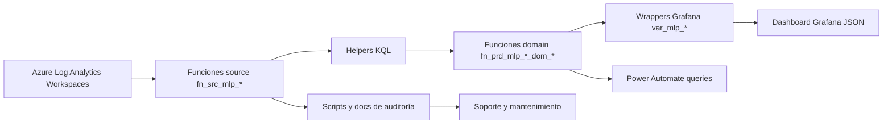
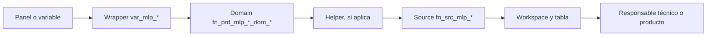

# Plataforma Monitoreo AMG — documentación técnica del repositorio

## Resumen ejecutivo

Este documento técnico consolida el entendimiento del repositorio **Plataforma Monitoreo AMG** para que soporte, analistas y líderes técnicos puedan mantener y reutilizar el modelo de monitoreo. El repositorio contiene un dashboard Grafana exportado, funciones KQL para Azure Log Analytics, wrappers para variables Grafana, queries de Power Automate, scripts de auditoría y documentación de refactorización.

El estado actual detectado muestra un modelo de monitoreo bien encaminado hacia una arquitectura por capas —`source`, `helper`, `domain`, `wrapper` y dashboard—, pero aún con brechas que deben cerrarse antes de considerarlo listo para producción formal: el validador KQL falla por mirrors `law_functions_body_only` faltantes, ADA AMG requiere normalización de estructura/extensiones y el JSON de Grafana conserva consultas legacy pesadas.

El modelo recomendado para futuras implementaciones es mantener funciones LAW como punto de centralización de reglas, usar wrappers livianos en Grafana, documentar contratos de salida uniformes para dominios y asegurar trazabilidad completa desde panel hasta workspace/tabla.

## 1. Título del proyecto

**Plataforma Monitoreo AMG** es un repositorio de artefactos de monitoreo para productos MLP, compuesto por un modelo JSON de Grafana, funciones y consultas KQL para Azure Log Analytics, wrappers para variables de Grafana, queries auxiliares para Power Automate, scripts de auditoría estática y documentación técnica de refactorización.

El foco observado del repositorio es monitorear estados operativos de productos y dominios asociados a **ADA**, **ADA AMG**, **NOTPII** y **SIROSAG**, principalmente sobre Log Analytics Workspaces de Azure y paneles de Grafana.

> **Criterio de esta documentación:** todo lo descrito proviene de archivos existentes en el repositorio. Cuando el repositorio no entrega evidencia suficiente, se marca como **Pendiente de confirmar** o **No identificado en el repositorio**.

## 2. Propósito del repositorio

Este repositorio existe para centralizar y versionar un modelo de monitoreo que permite:

- Consultar logs, ejecuciones de pipelines y eventos operativos desde Azure Log Analytics.
- Encapsular accesos a fuentes en funciones KQL de tipo `source`.
- Separar reglas de evaluación en funciones `helper` y funciones de dominio.
- Exponer resultados a Grafana mediante wrappers de variables.
- Soportar integraciones externas, especialmente queries listas para Power Automate.
- Mantener documentación de auditoría, equivalencia legacy, fuentes y dependencias.

El problema que resuelve es la dispersión de lógica pesada en variables y paneles. El repositorio propone una estructura más mantenible: **Grafana wrapper → Domain → Helper → Source → Workspace table**. Esto entrega al equipo de soporte un camino claro para entender por qué un producto está en estado normal o en alerta, y para replicar el patrón en otros productos.

## 3. Alcance funcional

### 3.1 Productos y dominios cubiertos

| Producto / paquete | Evidencia en repositorio | Alcance observado |
|---|---|---|
| ADA | `law_functions/prd/mlp/ada`, `grafana_wrappers/prd/mlp/ada`, queries Power Automate | Monitoreo de Dispatch, Drillit, Blockgrade, PI, Plans, Meteodata, Alarmas, Front, KPI, Optimizador Mezcla, Settings y estado global. |
| ADA AMG | `law_functions/prd/mlp/ada_amg`, `grafana_wrappers/prd/mlp/ada_amg` | Variante de funciones y wrappers para dominios similares a ADA. Presenta brechas de validación estática descritas más abajo. |
| NOTPII | `law_functions/prd/mlp/notpii`, `grafana_wrappers/prd/mlp/notpii`, queries Power Automate | Monitoreo de autoloader DEV/UAT, ingesta y estado global de difusión/NOTPII. |
| SIROSAG | `law_functions/prd/mlp/sirosag`, `grafana_wrappers/prd/mlp/sirosag`, queries Power Automate | Monitoreo resumido basado en ejecución, desfase y desactualización. |
| Dashboard Grafana | `Plataforma_Monitoreo_AMG.json` | Dashboard “Plataforma Monitoreo Prod” con secciones de resumen ejecutivo y detalle de productos MLP. |

### 3.2 Fuera de alcance o no identificado

- **Alert rules nativas de Grafana o Azure Monitor:** no identificadas en el repositorio.
- **Pipeline de CI/CD para despliegue automático:** no identificado en el repositorio.
- **Infraestructura como código para workspaces, dashboards o permisos:** no identificada en el repositorio.
- **Procedimiento formal de creación/alteración de funciones en LAW:** documentado parcialmente como recomendación, pero no automatizado.
- **Credenciales, service principals o RBAC:** no identificados en el repositorio.

## 4. Visión general de la arquitectura

El modelo está organizado por capas:

1. **Fuentes (`sources`)**: encapsulan workspaces y tablas de Log Analytics.
2. **Helpers**: calculan reglas reutilizables, como lag, ejecución esperada, desfase, alertas por logs o catálogos KPI.
3. **Domains**: consolidan una regla funcional por dominio de negocio/técnico y devuelven estado o color.
4. **Wrappers Grafana**: consultas pequeñas pensadas para variables/paneles, usando macros de tiempo de Grafana.
5. **Dashboard JSON**: modelo visual de Grafana que consume variables y renderiza resumen/detalle.
6. **Power Automate queries**: consultas listas para flujos externos o validaciones.
7. **Scripts de auditoría**: validan referencias KQL, marcadores de conflicto e inventarios.



### Relación entre componentes

- Los wrappers de Grafana no deberían contener lógica pesada; su rol es llamar una función de dominio y proyectar la salida que necesita el panel.
- Las funciones de dominio definen la semántica del estado operativo: `OK`, `ALERT`, `NOOK`, `Alertar`, color o columnas de detalle según producto.
- Los helpers concentran reglas repetibles y evitan duplicar lógica en múltiples dominios.
- Los sources concentran el acoplamiento con nombres de workspaces y tablas.
- El dashboard JSON representa la capa visual y conserva variables históricas embebidas; la carpeta `refactor_ada_optimized` contiene el modelo refactorizado que debería reemplazar gradualmente la lógica pesada.

## 5. Estructura del repositorio

```text
.
├── Plataforma_Monitoreo_AMG.json
├── docs/
│   └── analisis_ada_variables.md
├── refactor_ada_optimized/
│   ├── README.md
│   ├── INVENTORY.md
│   ├── KQL_SOURCES_TECH_AUDIT_2026-04-28.md
│   ├── analyze_source_catalog.py
│   ├── check_conflict_markers.py
│   ├── resolve_required_resources.py
│   ├── validate_kql_references.py
│   ├── docs/
│   ├── grafana_wrappers/prd/mlp/
│   │   ├── ada/
│   │   ├── ada_amg/
│   │   ├── notpii/
│   │   └── sirosag/
│   ├── law_functions/prd/mlp/
│   │   ├── ada/{domains,helpers}/
│   │   ├── ada_amg/domain/
│   │   ├── cross_product/helpers/
│   │   ├── notpii/{domains,helpers}/
│   │   ├── sirosag/{domains,helpers}/
│   │   └── sources/
│   └── power_automate_queries/prd/mlp/
│       ├── ada/
│       ├── notpii/
│       └── sirosag/
├── readme_codex.md
└── traspaso_codex.md
```

| Ruta | Propósito operativo | Consideraciones para soporte |
|---|---|---|
| `Plataforma_Monitoreo_AMG.json` | Modelo exportado de Grafana. Contiene el dashboard, variables, paneles HTML/text y metadatos. | Antes de importarlo, validar datasource, permisos y variables. El JSON contiene queries embebidas legacy además del refactor. |
| `docs/` | Documentación histórica o propuesta técnica. | Útil para entender decisiones de performance y centralización; no necesariamente representa el estado final desplegado. |
| `refactor_ada_optimized/law_functions/` | Funciones KQL organizadas por ambiente/faena/producto. | Es la capa principal del modelo reutilizable. Cambios aquí afectan wrappers y dashboards. |
| `refactor_ada_optimized/grafana_wrappers/` | Entrypoints livianos para Grafana. | Deben mantenerse alineados con variables del dashboard y salidas de funciones de dominio. |
| `refactor_ada_optimized/power_automate_queries/` | Queries listas para flujos, resumen de estado y validaciones legacy. | Útiles para automatizar notificaciones o comparar paridad. |
| `refactor_ada_optimized/docs/` | Catálogos, mapas de dependencia, validaciones y troubleshooting. | Deben actualizarse cuando cambien sources, domains o reglas. |
| Scripts Python | Auditoría estática, resolución de recursos requeridos y chequeo de conflictos. | Ejecutar antes de entregar cambios; actualmente `validate_kql_references.py` detecta brechas. |

## 6. Componentes principales

### 6.1 Dashboard Grafana

| Componente | Ubicación | Objetivo | Dependencias | Consideraciones |
|---|---|---|---|---|
| Dashboard `Plataforma Monitoreo Prod` | `Plataforma_Monitoreo_AMG.json` | Visualizar resumen y detalle de monitoreo de productos MLP. | Grafana, datasource Azure Monitor / Azure Log Analytics, variables `var_mlp_*`. | El JSON tiene 24 variables de tipo query y 4 paneles/filas principales. Pendiente confirmar datasource real y proceso de importación. |

### 6.2 Funciones KQL por producto

| Producto | Ubicación | Objetivo | Relación |
|---|---|---|---|
| ADA | `refactor_ada_optimized/law_functions/prd/mlp/ada` | Estados por dominio y helpers compartidos de ADA. | Consumido por wrappers `var_mlp_ada_*` y queries de Power Automate. |
| ADA AMG | `refactor_ada_optimized/law_functions/prd/mlp/ada_amg` | Variante de dominios ADA AMG. | Consumido por wrappers `var_mlp_ada_amg_*`; presenta brechas de naming/directorio frente al validador. |
| NOTPII | `refactor_ada_optimized/law_functions/prd/mlp/notpii` | Evaluar autoloader e ingesta. | Consumido por wrappers `var_mlp_notpii_*` y Power Automate. |
| SIROSAG | `refactor_ada_optimized/law_functions/prd/mlp/sirosag` | Evaluar resumen SIROSAG con helpers de ejecución, desfase y desactualización. | Consumido por wrapper `var_mlp_sirosag_resumen` y query de Power Automate. |
| Cross-product | `refactor_ada_optimized/law_functions/prd/mlp/cross_product/helpers` | Helpers transversales de color y estado global. | Potencialmente reutilizable en varios productos. |

### 6.3 Sources

Los sources son el contrato de acceso a datos. Encapsulan `workspace("...").table("...")`, filtros por `TimeGenerated`, `sourceType` y proyecciones comunes. El repositorio tiene sources workspace-genéricos y agregadores multi-workspace.

### 6.4 Wrappers Grafana

Los wrappers usan macros de Grafana: `bin($__timeFrom, 1m)` y `bin($__timeTo, 1m)`. Su objetivo es reducir lógica duplicada en variables/paneles, exponer color, estado o detalle tabular y conservar nombres esperados por el dashboard.

### 6.5 Scripts de validación

| Script | Objetivo | Uso operativo |
|---|---|---|
| `validate_kql_references.py` | Verifica wrappers requeridos, funciones requeridas, referencias indefinidas, duplicados, mirrors body-only y reglas de layout. | Ejecutar antes de entregar cambios KQL. Actualmente falla por brechas existentes. |
| `check_conflict_markers.py` | Busca marcadores de merge conflict en archivos de texto relevantes. | Ejecutar antes de PR o despliegue. |
| `analyze_source_catalog.py` | Analiza sources, consumidores y referencias de workspace. | Útil para impacto ante cambios de fuentes. |
| `resolve_required_resources.py` | Resuelve recursos requeridos. | Pendiente de confirmar flujo exacto de uso; revisar script antes de usarlo en despliegues. |

## 7. Dashboards y paneles

### 7.1 Dashboard identificado

| Dashboard | Archivo | Título interno | UID | Tags | Ventana default |
|---|---|---|---|---|---|
| Plataforma Monitoreo AMG | `Plataforma_Monitoreo_AMG.json` | `Plataforma Monitoreo Prod` | `df5way4eopgjkb` | `monitoring`, `cross`, `ingestas` | `now-6h` a `now` |

### 7.2 Paneles identificados

| ID | Tipo | Título | Objetivo operativo inferido desde el JSON |
|---:|---|---|---|
| 20 | `row` | `Resumen Ejecutivo` | Agrupar paneles ejecutivos. |
| 17 | `text` | `Resumen Productos MLP` | Mostrar resumen visual de productos MLP mediante HTML/text y variables. |
| 13 | `row` | `MONITOREO ANALITICA AVANZADA  Productos` | Agrupar detalle de productos. |
| 10 | `text` | `Detalle Productos MLP` | Mostrar detalle visual de productos/dominios mediante HTML/text y variables. |

### 7.3 Variables del dashboard

El JSON contiene variables embebidas para ADA, SIROSAG y NOTPII. Las variables del refactor tienen equivalentes en `grafana_wrappers/prd/mlp/*`, pero el JSON todavía conserva lógica KQL extensa en `templating.list` para varias variables.

| Grupo | Variables observadas | Uso esperado |
|---|---|---|
| ADA | `var_mlp_ada_global`, `var_mlp_ada_pi`, `var_mlp_ada_meteodata`, `var_mlp_ada_kpi`, `var_mlp_ada_alarm`, `var_mlp_ada_front`, `var_mlp_ada_dispatch`, `var_mlp_ada_drillit`, `var_mlp_ada_blockgrade`, `var_mlp_ada_plans`, `var_mlp_ada_ingestas_global` | Colores/estados para chips o bloques del dashboard. |
| SIROSAG | `var_mlp_sirosag_ing_pi`, `var_mlp_sirosag_ing_pdmsag`, `var_mlp_sirosag_ing_planes`, `var_mlp_sirosag_proc_pi`, `var_mlp_sirosag_salud_itot`, `var_mlp_sirosag_restricciones`, `var_mlp_sirosag_celdas`, `var_mlp_sirosag_solidos`, `var_mlp_sirosag_global` | Variables legacy granulares de SIROSAG en el JSON. El refactor expone un wrapper resumen `var_mlp_sirosag_resumen`. |
| NOTPII | `var_mlp_notpii_ingesta`, `var_mlp_notpii_autoloader_uat`, `var_mlp_notpii_autoloader_dev`, `var_mlp_notpii_difusion_global` | Estados/colores para ingesta, autoloader y global. |

### 7.4 Preguntas operativas que responde

- ¿Cuál es el estado general de los productos MLP monitoreados?
- ¿Qué dominio específico está en alerta: Dispatch, PI, Drillit, Blockgrade, Plans, Meteodata, KPI, Alarmas, Front, Optimizador o Settings?
- ¿Hay evidencia de fallas consecutivas, desactualización o desfase?
- ¿El problema viene de una fuente de datos, un job, una tabla con lag o una capa visual?
- ¿Las variables del dashboard están devolviendo color/estado esperado?

### 7.5 Consideraciones para adaptar a otros productos

- Duplicar primero el patrón de carpetas `prd/mlp/<producto>/{domains,helpers}` y `grafana_wrappers/prd/mlp/<producto>`.
- Crear sources explícitos para workspaces reales del nuevo producto.
- Mantener wrappers livianos y no reintroducir KQL pesado en el JSON.
- Confirmar que el dashboard consuma exactamente la columna proyectada por el wrapper (`color`, `status` o tabla de detalle).
- Documentar las variables nuevas y su relación con paneles.

## 8. Funciones, queries y lógica KQL

### 8.1 Organización lógica

| Capa | Patrón de nombre | Rol |
|---|---|---|
| Source | `fn_src_mlp_ws_*`, `fn_src_mlp_*_all` | Acceso a workspaces/tablas y agregación multi-workspace. |
| Domain | `fn_prd_mlp_<producto>_dom_<dominio>_status` | Estado final de un dominio. |
| Helper | `fn_prd_mlp_<producto>_*` | Reglas reutilizables de lag, expected-vs-real, alertas y catálogos. |
| Wrapper | `var_mlp_<producto>_<dominio>.kql` | Entrada para Grafana. |
| Power Automate | `resumen_estado.kql`, `legacy_*`, `dispatch_validacion.kql` | Resúmenes y validaciones para flujos o paridad. |

### 8.2 ADA

| Dominio | Función | Regla de alto nivel documentada/observada |
|---|---|---|
| Dispatch | `fn_prd_mlp_ada_dom_dispatch_status` | Alerta por lag clásico de tablas Dispatch, lag NRT o dos fallas consecutivas recientes de job17. |
| Drillit | `fn_prd_mlp_ada_dom_drillit_status` | Alerta si no hay pipeline OK o hay lag en tablas Drillit. |
| Blockgrade | `fn_prd_mlp_ada_dom_blockgrade_status` | Alerta si no hay ingesta ADF OK o hay lag `blockgrade_bybucket`; considera mantención. |
| PI | `fn_prd_mlp_ada_dom_pi_status` | Alerta por expected-vs-real de jobs PI o lag `pisystem_interpolated`. |
| Plans | `fn_prd_mlp_ada_dom_plans_status` | Alerta por expected-vs-real de job de planes o lag en tablas de planes. |
| Meteodata | `fn_prd_mlp_ada_dom_meteodata_status` | Alerta por faltas de jobs meteo o lag `meteodata`. |
| KPI | `fn_prd_mlp_ada_dom_kpi_status` | Alerta por jobs KPI o filas KPI no esperadas, con excepciones por horarios/mantención. |
| Alarmas | `fn_prd_mlp_ada_dom_alarm_status` | Alerta por jobs de alarmas, incidentes largos o error de storage. |
| Front | `fn_prd_mlp_ada_dom_front_status` | Alerta por errores de aplicación/token en AppServiceConsoleLogs. |
| Optimizador Mezcla | `fn_prd_mlp_ada_dom_optimizador_status` | Alerta por `runFailed`, falta de job01 genshare o lag optimizador. |
| Settings | `fn_prd_mlp_ada_dom_settings_status` | Alerta por expected-vs-real sobre jobs PRFCI. |
| Global | `fn_prd_mlp_ada_dom_global_status` | Consolida los dominios y marca global si cualquiera está en `ALERT`. |

Helpers ADA relevantes:

- `fn_prd_mlp_ada_lag_helpers`: evalúa lag por tabla con umbrales.
- `fn_prd_mlp_ada_alert_from_dispatch_nrt_logs`: evalúa desfase NRT de Dispatch.
- `fn_prd_mlp_ada_kpi_alert_rows`: detecta KPIs no esperados y aplica exclusiones/ventanas.
- `fn_prd_mlp_ada_jobs_status_detail`: entrega diagnóstico tabular de jobs.
- `fn_prd_mlp_ada_en_mantencion`: identifica mantención desde condición operacional en `Logs_MLP_ADA_CL`.
- `fn_prd_mlp_ada_kpi_catalogs` y `fn_prd_mlp_ada_lag_thresholds`: catálogos/umbrales usados por helpers.

### 8.3 ADA AMG

ADA AMG replica dominios equivalentes a ADA en `ada_amg/domain`, con wrappers `var_mlp_ada_amg_*`. Se detectan estas particularidades:

- La carpeta usa `domain` singular, mientras ADA usa `domains` plural.
- Existe un archivo sin extensión `.kql`: `fn_prd_mlp_ada_amg_jobs_status_detail`, por lo que el validador no lo reconoce como definición KQL.
- Los wrappers ADA AMG son marcados por el validador como apuntando a funciones no requeridas, porque `validate_kql_references.py` no contempla ADA AMG en su set requerido.
- Algunas funciones ADA AMG proyectan `status`; el global proyecta `color`.

**Pendiente de confirmar:** si ADA AMG está en producción, si debe incorporarse formalmente al validador y si la carpeta `domain` debe renombrarse a `domains`.

### 8.4 NOTPII

| Componente | Función | Objetivo |
|---|---|---|
| Autoloader DEV | `fn_prd_mlp_notpii_dom_autoloader_dev_status` | Evalúa jobs Databricks del autoloader DEV. |
| Autoloader UAT | `fn_prd_mlp_notpii_dom_autoloader_uat_status` | Evalúa jobs Databricks del autoloader UAT. |
| Ingesta | `fn_prd_mlp_notpii_dom_ingesta_status` | Evalúa job04 PI System por errores, warnings o ejecución. |
| Global | `fn_prd_mlp_notpii_dom_global_status` | Consolida autoloader DEV/UAT e ingesta. |

### 8.5 SIROSAG

| Componente | Función | Objetivo |
|---|---|---|
| Resumen | `fn_prd_mlp_ssag_dom_resumen_status` | Consolida reglas SIROSAG. |
| Ejecución | `fn_prd_mlp_ssag_eval_ejecucion` | Evalúa cumplimiento de ejecución de jobs. |
| Desfase | `fn_prd_mlp_ssag_eval_desfase` | Evalúa desfase temporal. |
| Desactualización | `fn_prd_mlp_ssag_eval_desactualizacion` | Evalúa frescura/desactualización de datos o logs. |

### 8.6 Consideraciones de performance KQL

- Filtrar por `TimeGenerated` dentro de sources reduce volumen temprano.
- Evitar repetir lógica pesada en variables de Grafana; preferir funciones LAW y wrappers livianos.
- Cuidar `union isfuzzy=true` en sources agregadores: facilita resiliencia ante esquemas, pero puede ocultar problemas de disponibilidad o cambios de tabla.
- Usar `bin($__timeFrom, 1m)` y `bin($__timeTo, 1m)` estabiliza rangos de consulta, pero soporte debe validar timezone y ventana.
- Los expected-vs-real con `range` y `mv-expand` pueden crecer si se amplía demasiado la ventana; validar costos antes de aumentar rangos.

## 9. Fuentes de datos

### 9.1 Workspaces y tablas observadas

| Source | Workspace lógico / real documentado | Tablas observadas |
|---|---|---|
| `fn_src_mlp_ws_ada` | `mlp-prd-law-ada` | `ContainerAppConsoleLogs_CL`, `ContainerAppSystemLogs_CL`, `AppServiceConsoleLogs` |
| `fn_src_mlp_ws_dataplatform` | `ams-dev-dataplatform-laws` | `Logs_MLP_ADA_CL` |
| `fn_src_mlp_ws_pisystem` | `mlp-prd-law-pisystem` | `ContainerAppSystemLogs_CL`, `ContainerAppConsoleLogs_CL` |
| `fn_src_mlp_ws_ssag` | `mlp-prd-law-ssag` | `ContainerAppConsoleLogs_CL`, `ContainerAppSystemLogs_CL` |
| `fn_src_mlp_ws_dispatch` | `mlp-prd-law-dispatch` | `AzureDiagnostics` |
| `fn_src_mlp_ws_drillit` | `mlp-prd-law-drillit` | `AzureDiagnostics` |
| `fn_src_mlp_ws_blkgrde` | `mlp-prd-law-blkgrde` | `AzureDiagnostics` |
| `fn_src_mlp_ws_meteo` | `mlp-prd-law-meteo` | `ContainerAppSystemLogs_CL` |
| `fn_src_mlp_ws_plans` | `mlp-prd-law-plans` | `ContainerAppSystemLogs_CL` |
| `fn_src_mlp_ws_pdmsagi` | `mlp-prd-law-pdmsagi` | `ContainerAppSystemLogs_CL` |
| `fn_src_mlp_ws_notpii_databricksjobs` | `ams-dev-dataplatform-laws`, `ams-uat-dataplatform-laws` | `DatabricksJobs` |
| `fn_src_mlp_ws_genshare` | `ams-prd-law-genshare` | `ContainerAppSystemLogs_CL` |
| `fn_src_mlp_ws_prfci` | `mlp-prd-law-prfci` | `ContainerAppSystemLogs_CL` |

### 9.2 Supuestos de adaptación

Para replicar el modelo en otro producto se debe cambiar, como mínimo:

- Subscription/resource group/workspace en funciones `fn_src_mlp_ws_*`.
- Nombres de tablas y columnas si difieren (`JobName_s`, `Log_s`, `TimeGenerated`, `OperationName`, `ResourceGroup`, etc.).
- Nombres de jobs (`mlp-prd-caj-*`) y cadencias esperadas.
- Umbrales de lag y expected-vs-real.
- Variables Grafana y referencias HTML si los nombres visuales cambian.

## 10. Convenciones y estándares

| Elemento | Convención observada | Recomendación |
|---|---|---|
| Ambiente/faena | `prd/mlp` | Mantener patrón `ambiente/faena/producto`. |
| Sources | `fn_src_mlp_ws_<workspace>` y agregadores `fn_src_mlp_*_all` | No mezclar lógica de dominio en sources. |
| Domains | `fn_prd_mlp_<producto>_dom_<dominio>_status` | Una función por estado funcional. |
| Helpers | `fn_prd_mlp_<producto>_<regla>` | Reutilizar antes de duplicar. |
| Wrappers | `var_mlp_<producto>_<dominio>.kql` | Deben llamar una sola función y proyectar salida esperada. |
| Estados | `OK`, `ALERT`; en algunos casos `NOOK`, `Alertar`, `Warning` | Normalizar estados para nuevos productos. |
| Colores | Rojo `#E53935`, verde `#EAF4EA`, amarillo `#FFF4CC` | Usar helper transversal para evitar divergencia. |
| Tiempo | `bin($__timeFrom, 1m)`, `bin($__timeTo, 1m)` | Validar zona horaria y refresh de Grafana. |

## 11. Flujo de implementación

1. **Revisión inicial:** identificar producto, dominios críticos, fuentes, jobs y tablas.
2. **Inventario de fuentes:** crear o adaptar `fn_src_mlp_ws_*` por workspace real.
3. **Definición de reglas:** acordar estados `OK/ALERT/WARN`, umbrales y ventanas.
4. **Implementar helpers:** centralizar reglas repetibles de lag, ejecución, desfase y errores.
5. **Implementar domains:** una función por dominio; el global debe depender solo de dominios.
6. **Crear wrappers:** consultas livianas que llamen domains con macros de tiempo de Grafana.
7. **Configurar dashboard:** variables, paneles resumen, paneles detalle y descripciones.
8. **Validar con datos reales:** comparar contra legacy si existe; revisar falsos positivos.
9. **Ejecutar auditorías:** `validate_kql_references.py` y `check_conflict_markers.py`.
10. **Paso a producción:** importar dashboard, desplegar funciones LAW y capacitar soporte.
11. **Post-producción:** monitorear latencia, costo, falsos positivos y brechas documentales.

## 12. Consideraciones operativas

- **Performance:** evitar queries duplicadas embebidas en JSON; mover lógica pesada a LAW.
- **Costos:** Log Analytics cobra por ingesta/consulta según configuración; ventanas amplias y unions multi-workspace pueden aumentar costo.
- **Mantenibilidad:** mantener sources como única capa que conoce workspaces.
- **Reutilización:** copiar el patrón por producto, no copiar consultas monolíticas.
- **Tiempo:** validar `now-6h`, refresh de variables y timezone de Chile usado por algunas reglas.
- **Ambientes:** el layout actual usa `prd/mlp`; NOTPII consulta DEV/UAT para Databricks. No hay carpetas DEV/UAT completas para todo el modelo.
- **Permisos:** se requieren permisos para consultar workspaces y crear/alterar funciones LAW. Detalle RBAC no identificado.
- **Azure/Grafana:** dependencias explícitas con Azure Log Analytics, AzureDiagnostics, Container Apps/App Service logs, DatabricksJobs y Grafana.

## 13. Buenas prácticas

- Mantener separación estricta entre source, helper, domain y wrapper.
- No poner lógica de negocio en el dashboard si puede estar en una función LAW.
- Documentar cada nuevo dominio con regla, fuente, umbral y acción de soporte.
- Usar nombres consistentes y trazables desde variable Grafana hasta workspace.
- Validar paridad antes de reemplazar consultas legacy.
- Agregar paneles de detalle para explicar alertas globales.
- Usar catálogos y umbrales versionados cuando cambien reglas operativas.
- Evitar `union` innecesarios y filtrar por tiempo lo antes posible.
- Mantener inventario de fuentes actualizado.
- Ejecutar scripts de auditoría antes de PR/despliegue.

## 14. Cómo contribuir o mantener el repositorio

### Antes de modificar

- Revisar `INVENTORY.md`, `README.md`, `source_catalog.md` y esta documentación.
- Ejecutar auditorías para conocer estado base.
- Confirmar si el cambio afecta dashboard JSON, wrappers o Power Automate.

### Agregar un nuevo producto

1. Crear carpeta `law_functions/prd/mlp/<producto>/{domains,helpers}`.
2. Crear sources si los workspaces no existen.
3. Crear dominios y helpers.
4. Crear wrappers en `grafana_wrappers/prd/mlp/<producto>`.
5. Actualizar dashboard/variables si corresponde.
6. Actualizar documentación e inventario.
7. Ajustar validador si el producto debe ser obligatorio.

### Agregar una nueva función

- Definir si es source, helper o domain.
- Usar prefijo correspondiente.
- Revisar dependencias para evitar ciclos.
- Agregar wrapper solo si Grafana la consume.
- Documentar propósito, entradas, salida y reglas.

### Agregar un nuevo panel

- Definir pregunta operativa que responde.
- Vincularlo a una variable/wrapper o query clara.
- Documentar interpretación y acciones ante alerta.
- Evitar saturar el dashboard con datos no accionables.

## 15. Glosario

| Término | Definición operativa |
|---|---|
| KQL | Kusto Query Language, lenguaje usado para consultar Log Analytics/ADX. |
| LAW | Log Analytics Workspace, repositorio de logs en Azure. |
| Grafana | Herramienta de visualización que consume variables y paneles definidos en el JSON. |
| Dashboard | Vista de monitoreo compuesta por paneles y variables. |
| Panel | Unidad visual del dashboard: texto, tabla, gráfico, fila, etc. |
| Wrapper | Query liviana para Grafana que llama una función KQL y proyecta salida. |
| Helper | Función KQL reutilizable para reglas comunes. |
| Domain | Función KQL que representa estado de un dominio operativo. |
| Source | Función KQL que encapsula un workspace/tabla. |
| Estado global | Consolidación de estados de múltiples dominios. |
| Alerta | Condición operacional no normal, típicamente `ALERT` o rojo `#E53935`. |
| Lag | Desfase o atraso entre datos esperados y últimos datos disponibles. |
| Expected-vs-real | Patrón que compara ejecuciones esperadas contra ejecuciones reales. |
| NRT | Near Real Time, monitoreo casi en tiempo real. |
| `union isfuzzy=true` | Unión KQL tolerante a diferencias de esquema/disponibilidad. |

## 16. Pendientes o brechas detectadas

| Brecha | Evidencia / impacto | Recomendación |
|---|---|---|
| `validate_kql_references.py` falla actualmente | Faltan mirrors `law_functions_body_only`, ADA AMG no está contemplado y hay llamada indefinida por archivo sin `.kql`. | Resolver antes de despliegue formal o ajustar alcance del validador. |
| Carpeta `law_functions_body_only` mencionada pero no presente | README/validador esperan mirrors body-only. | Confirmar si se eliminó intencionalmente o restaurar mirrors. |
| ADA AMG usa `domain` singular y archivo sin extensión `.kql` | El validador no reconoce la definición de `fn_prd_mlp_ada_amg_jobs_status_detail`. | Normalizar estructura y extensión. |
| Wrappers ADA proyectan `color`, pero varios domains ADA observados proyectan `status` | Riesgo de error de columna si no existe adaptación en despliegue LAW. | Confirmar contrato real de salida y ajustar wrappers o domains. |
| JSON de Grafana conserva KQL legacy pesado en variables | Puede duplicar lógica y costo frente al refactor. | Migrar variables del JSON a wrappers livianos de forma controlada. |
| Documentación existente tiene referencias históricas posiblemente desactualizadas | Algunos docs indican auditoría OK, pero validación actual falla. | Actualizar docs después de corregir brechas. |
| No hay CI/CD ni runbook de despliegue automatizado | Riesgo de despliegue manual inconsistente. | Crear pipeline o checklist formal. |
| Permisos/RBAC no documentados | Soporte puede no poder consultar o desplegar funciones. | Documentar roles mínimos por workspace y Grafana. |


## 17. Resumen ejecutivo de madurez del repositorio

Esta sección resume, para líderes técnicos y soporte, qué partes del modelo están mejor preparadas para reutilización y qué partes requieren cierre antes de un traspaso productivo completo.

| Área | Madurez observada | Evidencia en repositorio | Riesgo operativo | Acción recomendada |
|---|---|---|---|---|
| Organización por capas | Alta para ADA/NOTPII/SIROSAG | Existen `sources`, `helpers`, `domains` y `grafana_wrappers`. | Bajo/medio: el patrón existe, pero debe respetarse en nuevas extensiones. | Usar el patrón como referencia base para otros productos. |
| Dashboard Grafana | Media | Existe `Plataforma_Monitoreo_AMG.json` con variables y paneles. | Medio: el JSON conserva consultas legacy extensas. | Migrar variables a wrappers livianos de forma controlada. |
| Funciones ADA | Media/alta | Hay dominios, helpers, validaciones legacy y wrappers. | Medio: revisar contrato `status`/`color` antes de despliegue. | Alinear salida de domains y wrappers antes de operación formal. |
| ADA AMG | Baja/media | Existen funciones y wrappers, pero el validador reporta inconsistencias. | Alto si se usa sin normalizar. | Normalizar carpeta, extensión `.kql` y reglas del validador. |
| NOTPII | Media | Existen domains, helpers y wrappers. | Medio: confirmar semántica de `Alertar` y salida global. | Documentar reglas por job/ambiente y validar con datos reales. |
| SIROSAG | Media | Existe domain resumen y helpers de evaluación. | Medio: JSON tiene variables SIROSAG legacy más granulares que el wrapper refactor. | Confirmar si el modelo refactor reemplaza o complementa las variables legacy. |
| Validación estática | Media | Existen scripts de auditoría. | Alto actualmente porque el validador falla. | Corregir brechas o actualizar el validador al alcance real. |
| Despliegue | Baja | No se identificó CI/CD ni runbook automatizado. | Alto: riesgo de diferencias entre repo y LAW/Grafana. | Crear procedimiento de despliegue y rollback. |

## 18. Contratos operativos recomendados

Para que soporte pueda operar el modelo sin ambigüedad, cada componente debería tener un contrato mínimo documentado. Algunos contratos se observan parcialmente en el repositorio, pero conviene formalizarlos.

### 18.1 Contrato de una función `source`

| Campo | Descripción | Estado en repo |
|---|---|---|
| Nombre | `fn_src_mlp_ws_<workspace>` o agregador `fn_src_mlp_*_all`. | Observado. |
| Entradas | `sourceType`/`tableName`, `startTime`, `endTime`; algunos agregadores solo tiempo. | Observado con variaciones. |
| Salida | Columnas originales o proyección común. | Observado, pero no documentado por función en todos los casos. |
| Responsabilidad | Acceso a datos y filtro temporal; sin reglas de negocio. | Observado como intención arquitectónica. |
| Riesgo | Cambiar workspace o tabla impacta todos los consumidores. | Debe manejarse con análisis de dependencias. |

### 18.2 Contrato de una función `domain`

| Campo | Descripción | Recomendación |
|---|---|---|
| Entradas | `startTime:datetime`, `endTime:datetime`. | Mantener estándar para facilitar wrappers. |
| Salida mínima | `status` con `OK/ALERT` o `color` con código hexadecimal. | Normalizar: idealmente devolver ambos cuando sea posible. |
| Regla | Explicar condiciones exactas que generan alerta. | Documentar en el archivo o en catálogo de dominios. |
| Dependencias | Helpers y sources llamados. | Mantener mapa actualizado con scripts. |
| Acción soporte | Qué revisar cuando el dominio alerta. | Debe existir en el runbook del producto. |

### 18.3 Contrato de un wrapper Grafana

| Campo | Descripción | Recomendación |
|---|---|---|
| Entrada temporal | `bin($__timeFrom, 1m)`, `bin($__timeTo, 1m)`. | Mantener salvo necesidad justificada. |
| Llamada | Una sola función principal. | Permite trazabilidad y auditoría. |
| Proyección | `project color`, `project status` o tabla de detalle. | Debe coincidir con el panel que lo consume. |
| Uso visual | Variable, chip, tabla o detalle. | Documentar en inventario de paneles. |

## 19. Trazabilidad mínima para soporte

Cuando soporte reporte una alerta o un error de monitoreo, debería poder completar esta cadena:



| Elemento | Dato que soporte debe registrar | Ejemplo de formato |
|---|---|---|
| Panel/variable | Nombre visible o variable Grafana. | `var_mlp_ada_dispatch` |
| Wrapper | Ruta del archivo wrapper. | `grafana_wrappers/prd/mlp/ada/var_mlp_ada_dispatch.kql` |
| Domain | Función de estado. | `fn_prd_mlp_ada_dom_dispatch_status` |
| Helper | Regla específica. | `fn_prd_mlp_ada_lag_helpers` |
| Source | Función de acceso. | `fn_src_mlp_ws_ada` |
| Fuente | Workspace/tabla. | `mlp-prd-law-ada / ContainerAppSystemLogs_CL` |
| Evidencia | Ventana y resultado. | `2026-05-08 10:00-10:30 UTC, status=ALERT` |

## 20. Guía de validación documental antes de entregar a soporte

Antes de hacer un traspaso formal, se recomienda validar la documentación con esta lista:

| Validación | Criterio de aceptación | Estado actual |
|---|---|---|
| Inventario de productos | ADA, ADA AMG, NOTPII y SIROSAG aparecen descritos. | Cubierto en este documento. |
| Inventario de fuentes | Cada source relevante tiene workspace lógico y tabla. | Cubierto a nivel general; falta contrato por función individual. |
| Inventario de paneles | Dashboard, variables y paneles principales identificados. | Cubierto; falta descripción funcional dentro del JSON/Grafana. |
| Runbook | Existe guía operativa diaria. | Cubierto en `traspaso_codex.md`. |
| Escalamiento | Existe matriz de responsabilidades sugerida. | Cubierto en `traspaso_codex.md`; falta matriz oficial de la organización. |
| Validación técnica | Scripts de auditoría ejecutados y resultados documentados. | Cubierto; hay falla pendiente en validador KQL. |
| Despliegue | Existe paso a paso de despliegue y rollback. | Parcial; falta procedimiento oficial y automatización. |

## 21. Recomendaciones de mejora priorizadas

| Prioridad | Mejora | Beneficio esperado |
|---|---|---|
| P0 | Corregir o ajustar `validate_kql_references.py` según el alcance real del paquete. | Permite una señal confiable de calidad antes de entregar cambios. |
| P0 | Normalizar contratos de salida `status`/`color` entre domains y wrappers. | Evita fallas de panel por columnas inexistentes. |
| P1 | Formalizar despliegue de funciones LAW y dashboard Grafana. | Reduce diferencias entre repositorio y ambiente real. |
| P1 | Migrar el JSON a wrappers livianos cuando la paridad esté validada. | Reduce costo y duplicación de KQL. |
| P1 | Definir matriz oficial de severidades y escalamiento. | Mejora tiempos de respuesta y claridad operativa. |
| P2 | Agregar documentación por dominio con ejemplos de queries de diagnóstico. | Facilita capacitación y soporte N2. |
| P2 | Incorporar validación Markdown o revisión documental en CI. | Mantiene vivos los documentos de traspaso. |


## 22. Estado actual detectado en el repositorio

| Área | Estado actual detectado | Evidencia | Implicancia para soporte |
|---|---|---|---|
| Dashboard Grafana | Existe un modelo JSON único con variables y paneles de resumen/detalle. | `Plataforma_Monitoreo_AMG.json`. | Soporte puede revisar visualmente estados, pero debe confirmar si el JSON está sincronizado con wrappers refactorizados. |
| KQL refactorizado | Existe estructura por `law_functions/prd/mlp` con productos ADA, ADA AMG, NOTPII, SIROSAG, cross-product y sources. | Carpetas `refactor_ada_optimized/law_functions/prd/mlp/*`. | El patrón por capas es reutilizable, aunque no todo pasa auditoría estática. |
| Wrappers Grafana | Existen wrappers para ADA, ADA AMG, NOTPII y SIROSAG. | `refactor_ada_optimized/grafana_wrappers/prd/mlp/*`. | Deben validarse contra las columnas reales que devuelven los domains (`color`, `status` o detalle). |
| Queries Power Automate | Existen consultas de resumen/validación para ADA, NOTPII y SIROSAG. | `refactor_ada_optimized/power_automate_queries/prd/mlp/*`. | Útiles para automatización, pero requieren validación con funciones desplegadas. |
| Validación estática | `validate_kql_references.py` falla actualmente. | Faltan mirrors body-only y ADA AMG no queda reconocido por el validador. | No usar como “OK productivo” hasta resolver o aceptar formalmente las brechas. |
| Despliegue | No se identificó pipeline CI/CD ni procedimiento automatizado. | No hay archivos de pipeline o IaC detectados. | El despliegue debe ejecutarse con checklist manual o crear automatización. |

## 23. Modelo recomendado para futuras implementaciones

| Capa | Modelo recomendado | Motivo operativo |
|---|---|---|
| Sources | Una función `fn_src_mlp_ws_*` por workspace lógico/real y agregadores solo cuando exista necesidad multi-workspace. | Reduce acoplamiento de domains/helpers a rutas de Azure y facilita cambios de workspace. |
| Helpers | Reglas reutilizables para lag, expected-vs-real, desfase, catálogos y parsing de logs. | Evita duplicar reglas en cada dominio y facilita soporte N2. |
| Domains | Una función por dominio operativo, con contrato de salida estándar. | Permite explicar claramente por qué un dominio está en alerta. |
| Wrappers | Consultas livianas que llamen una sola función principal y proyecten lo que Grafana necesita. | Reduce costo, duplicación y errores en variables del dashboard. |
| Dashboard | Resumen accionable arriba, detalle diagnóstico abajo, variables con nombres trazables. | Soporte puede pasar desde estado global a causa probable. |
| Documentación | Plantilla por producto, panel y dominio. | Evita pérdida de conocimiento al replicar el modelo. |

## 24. Brechas que deben cerrarse antes de producción

| Brecha | Impacto | Cierre requerido |
|---|---|---|
| Validador KQL falla por mirrors `law_functions_body_only` faltantes. | No hay señal automatizada confiable de paquete completo. | Restaurar mirrors, remover exigencia si ya no aplica o separar validación por alcance real. |
| ADA AMG usa `domain` singular y un archivo sin extensión `.kql`. | Funciones no reconocidas por auditoría y wrappers marcados como no-domain. | Normalizar estructura a `domains`, agregar extensión `.kql` y actualizar validador. |
| Posible desalineación entre wrappers que proyectan `color` y domains que devuelven `status`. | Paneles pueden fallar por columna inexistente. | Estandarizar contrato de salida de domains o ajustar wrappers. |
| JSON de Grafana conserva consultas legacy pesadas. | Mayor costo y dificultad de mantenimiento. | Migrar progresivamente a wrappers livianos validados. |
| No hay procedimiento automatizado de despliegue. | Riesgo de diferencias entre repo, LAW y Grafana. | Crear pipeline o runbook manual aprobado. |
| Permisos/RBAC no documentados. | Soporte podría no poder diagnosticar o consultar fuentes. | Documentar roles mínimos por workspace, Grafana y Power Automate. |

## 25. Matriz de trazabilidad completa

| Producto | Panel o variable Grafana | Wrapper | Domain | Helper principal | Source | Workspace/Tabla | Qué valida | Acción de soporte |
|---|---|---|---|---|---|---|---|---|
| ADA | `var_mlp_ada_global` | `grafana_wrappers/prd/mlp/ada/var_mlp_ada_global.kql` | `fn_prd_mlp_ada_dom_global_status` | Dominios ADA consolidados | Sources ADA/PI/Plans/Meteo/Dataplatform/Genshare/PRFCI | Múltiples workspaces/tablas | Estado global ADA. | Identificar dominio en alerta y bajar a wrapper/domain específico. |
| ADA | `var_mlp_ada_dispatch` | `grafana_wrappers/prd/mlp/ada/var_mlp_ada_dispatch.kql` | `fn_prd_mlp_ada_dom_dispatch_status` | `fn_prd_mlp_ada_lag_helpers`, `fn_prd_mlp_ada_alert_from_dispatch_nrt_logs` | `fn_src_mlp_ws_ada` | `mlp-prd-law-ada / ContainerAppSystemLogs_CL, ContainerAppConsoleLogs_CL` | Lag Dispatch, NRT y fallas consecutivas job17. | Revisar logs job17, lag de tablas y ventana seleccionada. |
| ADA | `var_mlp_ada_drillit` | `grafana_wrappers/prd/mlp/ada/var_mlp_ada_drillit.kql` | `fn_prd_mlp_ada_dom_drillit_status` | `fn_prd_mlp_ada_lag_helpers` | `fn_src_mlp_pipeline_runs_all`, `fn_src_mlp_ws_ada` | `mlp-prd-law-drillit / AzureDiagnostics`; `mlp-prd-law-ada / tablas drillit` | Pipeline OK y lag Drillit. | Validar pipeline `MLP-PRD-RG-DRILLIT` y tablas `drillit_*`. |
| ADA | `var_mlp_ada_blockgrade` | `grafana_wrappers/prd/mlp/ada/var_mlp_ada_blockgrade.kql` | `fn_prd_mlp_ada_dom_blockgrade_status` | `fn_prd_mlp_ada_lag_helpers`, `fn_prd_mlp_ada_en_mantencion` | `fn_src_mlp_pipeline_runs_all`, `fn_src_mlp_ws_dataplatform` | `mlp-prd-law-blkgrde / AzureDiagnostics`; `ams-dev-dataplatform-laws / Logs_MLP_ADA_CL` | Pipeline Blockgrade, lag y mantención. | Confirmar mantención operacional y pipeline Blockgrade. |
| ADA | `var_mlp_ada_pi` | `grafana_wrappers/prd/mlp/ada/var_mlp_ada_pi.kql` | `fn_prd_mlp_ada_dom_pi_status` | `fn_prd_mlp_ada_lag_helpers` | `fn_src_mlp_systemlogs_all` | `mlp-prd-law-pisystem / ContainerAppSystemLogs_CL` | Expected-vs-real y lag PI. | Validar jobs PI y frescura `pisystem_interpolated`. |
| ADA | `var_mlp_ada_plans` | `grafana_wrappers/prd/mlp/ada/var_mlp_ada_plans.kql` | `fn_prd_mlp_ada_dom_plans_status` | `fn_prd_mlp_ada_lag_helpers` | `fn_src_mlp_systemlogs_all`, `fn_src_mlp_ws_plans` | `mlp-prd-law-plans / ContainerAppSystemLogs_CL` | Ejecución de planes y lag de tablas de planes. | Revisar jobs Plans y tablas `planes_*`. |
| ADA | `var_mlp_ada_meteodata` | `grafana_wrappers/prd/mlp/ada/var_mlp_ada_meteodata.kql` | `fn_prd_mlp_ada_dom_meteodata_status` | `fn_prd_mlp_ada_lag_helpers` | `fn_src_mlp_systemlogs_all`, `fn_src_mlp_ws_meteo` | `mlp-prd-law-meteo / ContainerAppSystemLogs_CL` | Jobs meteo y lag `meteodata`. | Revisar emisión de logs meteo y última actualización. |
| ADA | `var_mlp_ada_kpi` | `grafana_wrappers/prd/mlp/ada/var_mlp_ada_kpi.kql` | `fn_prd_mlp_ada_dom_kpi_status` | `fn_prd_mlp_ada_jobs_status_detail`, `fn_prd_mlp_ada_kpi_alert_rows` | `fn_src_mlp_ws_ada`, `fn_src_mlp_ws_dataplatform` | `mlp-prd-law-ada / ContainerAppSystemLogs_CL`; `ams-dev-dataplatform-laws / Logs_MLP_ADA_CL` | Jobs KPI, KPIs no esperados y excepciones. | Revisar detalle por job/KPI y si hay mantención/horario especial. |
| ADA | `var_mlp_ada_alarm` | `grafana_wrappers/prd/mlp/ada/var_mlp_ada_alarm.kql` | `fn_prd_mlp_ada_dom_alarm_status` | `fn_prd_mlp_ada_jobs_status_detail` | `fn_src_mlp_ws_ada` | `mlp-prd-law-ada / ContainerAppConsoleLogs_CL` | Jobs alarmas, incidentes largos y storage. | Revisar logs job06/job07 y errores de storage. |
| ADA | `var_mlp_ada_front` | `grafana_wrappers/prd/mlp/ada/var_mlp_ada_front.kql` | `fn_prd_mlp_ada_dom_front_status` | No identificado en el repositorio | `fn_src_mlp_ws_ada` | `mlp-prd-law-ada / AppServiceConsoleLogs` | Errores de app o token inválido. | Revisar errores Front y permisos/token. |
| ADA | `var_mlp_ada_jobs_detail` | `grafana_wrappers/prd/mlp/ada/var_mlp_ada_jobs_detail.kql` | No aplica; llama helper de detalle | `fn_prd_mlp_ada_jobs_status_detail` | `fn_src_mlp_ws_ada` | `mlp-prd-law-ada / ContainerAppSystemLogs_CL` | Detalle expected-vs-real por job. | Usar como primera tabla de diagnóstico N2. |
| ADA AMG | `var_mlp_ada_amg_global` | `grafana_wrappers/prd/mlp/ada_amg/var_mlp_ada_amg_global.kql` | `fn_prd_mlp_ada_amg_dom_global_status` | Dominios ADA AMG consolidados | Sources compartidos ADA | Múltiples workspaces/tablas | Estado global ADA AMG. | Pendiente de confirmar producción; normalizar antes de operar. |
| ADA AMG | `var_mlp_ada_amg_*` | `grafana_wrappers/prd/mlp/ada_amg/*.kql` | `fn_prd_mlp_ada_amg_dom_*_status` | Helpers ADA/ADA AMG según dominio | Sources compartidos ADA | Pendiente de confirmar por dominio | Dominios ADA AMG. | Corregir brechas de validador y contrato antes de traspaso. |
| NOTPII | `var_mlp_notpii_autoloader_dev` | `grafana_wrappers/prd/mlp/notpii/var_mlp_notpii_autoloader_dev.kql` | `fn_prd_mlp_notpii_dom_autoloader_dev_status` | `fn_prd_mlp_notpii_autoloader_alert` | `fn_src_mlp_ws_notpii_databricksjobs` | `ams-dev-dataplatform-laws / DatabricksJobs` | Jobs Autoloader DEV. | Revisar ejecuciones Databricks DEV y estados failed/running. |
| NOTPII | `var_mlp_notpii_autoloader_uat` | `grafana_wrappers/prd/mlp/notpii/var_mlp_notpii_autoloader_uat.kql` | `fn_prd_mlp_notpii_dom_autoloader_uat_status` | `fn_prd_mlp_notpii_autoloader_alert` | `fn_src_mlp_ws_notpii_databricksjobs` | `ams-uat-dataplatform-laws / DatabricksJobs` | Jobs Autoloader UAT. | Revisar ejecuciones Databricks UAT y estados failed/running. |
| NOTPII | `var_mlp_notpii_ingesta` | `grafana_wrappers/prd/mlp/notpii/var_mlp_notpii_ingesta.kql` | `fn_prd_mlp_notpii_dom_ingesta_status` | `fn_prd_mlp_notpii_ingesta_job04_alert` | `fn_src_mlp_ws_pisystem` | `mlp-prd-law-pisystem / ContainerAppSystemLogs_CL, ContainerAppConsoleLogs_CL` | Ingesta job04 PI System. | Revisar errores/warnings y ejecución de job04. |
| NOTPII | `var_mlp_notpii_difusion_global` | `grafana_wrappers/prd/mlp/notpii/var_mlp_notpii_difusion_global.kql` | `fn_prd_mlp_notpii_dom_global_status` | Dominios NOTPII | Sources NOTPII y PI System | DatabricksJobs y PI System logs | Estado global NOTPII. | Bajar a autoloader DEV/UAT o ingesta. |
| SIROSAG | `var_mlp_sirosag_resumen` | `grafana_wrappers/prd/mlp/sirosag/var_mlp_sirosag_resumen.kql` | `fn_prd_mlp_ssag_dom_resumen_status` | `fn_prd_mlp_ssag_eval_ejecucion`, `fn_prd_mlp_ssag_eval_desfase`, `fn_prd_mlp_ssag_eval_desactualizacion` | `fn_src_mlp_ws_ssag`, `fn_src_mlp_ssag_systemlogs_all` | `mlp-prd-law-ssag / ContainerApp*`; Plans/PDMSAGI/PISystem system logs | Ejecución, desfase y desactualización SIROSAG. | Revisar helper específico y fuente SSAG/Plans/PDMSAGI/PISystem. |

## 26. Procedimiento real de despliegue

### 26.1 Prevalidación del repositorio

1. Confirmar que la rama contiene solo cambios esperados.
2. Ejecutar `python refactor_ada_optimized/check_conflict_markers.py`.
3. Ejecutar `python refactor_ada_optimized/validate_kql_references.py` y registrar resultado.
4. Si el validador falla por brechas conocidas, obtener aceptación formal antes de continuar.
5. Revisar que el dashboard JSON corresponda al ambiente objetivo.

### 26.2 Orden de despliegue de funciones LAW

1. Desplegar primero funciones `sources` (`refactor_ada_optimized/law_functions/prd/mlp/sources`).
2. Desplegar helpers transversales (`cross_product/helpers`).
3. Desplegar helpers de producto (`ada/helpers`, `notpii/helpers`, `sirosag/helpers`).
4. Desplegar domains de producto (`ada/domains`, `notpii/domains`, `sirosag/domains` y ADA AMG si se normaliza).
5. Desplegar o actualizar queries externas solo después de validar domains.

### 26.3 Validación de sources

- Ejecutar cada source con ventana corta y `summarize count()`.
- Confirmar que el workspace existe, la tabla existe y `TimeGenerated` devuelve datos recientes.
- Si no hay datos, ampliar ventana antes de declarar incidente.

### 26.4 Validación de helpers

- Ejecutar helpers con rangos controlados.
- Validar columnas esperadas como `status`, `reason`, `isAlert`, `realCount` o `expectedCount` cuando existan.
- Confirmar que catálogos/umbrales aplican al producto correcto.

### 26.5 Validación de domains

- Ejecutar cada domain con `startTime` y `endTime` reales.
- Confirmar contrato de salida: `status`, `color`, `reason`, `severity` o campos disponibles.
- Comparar domain global contra domains individuales.

### 26.6 Validación de wrappers

- Ejecutar wrappers en Grafana Explore o herramienta equivalente.
- Confirmar que cada wrapper llama una sola función principal.
- Confirmar que la columna proyectada existe (`color`, `status` o tabla de detalle).

### 26.7 Importación o actualización del dashboard en Grafana

- Respaldar dashboard actual antes de importar.
- Importar `Plataforma_Monitoreo_AMG.json` o actualizar el dashboard existente.
- Confirmar datasource Azure Monitor/Log Analytics.
- Confirmar UID/título para evitar sobrescribir un dashboard no deseado.

### 26.8 Validación de variables

- Ejecutar cada variable crítica: ADA global, dominios ADA, NOTPII y SIROSAG.
- Confirmar refresh y rango de tiempo.
- Validar que las variables usadas por HTML/text devuelvan el formato esperado.

### 26.9 Validación de paneles

- Revisar panel resumen ejecutivo.
- Revisar panel detalle productos MLP.
- Confirmar que rojo/verde/amarillo se rendericen correctamente.
- Confirmar que un estado global en alerta pueda trazarse a dominio/fuente.

### 26.10 Pruebas antes de producción

- Ejecutar prueba con ventana corta (`now-30m`) y ventana default (`now-6h`).
- Comparar contra dashboard o query legacy si existe.
- Registrar evidencia de al menos un source, helper, domain y wrapper por producto.
- Obtener aprobación de soporte N2 y líder técnico.

### 26.11 Rollback o reversa

- Restaurar dashboard Grafana respaldado si falla la visualización.
- Revertir wrappers a versión anterior si falla contrato de salida.
- Mantener funciones LAW previas hasta confirmar paridad.
- Si se despliega por `.create-or-alter`, conservar copia del cuerpo anterior de cada función crítica.
- Registrar causa del rollback y tarea de corrección.

## 27. Criterios de aceptación del traspaso

### 27.1 Criterios técnicos

- Los sources críticos consultan workspaces/tablas correctos.
- Los helpers críticos devuelven resultados interpretables.
- Los domains críticos tienen contrato de salida conocido.
- Los wrappers críticos funcionan con las macros de Grafana.
- El resultado de `validate_kql_references.py` está en verde o sus fallas están aceptadas formalmente como brecha.

### 27.2 Criterios operativos

- Soporte puede identificar producto, dominio, fuente y acción ante una alerta.
- Existe matriz de escalamiento por dominio crítico o al menos responsable pendiente de confirmar.
- Se ejecutó el runbook con un caso de prueba.
- Hay procedimiento de rollback conocido.

### 27.3 Criterios de documentación

- `readme_codex.md` y `traspaso_codex.md` están actualizados.
- La matriz de trazabilidad tiene todos los campos obligatorios o “Pendiente de confirmar”.
- Las brechas están priorizadas.
- Las descripciones de panel están disponibles para Grafana.

### 27.4 Criterios de capacitación

- Soporte N1 entiende lectura básica de dashboard.
- Soporte N2 puede ejecutar diagnóstico por capas.
- El equipo completó ejercicios prácticos de alerta, sin datos, permisos, wrapper roto y falso positivo.
- Las dudas pendientes quedaron registradas con responsable.

## 28. Ejercicios prácticos para capacitar al equipo

### 28.1 Dashboard sin datos

| Campo | Descripción |
|---|---|
| Objetivo | Enseñar a distinguir entre falta real de datos, rango incorrecto, problema de datasource o permisos. |
| Contexto | Un panel del dashboard aparece vacío para un rango de `now-6h`. |
| Pasos | 1) Validar rango. 2) Ejecutar variable. 3) Ejecutar wrapper. 4) Ejecutar source con `summarize count()`. 5) Probar con usuario con permisos conocidos. |
| Resultado esperado | Soporte identifica si el problema está en Grafana, permisos, source o emisión de logs. |
| Aprendizaje | Un panel vacío no implica necesariamente caída del producto. |

### 28.2 Estado global en alerta

| Campo | Descripción |
|---|---|
| Objetivo | Aprender a bajar desde global a dominio y de dominio a fuente. |
| Contexto | `var_mlp_ada_global` o un global equivalente aparece en rojo. |
| Pasos | 1) Ejecutar global. 2) Identificar dominio en `ALERT`. 3) Ejecutar wrapper del dominio. 4) Ejecutar helper/source asociado. 5) Registrar evidencia. |
| Resultado esperado | Soporte determina el dominio causante y la fuente probable. |
| Aprendizaje | El global solo prioriza; el diagnóstico real está en dominios/helpers/sources. |

### 28.3 Wrapper con error de columna

| Campo | Descripción |
|---|---|
| Objetivo | Detectar desalineación entre wrapper y domain. |
| Contexto | Un wrapper ejecuta `project color`, pero la función llamada devuelve solo `status`. |
| Pasos | 1) Ejecutar domain directamente. 2) Revisar columnas devueltas. 3) Comparar con `project` del wrapper. 4) Documentar ajuste requerido. |
| Resultado esperado | Se identifica mismatch `color/status` sin modificar lógica en caliente. |
| Aprendizaje | El contrato de salida es crítico para paneles Grafana. |

### 28.4 Usuario sin permisos

| Campo | Descripción |
|---|---|
| Objetivo | Diferenciar error por RBAC/datasource de error funcional del producto. |
| Contexto | Un usuario ve errores de consulta y otro usuario ve datos. |
| Pasos | 1) Comparar usuarios. 2) Validar acceso al dashboard. 3) Validar acceso a Log Analytics. 4) Revisar datasource Grafana. 5) Escalar a plataforma si corresponde. |
| Resultado esperado | Se confirma problema de permisos y no se genera incidente falso del producto. |
| Aprendizaje | La operación requiere permisos documentados y usuarios de referencia. |

### 28.5 Alerta falsa por ventana de tiempo

| Campo | Descripción |
|---|---|
| Objetivo | Entender efecto de rango, refresh y latencia sobre expected-vs-real. |
| Contexto | Un dominio alerta con ventana corta, pero normaliza con ventana mayor. |
| Pasos | 1) Ejecutar con `now-15m`. 2) Ejecutar con `now-6h`. 3) Revisar cadencia esperada del job. 4) Revisar `expectedCount` y `realCount`. 5) Registrar si requiere ajuste de umbral. |
| Resultado esperado | Soporte identifica falso positivo asociado a ventana o latencia. |
| Aprendizaje | Las ventanas de tiempo deben alinearse con cadencia real de jobs y tablas. |

## 29. Contrato estándar recomendado para funciones domain

| Campo | Tipo recomendado | Por qué es importante para soporte |
|---|---|---|
| `domain` | `string` | Identifica el dominio operativo sin depender del nombre de la función. Facilita tablas globales y escalamiento. |
| `status` | `string` (`OK`, `ALERT`, `WARN`) | Es la señal principal para decidir si hay acción operativa. |
| `color` | `string` hexadecimal | Permite consumo directo por Grafana sin repetir lógica visual. |
| `reason` | `string` | Explica por qué el dominio está en alerta o normal. Reduce tiempo de diagnóstico. |
| `startTime` | `datetime` | Registra la ventana evaluada y evita confusiones por rangos. |
| `endTime` | `datetime` | Permite reproducir el resultado con la misma ventana. |
| `evidence` | `dynamic` o `string` | Contiene conteos, job afectado, tabla con lag o último timestamp. Ayuda a escalar con evidencia. |
| `severity` | `string` (`info`, `warning`, `critical`) | Permite priorizar alertas y evitar tratar todos los rojos igual. |

> **Recomendación:** para nuevos domains, devolver al menos una fila con estos campos. Si un domain actual no puede hacerlo sin cambio funcional, documentar su contrato actual y planificar la normalización.

## 30. Ruta recomendada de lectura para una persona nueva

1. Leer el **Resumen ejecutivo** de `readme_codex.md`.
2. Revisar la **Estructura del repositorio** para ubicar dashboard, KQL, wrappers y scripts.
3. Leer la **Matriz de trazabilidad completa** para entender relación panel → fuente.
4. Revisar **Estado actual**, **Modelo recomendado** y **Brechas**.
5. Leer el **Procedimiento real de despliegue** antes de tocar funciones o dashboard.
6. Leer `traspaso_codex.md` para operación, diagnóstico y capacitación.
7. Ejecutar los comandos del anexo en una rama local o entorno seguro.
8. Completar ejercicios prácticos antes de operar en producción.

## 31. Anexo con comandos de validación

| Comando | Qué valida | Qué hacer si falla |
|---|---|---|
| `python refactor_ada_optimized/validate_kql_references.py` | Referencias KQL, wrappers requeridos, funciones requeridas, duplicados, mirrors body-only y layout esperado. | Revisar cada error; si corresponde a brecha conocida, documentar aceptación formal; si no, corregir función/ruta/wrapper. |
| `python refactor_ada_optimized/check_conflict_markers.py` | Marcadores de conflicto Git en archivos relevantes. | Corregir manualmente conflictos antes de desplegar o hacer PR. |
| `python refactor_ada_optimized/analyze_source_catalog.py` | Catálogo estático de sources, consumidores, workspaces y dependencias. | Si falla, revisar consumidores impactados; si devuelve `0` sources, revisar alcance/ruta esperada por el script antes de usar el resultado como inventario real. |
| `python refactor_ada_optimized/resolve_required_resources.py <function_name>` | Recursos requeridos por una función específica; por ejemplo `fn_prd_mlp_ada_dom_dispatch_status`. | Si se ejecuta sin argumento falla por uso incorrecto; si falla con argumento, confirmar que la función exista y tenga extensión `.kql`. |

## 32. Anexo con descripciones breves listas para pegar en paneles de Grafana

| Panel/variable | Descripción breve sugerida |
|---|---|
| ADA Global | Estado global ADA consolidado. Si aparece en alerta, revisar dominios Dispatch, Drillit, Blockgrade, PI, Plans, Meteodata, KPI, Alarmas, Front, Optimizador y Settings. |
| ADA Dispatch | Valida lag de tablas Dispatch, señal NRT y fallas consecutivas del job17. Ante alerta, revisar logs ADA y últimos intervalos de ejecución. |
| ADA Drillit | Valida pipeline Drillit y frescura de tablas Drillit. Ante alerta, revisar `AzureDiagnostics` y tablas `drillit_*`. |
| ADA Blockgrade | Valida pipeline Blockgrade, lag de `blockgrade_bybucket` y condición de mantención. Ante alerta, confirmar mantención y ejecución ADF. |
| ADA PI | Valida ejecución esperada y frescura de datos PI. Ante alerta, revisar jobs PI y tabla `pisystem_interpolated`. |
| ADA Plans | Valida ejecución y frescura de tablas de planes. Ante alerta, revisar logs Plans y tablas `planes_*`. |
| ADA KPI | Valida jobs KPI y KPIs no esperados considerando excepciones. Ante alerta, revisar detalle por job/KPI y condiciones de mantención. |
| ADA Alarmas | Valida jobs de alarmas, incidentes largos y errores de storage. Ante alerta, revisar logs job06/job07 y errores persistentes. |
| ADA Front | Valida errores de aplicación o token en Front. Ante alerta, revisar `AppServiceConsoleLogs` y autenticación. |
| NOTPII Autoloader DEV/UAT | Valida estado de jobs Databricks Autoloader por ambiente. Ante alerta, revisar ejecuciones failed/running/cancelled. |
| NOTPII Ingesta | Valida ingesta job04 PI System por errores, warnings o ausencia de ejecución. Ante alerta, revisar logs PI System. |
| SIROSAG Resumen | Valida ejecución, desfase y desactualización SIROSAG. Ante alerta, revisar helper específico y fuentes SSAG/Plans/PDMSAGI/PISystem. |
