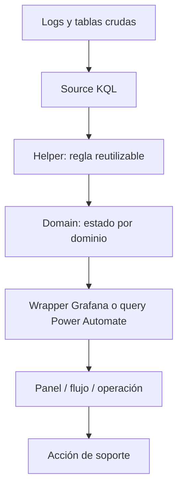
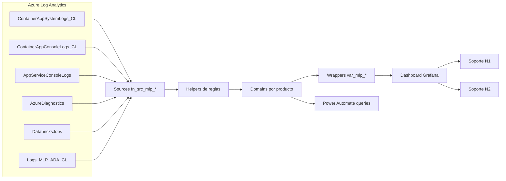

# Traspaso técnico-operativo — Plataforma Monitoreo AMG

## 1. Objetivo del documento

Este documento transfiere conocimiento al equipo de soporte para que pueda entender, operar, mantener y replicar el modelo de monitoreo contenido en este repositorio.

La meta no es solo saber dónde están los archivos, sino comprender cómo se transforma una señal técnica —logs, jobs, pipelines o tablas— en un estado operativo visible en Grafana o consumible por Power Automate.

## 2. Público objetivo

| Rol | Uso esperado del documento |
|---|---|
| Soporte Nivel 1 | Interpretar estados, validar datos visibles y escalar con contexto. |
| Soporte Nivel 2 | Diagnosticar queries, fuentes, funciones y falsos positivos. |
| Analistas | Leer KQL, adaptar consultas y documentar paneles. |
| Analistas senior | Diseñar nuevas reglas y validar paridad con modelos legacy. |
| Líderes técnicos | Gobernar estándares, despliegues, revisiones y deuda técnica. |
| Constructores de dashboards | Crear o mantener paneles operativos reutilizables. |

## 3. Qué debe aprender el equipo de soporte

Al finalizar el traspaso, soporte debe poder:

- Entender el modelo por capas: source, helper, domain, wrapper y dashboard.
- Identificar qué fuente alimenta cada dominio monitoreado.
- Leer una query KQL y reconocer filtros de tiempo, tablas, jobs y umbrales.
- Interpretar estados `OK`, `ALERT`, `NOOK`, `Alertar` y colores.
- Usar el dashboard para separar alerta real, falta de datos, problema de permisos o problema visual.
- Validar si una función está desplegada y devuelve columnas esperadas.
- Adaptar el patrón a otro producto sin duplicar lógica innecesariamente.
- Documentar nuevos paneles, fuentes y reglas.
- Escalar incidentes con evidencia: dominio, fuente, ventana, query y resultado.

## 4. Modelo conceptual de monitoreo

### 4.1 Qué es monitorear

Monitorear es observar señales técnicas y funcionales para tomar decisiones operativas oportunas. En este repositorio, las señales provienen principalmente de Log Analytics Workspaces y se transforman en estados de salud.

### 4.2 Monitoreo técnico, funcional y operativo

| Tipo | Qué observa | Ejemplo en este repositorio | Decisión que habilita |
|---|---|---|---|
| Técnico | Logs, jobs, pipelines, tablas, errores | `ContainerAppSystemLogs_CL`, `AzureDiagnostics`, `DatabricksJobs` | Revisar ejecución, permisos, latencia o fallas de infraestructura. |
| Funcional | Cumplimiento de reglas del producto | Expected-vs-real, lag de tablas, fallas consecutivas | Determinar si un dominio del producto está sano. |
| Operativo | Estado consolidado para soporte | `GlobalStatus`, colores de Grafana, resumen SIROSAG/NOTPII/ADA | Priorizar atención, escalar y comunicar impacto. |

### 4.3 De datos crudos a indicadores



### 4.4 Consolidación de estados

Un estado global no debería inventar reglas nuevas: debe consolidar dominios. En ADA, el dominio global consulta dominios como Dispatch, Drillit, Blockgrade, PI, Plans, Meteodata, KPI, Alarmas, Front, Optimizador y Settings, y marca global en alerta si alguno está en `ALERT`.

## 5. Arquitectura del modelo de monitoreo del repositorio



### Rol de cada capa

| Capa | Rol | Qué debe revisar soporte |
|---|---|---|
| Fuente | Trae datos desde workspace/tabla. | Workspace correcto, tabla existe, columnas esperadas, permisos. |
| Helper | Aplica regla reusable. | Umbral, ventana, job, tabla, excepciones. |
| Domain | Devuelve estado funcional. | Qué condiciones disparan `ALERT`. |
| Wrapper | Adapta la salida a Grafana. | Columna proyectada (`color`, `status` o detalle), macros de tiempo. |
| Dashboard | Visualiza estado. | Variables, paneles, refresh, tiempo seleccionado. |
| Power Automate | Automatiza consumo de estado. | Query usada, salida esperada y frecuencia. |

## 6. Flujo general de funcionamiento

1. **Nacen los datos:** servicios, jobs, pipelines, Databricks o aplicaciones escriben logs en Azure Log Analytics.
2. **Se consultan:** una función `fn_src_mlp_ws_*` lee la tabla correspondiente y filtra por ventana de tiempo.
3. **Se transforman:** helpers calculan lag, expected-vs-real, fallas consecutivas, warnings o errores.
4. **Se evalúan reglas:** domains convierten señales técnicas en estados como `OK` o `ALERT`.
5. **Se consolidan:** domains globales unen estados por dominio y determinan estado global.
6. **Se visualizan:** wrappers alimentan variables o paneles de Grafana.
7. **Soporte interpreta:** soporte revisa color/estado, baja al detalle, valida fuentes y escala si corresponde.

## 7. Componentes que debe dominar soporte

| Componente | Qué es | Para qué sirve | Qué debe revisar soporte | Errores detectables | Acción sugerida |
|---|---|---|---|---|---|
| `Plataforma_Monitoreo_AMG.json` | Dashboard Grafana exportado. | Visualización del monitoreo. | Variables, paneles, datasource, rango de tiempo. | Variables sin datos, panel HTML sin color, datasource incorrecto. | Validar variable en Grafana Explore y revisar wrapper. |
| `law_functions/prd/mlp/sources` | Capa de acceso a datos. | Encapsula workspaces/tablas. | Workspace, tabla, columnas, permisos. | Tabla inexistente, workspace incorrecto, datos atrasados. | Consultar source directamente con rango corto. |
| `ada/domains` | Estados de ADA. | Define salud por dominio. | Condición que genera alerta. | Falso positivo por umbral o lag. | Ejecutar domain y helpers relacionados. |
| `ada/helpers` | Reglas reutilizables ADA. | Evita duplicar lógica. | Umbrales, catálogos, ventanas, excepciones. | Cambio de job, KPI excluido, timezone. | Validar paso a paso. |
| `ada_amg/domain` | Variante ADA AMG. | Monitoreo ADA AMG. | Estructura y compatibilidad con validador. | Archivo sin `.kql`, wrappers fuera del set requerido. | Regularizar antes de producción formal. |
| `notpii` | Reglas autoloader/ingesta. | Monitorear NOTPII DEV/UAT e ingesta. | DatabricksJobs y PI System. | Estados `Alertar`, warnings, jobs sin ejecución. | Revisar helper específico. |
| `sirosag` | Resumen SIROSAG. | Evaluar ejecución, desfase y desactualización. | Job names, ventanas, logs SSAG. | Datos desactualizados o desfase. | Revisar helpers `eval_*`. |
| `grafana_wrappers` | Entrypoints Grafana. | Simplificar variables. | Función llamada y columna final. | Mismatch `project color` vs salida `status`. | Ajustar contrato o documentar excepción. |
| Scripts Python | Auditoría estática. | Validación previa a cambios. | Salida de comandos y brechas. | Referencias indefinidas, mirrors faltantes, conflictos. | Corregir o registrar pendiente. |

## 8. Cómo leer un dashboard de monitoreo

### 8.1 Panel resumen

1. Confirmar el rango de tiempo seleccionado.
2. Revisar el estado global por producto.
3. Identificar dominios en rojo o alerta.
4. No asumir impacto de negocio sin revisar detalle: un `ALERT` puede ser fuente sin datos, job fallido, lag o problema visual.

### 8.2 Bajar al detalle

- Si el global está en alerta, identificar qué dominio lo activó.
- Ejecutar la variable o wrapper asociada.
- Si existe detalle tabular (`jobs_detail`), revisar `domain`, `jobName`, `status`, `realCount`, `expectedCount`, `isAlert` y `reason`.
- Validar si la ventana del dashboard coincide con la ventana de la regla.

### 8.3 Diferenciar alerta real de falso positivo

| Señal | Probable causa | Validación |
|---|---|---|
| Dashboard sin datos | Datasource, permisos, rango, variable rota | Probar source directo. |
| Domain en `ALERT` pero fuente sin filas | Producto no emitió logs o source incorrecto | Consultar workspace/tabla con rango amplio. |
| Wrapper falla por columna | Contrato salida-wrapper inconsistente | Revisar `project color/status`. |
| Solo un usuario ve error | Permisos Grafana/Azure | Comparar con usuario con permisos conocidos. |
| Alerta intermitente | Ventana muy corta, latencia o job tardío | Ampliar rango y revisar expected-vs-real. |

## 9. Cómo interpretar estados, colores y alertas

| Estado/color | Significado observado | Acción soporte |
|---|---|---|
| `OK` / `#EAF4EA` | Estado normal o sin condición de alerta detectada. | Mantener observación. |
| `ALERT` / `#E53935` | Condición de alerta. | Revisar dominio, helper y fuente; escalar si hay impacto. |
| `WARN` / `WARNING` / `#FFF4CC` | Advertencia potencial. | Revisar tendencia y confirmar si requiere acción. |
| `NOOK` | Variante usada en ADA AMG para representar no OK. | Tratar como alerta funcional hasta normalizar. |
| `Alertar` | Estado usado por NOTPII antes de mapear a color. | Revisar autoloader o ingesta correspondiente. |
| `a`, `w`, `n`, `e` | Estados granulares en helpers/jobs: alerta, warning, normal o error según contexto. | Revisar `statusText`/`reason` y documentación del helper. |

**Pendiente de confirmar:** matriz oficial de severidades de negocio y procedimientos por color. El repositorio muestra estados y colores, pero no define SLA/SLO formal.

## 10. Cómo implementar este modelo en otro producto

1. **Levantar objetivo del producto:** qué debe saber soporte para operar.
2. **Identificar componentes críticos:** jobs, APIs, pipelines, tablas, app services, Databricks.
3. **Identificar fuentes:** workspaces, tablas, columnas y permisos.
4. **Definir reglas:** qué es OK, alerta, warning, ausencia de datos, retraso aceptable.
5. **Crear sources:** un `fn_src_mlp_ws_*` por workspace o fuente lógica.
6. **Crear helpers:** lag, ejecución, desfase, catálogos o parsing de logs.
7. **Crear domains:** una función por dominio y una global.
8. **Crear wrappers:** una query liviana por variable/panel.
9. **Crear paneles:** resumen accionable arriba, detalle abajo.
10. **Validar datos:** probar source → helper → domain → wrapper → panel.
11. **Documentar:** actualizar README, traspaso, inventario y plantilla de panel.
12. **Presentar a soporte:** explicar estados, acciones y escalamiento.
13. **Operar en producción:** revisar falsos positivos, costo y performance.

## 11. Checklist de implementación

| Ítem | Estado |
|---|---|
| Producto identificado | ☐ |
| Objetivo de monitoreo definido | ☐ |
| Componentes críticos identificados | ☐ |
| Workspaces identificados | ☐ |
| Tablas y columnas validadas | ☐ |
| Permisos validados | ☐ |
| Sources creados/adaptados | ☐ |
| Helpers creados/adaptados | ☐ |
| Domains creados/adaptados | ☐ |
| Estado global definido | ☐ |
| Wrappers creados | ☐ |
| Variables Grafana configuradas | ☐ |
| Panel resumen creado | ☐ |
| Panel detalle creado | ☐ |
| Queries probadas con datos reales | ☐ |
| Funciones desplegadas en LAW | ☐ |
| Dashboard importado/probado | ☐ |
| Alertas/colores validados | ☐ |
| Power Automate validado, si aplica | ☐ |
| Documentación actualizada | ☐ |
| Equipo de soporte capacitado | ☐ |
| Plan de rollback definido | ☐ |

## 12. Buenas prácticas para soporte

- No duplicar lógica si existe helper o domain reutilizable.
- Centralizar reglas comunes en KQL, no en HTML del dashboard.
- Documentar cada panel con objetivo, fuente, interpretación y acción.
- Mantener nombres claros y trazables.
- Validar siempre rango de tiempo y timezone.
- Revisar permisos antes de declarar caída de producto.
- Evitar queries costosas con ventanas amplias sin necesidad.
- Separar resumen ejecutivo de detalle diagnóstico.
- Diseñar paneles accionables: si no guía una acción, cuestionar su valor.
- Mantener trazabilidad desde alerta hasta fuente.
- Registrar falsos positivos y ajustar umbrales con aprobación técnica.

## 13. Buenas prácticas de diseño de dashboards

| Práctica | Aplicación recomendada |
|---|---|
| Resumen arriba | Mostrar global y dominios principales al inicio. |
| Detalle abajo | Tablas de jobs, razones y fuentes para diagnóstico. |
| Colores consistentes | Verde normal, rojo alerta, amarillo warning. |
| Texto claro | Cada panel debe responder “qué miro” y “qué hago si falla”. |
| Evitar saturación | No llenar con métricas sin acción asociada. |
| Variables explícitas | Nombres `var_mlp_<producto>_<dominio>`. |
| Drill-down | Desde global a dominio, desde dominio a source/helper. |
| Reutilización | Wrappers livianos para no repetir KQL en paneles. |

## 14. Buenas prácticas de KQL o consultas

- Iniciar por rango de tiempo: `where TimeGenerated between (startTime .. endTime)`.
- Filtrar por `ResourceGroup`, `JobName_s`, `OperationName` o tabla lo antes posible.
- Usar sources para esconder workspaces reales.
- Evitar accesos directos a `workspace()` fuera de `sources`, salvo excepción documentada.
- Probar cada bloque con `take 10` o `summarize count()` antes de unir.
- Mantener output estable: si el wrapper proyecta `color`, el domain debe producir `color`.
- Documentar umbrales y razones de excepciones.
- Evitar ampliar ventanas sin evaluar costo.
- Usar `union isfuzzy=true` con cautela y validar datos faltantes.
- Probar en orden: source → helper → domain → wrapper.

## 15. Diagnóstico operativo

### 15.1 El dashboard no muestra datos

1. Confirmar rango de tiempo.
2. Confirmar datasource de Grafana.
3. Ejecutar variable en Grafana Explore.
4. Ejecutar wrapper equivalente.
5. Ejecutar domain directo.
6. Ejecutar source directo.
7. Revisar permisos del usuario.
8. Registrar si falta tabla, workspace o columna.

### 15.2 El estado aparece en alerta

1. Identificar dominio exacto.
2. Revisar regla del domain.
3. Consultar helper que calcula la condición.
4. Comparar `real` vs `expected` si aplica.
5. Revisar últimos logs del job o tabla.
6. Confirmar si hay mantención o ventana especial.
7. Escalar al equipo responsable con evidencia.

### 15.3 La query falla

- Revisar si la función existe en LAW.
- Revisar nombres exactos de columnas.
- Revisar si el wrapper llama una función definida.
- Revisar si el archivo tiene extensión `.kql` y fue desplegado.
- Revisar errores por permisos cross-workspace.

### 15.4 La función no responde o está lenta

- Reducir ventana de tiempo.
- Probar source de forma aislada.
- Identificar `union` o `mv-expand` costosos.
- Revisar cantidad de filas con `summarize count()`.
- Consultar si hubo aumento de ingesta o cambio de esquema.

### 15.5 Hay diferencia entre usuarios

- Comparar permisos en Grafana.
- Comparar permisos sobre Log Analytics Workspace.
- Validar datasource y organización Grafana.
- Probar con un usuario de referencia.

### 15.6 Hay datos atrasados

- Revisar `max(TimeGenerated)` por tabla.
- Comparar hora UTC vs hora local.
- Validar latencia de ingesta.
- Revisar job/pipeline que produce la tabla.

### 15.7 La alerta parece falsa

- Revisar ventana y refresh.
- Confirmar si la regla tiene excepciones por mantención/horario.
- Verificar si una fuente cambió de formato.
- Registrar evidencia y proponer ajuste de umbral con aprobación.

## 16. Matriz de responsabilidades sugerida

| Rol | Responsabilidades |
|---|---|
| Soporte Nivel 1 | Revisar dashboard, registrar alertas, validar rango de tiempo, ejecutar checklist inicial y escalar con evidencia. |
| Soporte Nivel 2 | Ejecutar wrappers/domains/helpers, diagnosticar fuentes, confirmar falso positivo y proponer corrección operativa. |
| Líder técnico | Aprobar cambios de reglas, gobernar estándares, revisar PRs y coordinar despliegues. |
| Equipo de plataforma | Gestionar workspaces, permisos, datasource Grafana, disponibilidad de Log Analytics y costos. |
| Equipo de desarrollo | Corregir jobs, pipelines, aplicaciones o formatos de logs que originan la alerta. |
| Dueño del producto | Definir criticidad, ventanas aceptables, reglas funcionales y prioridad de incidentes. |

## 17. Runbook base de operación diaria

1. Abrir dashboard `Plataforma Monitoreo Prod`.
2. Confirmar rango de tiempo activo.
3. Revisar estado global de productos.
4. Revisar dominios en alerta.
5. Si hay alerta, abrir detalle o ejecutar wrapper/domain.
6. Validar fuente con rango corto.
7. Confirmar impacto funcional con dueño del producto si corresponde.
8. Registrar hallazgo: hora, producto, dominio, query, resultado y acción.
9. Escalar a N2, plataforma o desarrollo según causa.
10. Hacer seguimiento hasta normalización.
11. Cerrar caso con causa raíz o pendiente documentado.
12. Si fue falso positivo, registrar recomendación de ajuste.

## 18. Plantilla para documentar nuevos paneles

```markdown
## Panel: <nombre del panel>

- **Producto:** <producto>
- **Objetivo:** <qué decisión permite tomar>
- **Fuente de datos:** <workspace / tabla / source>
- **Query o función asociada:** <wrapper / domain / helper>
- **Qué representa:** <estado, tendencia, tabla, conteo>
- **Cómo se interpreta:** <reglas de lectura>
- **Estados posibles:** <OK / ALERT / WARN / otros>
- **Acciones ante alerta:** <pasos de soporte>
- **Responsable funcional:** <rol/equipo>
- **Responsable técnico:** <rol/equipo>
- **Ventana de tiempo recomendada:** <rango>
- **Dependencias:** <jobs, tablas, permisos>
- **Observaciones:** <pendientes o excepciones>
```

## 19. Plantilla para documentar nuevos productos monitoreados

```markdown
# Producto monitoreado: <nombre>

## Objetivo del monitoreo
<describir objetivo>

## Componentes críticos
| Componente | Tipo | Criticidad | Señal esperada |
|---|---|---|---|

## Fuentes
| Workspace | Tabla | Source KQL | Columnas clave |
|---|---|---|---|

## Reglas
| Dominio | Regla OK | Regla ALERT | Umbral | Ventana |
|---|---|---|---|---|

## Dashboards y paneles
| Panel | Wrapper | Interpretación | Acción soporte |
|---|---|---|---|

## Alertas y escalamiento
| Condición | Severidad | Escala a | Evidencia requerida |
|---|---|---|---|

## Consideraciones
- Pendientes:
- Riesgos:
- Supuestos:
```

## 20. Errores comunes y cómo evitarlos

| Error común | Cómo se ve | Cómo evitarlo |
|---|---|---|
| Ruta incorrecta de función | Validador reporta función no definida. | Mantener estructura `prd/mlp/<producto>` y extensión `.kql`. |
| Query duplicada en JSON | Alto costo y difícil mantenimiento. | Reemplazar por wrapper liviano. |
| Función no desplegada | Grafana falla aunque el archivo exista. | Verificar despliegue en LAW antes de dashboard. |
| Workspace incorrecto | No hay datos o hay falsos OK/ALERT. | Encapsular en source y validar catálogo. |
| Variable mal configurada | Panel queda vacío o sin color. | Confirmar nombre, refresh y columna proyectada. |
| Falta de permisos | Un usuario ve error y otro no. | Documentar RBAC y probar con usuario soporte. |
| Ventana mal interpretada | Alerta intermitente o sin sentido. | Revisar `$__timeFrom`, `$__timeTo`, UTC y horario local. |
| Dashboard sin descripción | Soporte no sabe actuar. | Usar plantilla de panel. |
| Estados no normalizados | Un panel usa `NOOK`, otro `ALERT`. | Definir catálogo común de estados. |
| Mirrors/documentación desactualizados | Auditoría contradice docs. | Actualizar docs y scripts junto con cambios. |

## 21. Recomendaciones finales

- Corregir brechas actuales antes de considerar el modelo listo para traspaso productivo completo.
- Normalizar salida de domains y wrappers: decidir si el contrato oficial es `status`, `color` o ambos.
- Incorporar ADA AMG formalmente al validador o separarlo como paquete experimental.
- Evitar volver a cargar KQL pesado dentro del JSON de Grafana.
- Crear procedimiento de despliegue de funciones LAW y dashboard.
- Documentar permisos mínimos por workspace y datasource.
- Mantener inventario de sources y dependencias actualizado.
- Agendar revisión periódica de falsos positivos, costos y performance.
- Capacitar soporte con casos reales: “sin datos”, “alerta real”, “falso positivo” y “error de permisos”.
- Hacer que cada alerta sea trazable hasta una fuente y una acción concreta.

## 22. Pendientes identificados para el traspaso

| Pendiente | Prioridad | Motivo |
|---|---|---|
| Resolver falla de `validate_kql_references.py` | Alta | El paquete no pasa auditoría estática actual. |
| Confirmar proceso de despliegue a LAW | Alta | Sin procedimiento, soporte no puede reproducir instalación. |
| Confirmar datasource y permisos Grafana/Azure | Alta | Requisito para operación diaria. |
| Normalizar ADA AMG | Media/Alta | Hay estructura y extensiones inconsistentes. |
| Actualizar JSON para usar wrappers refactorizados | Media | Reduce costo y duplicación. |
| Crear documentación por panel dentro de Grafana | Media | Facilita lectura operativa. |
| Definir severidades oficiales y matriz SLA/SLO | Media | Permite priorización consistente. |


## 23. Plan sugerido de capacitación para soporte

Para que el traspaso sea efectivo, no basta con entregar los archivos. Se recomienda realizar una capacitación práctica en sesiones cortas.

| Sesión | Duración sugerida | Objetivo | Actividad práctica | Resultado esperado |
|---|---:|---|---|---|
| 1. Contexto y arquitectura | 60 min | Entender capas del modelo y productos cubiertos. | Recorrer `readme_codex.md`, dashboard JSON y carpetas principales. | Soporte puede explicar source → helper → domain → wrapper → dashboard. |
| 2. Lectura de dashboard | 60 min | Interpretar resumen, detalle, estados y colores. | Simular lectura de `OK`, `ALERT`, sin datos y panel lento. | Soporte distingue alerta real de problema de monitoreo. |
| 3. Diagnóstico KQL básico | 90 min | Probar queries por capas. | Ejecutar secuencia source → helper → domain → wrapper en un entorno autorizado. | Soporte N2 obtiene evidencia técnica para escalar. |
| 4. Implementación en otro producto | 90 min | Replicar el patrón sin duplicar lógica. | Completar plantilla de nuevo producto y panel. | Equipo entiende cómo reutilizar el modelo. |
| 5. Operación y escalamiento | 60 min | Alinear roles, evidencias y comunicación. | Ejecutar runbook con un caso ficticio. | Soporte sabe qué registrar y a quién escalar. |

**Pendiente de confirmar:** disponibilidad de un entorno seguro para ejecutar KQL durante la capacitación y usuarios con permisos equivalentes a soporte.

## 24. Criterios de aceptación para considerar el traspaso listo

| Criterio | Aceptación mínima | Responsable sugerido |
|---|---|---|
| Documentación leída y validada | Soporte confirma que entiende arquitectura, fuentes, estados y runbook. | Líder técnico + Soporte N2 |
| Dashboard accesible | Usuarios de soporte pueden abrir el dashboard y ver variables sin errores de permisos. | Plataforma/Grafana |
| Queries críticas probadas | Al menos un source, un helper, un domain y un wrapper por producto probado con datos reales. | Soporte N2 |
| Validador acordado | `validate_kql_references.py` pasa o sus fallas quedan aceptadas formalmente como pendientes. | Líder técnico |
| Severidades definidas | Existe criterio oficial para actuar ante rojo/amarillo/verde. | Dueño del producto |
| Escalamiento validado | Cada dominio crítico tiene equipo responsable y canal de escalamiento. | Soporte + Producto |
| Rollback documentado | Existe forma de volver a query/panel anterior si una migración falla. | Plataforma + Líder técnico |

## 25. Evidencia mínima para escalar incidentes

Cuando soporte escale un incidente, debe adjuntar evidencia suficiente para evitar reprocesos.

| Dato | Obligatorio | Ejemplo |
|---|---|---|
| Producto | Sí | ADA |
| Dominio | Sí | Dispatch |
| Estado observado | Sí | `ALERT` / `#E53935` |
| Hora de detección | Sí | `2026-05-08 14:10 UTC` |
| Rango consultado | Sí | `now-30m` o fechas absolutas |
| Panel o variable | Sí | `var_mlp_ada_dispatch` |
| Función KQL | Sí para N2 | `fn_prd_mlp_ada_dom_dispatch_status` |
| Source o tabla | Deseable | `fn_src_mlp_ws_ada`, `ContainerAppSystemLogs_CL` |
| Resultado resumido | Sí | `job17 sin ejecuciones esperadas en 2 intervalos` |
| Impacto confirmado | Si existe | Usuarios/producto afectado, si fue confirmado por dueño del producto |
| Acción realizada | Sí | Validado source, escalado a desarrollo |

## 26. Escenarios prácticos de diagnóstico

### 26.1 Escenario A: variable roja en Grafana

1. Identificar variable y dominio.
2. Ejecutar wrapper con el mismo rango de tiempo.
3. Ejecutar domain directamente.
4. Si el domain devuelve alerta, revisar helper o source asociado.
5. Si el wrapper falla pero el domain funciona, revisar proyección `color/status`.
6. Registrar evidencia y escalar según matriz.

### 26.2 Escenario B: dashboard vacío

1. Confirmar que el rango no sea demasiado restrictivo.
2. Validar datasource y permisos del usuario.
3. Probar una query simple contra el workspace.
4. Probar source con `summarize count()`.
5. Si no hay datos, confirmar si el producto dejó de emitir logs o si cambió la tabla.
6. Escalar a plataforma si es permisos/datasource o a desarrollo si es emisión de logs.

### 26.3 Escenario C: falso positivo recurrente

1. Registrar ocurrencias con fecha, rango y dominio.
2. Revisar si coincide con ventanas de mantención, horarios especiales o latencia normal.
3. Comparar `expectedCount` vs `realCount` cuando exista detalle.
4. Revisar si el umbral es demasiado estricto.
5. Proponer ajuste documentado y validarlo con dueño del producto.
6. No modificar reglas sin aprobación.

### 26.4 Escenario D: falla después de adaptar a otro producto

1. Confirmar que los sources apuntan a workspaces del nuevo producto.
2. Confirmar nombres de tablas y columnas.
3. Confirmar que los jobs esperados existen con los nombres configurados.
4. Ejecutar source → helper → domain → wrapper.
5. Revisar si el validador contempla el nuevo producto.
6. Actualizar documentación e inventario.

## 27. Paquete mínimo que debe recibir soporte por cada nuevo producto

Cada vez que se replique el modelo en otro producto, soporte debería recibir un paquete documental mínimo:

| Entregable | Contenido mínimo |
|---|---|
| Inventario de fuentes | Workspaces, tablas, columnas clave, permisos y responsables. |
| Inventario de dominios | Regla OK/ALERT, umbral, ventana, helpers y sources. |
| Dashboard o paneles | Capturas o descripción, variables, datasource y rango recomendado. |
| Runbook específico | Pasos de diagnóstico por dominio crítico. |
| Matriz de escalamiento | Responsable técnico, producto, plataforma y canal. |
| Evidencia de validación | Queries probadas, resultados y fecha de validación. |
| Pendientes aceptados | Brechas conocidas y plan de cierre. |
| Rollback | Cómo volver a versión anterior del dashboard/query si falla. |

## 28. Cómo mantener viva esta documentación

- Revisar `readme_codex.md` y `traspaso_codex.md` en cada cambio de función, wrapper, dashboard o source.
- Agregar fecha y responsable en documentos específicos si se crean nuevas guías por producto.
- No aceptar nuevos paneles sin plantilla de interpretación y acción soporte.
- Mantener sincronizados inventario, dashboard y scripts de validación.
- Convertir brechas repetidas en tareas de backlog técnico.
- Revisar trimestralmente si las reglas siguen representando la operación real.
