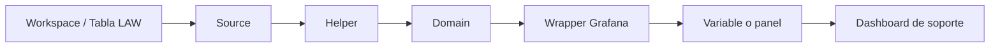
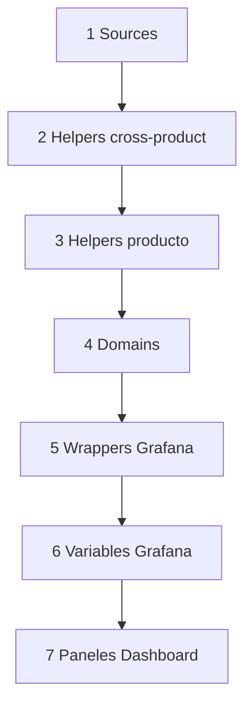

# Traspaso técnico para soporte — Implementación del modelo de funciones en dashboards

## Resumen ejecutivo

Este documento está enfocado exclusivamente en **cómo el equipo de soporte debe implementar, adaptar y consumir el modelo de funciones KQL de este repositorio para construir dashboards de monitoreo**. No es un manual general del repositorio ni un runbook de incidentes; es una guía práctica para entender la arquitectura de funciones, crear nuevas funciones, desplegarlas en Azure Log Analytics Workspace (LAW), consumirlas desde Grafana y replicar el patrón en otros productos.

El modelo recomendado separa responsabilidades en niveles:

```text
Source -> Helper -> Domain -> Wrapper Grafana -> Dashboard
```

Cada nivel tiene un objetivo claro:

- **Source:** leer datos desde workspaces/tablas.
- **Helper:** encapsular reglas reutilizables o cálculos intermedios.
- **Domain:** convertir señales técnicas en estado operacional de un dominio.
- **Wrapper:** adaptar una función para que Grafana la consuma como variable o panel.
- **Dashboard:** visualizar estado, color, detalle y evidencia.

El equipo de soporte debe aprender a implementar este flujo completo para nuevos productos sin duplicar KQL pesado dentro del JSON de Grafana.

---

## 1. Objetivo del documento

El objetivo es transferir al equipo de soporte el conocimiento necesario para:

1. Entender los distintos niveles de funciones del modelo.
2. Saber **dónde se crean** las funciones en el repositorio.
3. Saber **dónde se despliegan** en LAW.
4. Saber **cómo se consumen** desde Grafana mediante wrappers.
5. Saber **cómo adaptar** el modelo a otros productos.
6. Saber **cómo validar** cada capa antes de usarla en dashboards.
7. Evitar duplicar lógica en paneles o variables Grafana.

Este documento se debe usar cuando soporte necesite construir o mantener dashboards basados en funciones KQL reutilizables.

---

## 2. Qué debe dominar soporte para implementar dashboards con funciones

| Competencia | Qué debe saber soporte | Resultado esperado |
|---|---|---|
| Leer estructura del paquete | Ubicar `law_functions`, `grafana_wrappers` y `power_automate_queries`. | Puede encontrar dónde vive cada función. |
| Crear sources | Encapsular workspace/tabla en una función KQL. | Evita consultas directas repetidas a `workspace()`. |
| Crear helpers | Reutilizar cálculos de lag, ejecución, desfase o alertas. | Evita duplicar reglas de negocio. |
| Crear domains | Convertir reglas técnicas en estado de dominio. | Cada dominio tiene una salida clara para dashboard. |
| Crear wrappers | Adaptar domains/helpers a Grafana. | Variables y paneles consumen KQL liviano. |
| Validar por capas | Probar source -> helper -> domain -> wrapper. | Se identifica rápido dónde falla. |
| Documentar trazabilidad | Registrar qué panel usa qué función y fuente. | Soporte puede mantener dashboards en el tiempo. |

---

## 3. Estructura de carpetas relevante para soporte

La implementación del modelo se concentra en `refactor_ada_optimized/`.

```text
refactor_ada_optimized/
├── law_functions/prd/mlp/
│   ├── sources/
│   ├── cross_product/helpers/
│   ├── ada/
│   │   ├── domains/
│   │   └── helpers/
│   ├── ada_amg/
│   │   └── domain/
│   ├── notpii/
│   │   ├── domains/
│   │   └── helpers/
│   └── sirosag/
│       ├── domains/
│       └── helpers/
├── grafana_wrappers/prd/mlp/
│   ├── ada/
│   ├── ada_amg/
│   ├── notpii/
│   └── sirosag/
└── power_automate_queries/prd/mlp/
    ├── ada/
    ├── notpii/
    └── sirosag/
```

| Carpeta | Qué contiene | Cuándo la usa soporte |
|---|---|---|
| `law_functions/prd/mlp/sources` | Funciones que leen workspaces y tablas. | Al conectar un producto a fuentes de datos. |
| `law_functions/prd/mlp/<producto>/helpers` | Funciones de reglas reutilizables. | Al crear lógica común para varios dominios. |
| `law_functions/prd/mlp/<producto>/domains` | Funciones de estado final por dominio. | Al definir qué verá el dashboard como OK/ALERT. |
| `law_functions/prd/mlp/cross_product/helpers` | Helpers transversales, por ejemplo conversión estado-color. | Al estandarizar reglas comunes entre productos. |
| `grafana_wrappers/prd/mlp/<producto>` | Queries livianas para Grafana. | Al crear variables o paneles en Grafana. |
| `power_automate_queries/prd/mlp/<producto>` | Queries listas para flujos externos. | Solo si el estado se consume fuera de Grafana. |

> **Nota importante:** ADA AMG aparece en `ada_amg/domain` singular y no `domains`. Esto está documentado como brecha; para implementaciones nuevas se recomienda usar `domains` plural.

---

## 4. Modelo funcional por niveles

### 4.1 Flujo general



### 4.2 Responsabilidad de cada nivel

| Nivel | Responsabilidad | Qué NO debe hacer |
|---|---|---|
| Source | Leer datos de una tabla/workspace y filtrar por tiempo. | No debe decidir si hay alerta de negocio. |
| Helper | Calcular reglas reutilizables: lag, desfase, expected-vs-real, parsing. | No debe estar acoplado a un panel específico. |
| Domain | Consolidar regla de estado de un dominio: `OK`, `ALERT`, `WARN`. | No debe contener HTML ni lógica visual de Grafana. |
| Wrapper | Adaptar la salida para Grafana: `color`, `status` o tabla. | No debe duplicar toda la lógica del domain. |
| Dashboard | Visualizar y ordenar estados. | No debe ser el lugar principal de la lógica KQL pesada. |

---

## 5. Nivel 1 — Funciones Source

### 5.1 Qué es una función Source

Una función **Source** encapsula el acceso a una fuente de datos. En este repositorio suelen llamarse:

```text
fn_src_mlp_ws_<workspace_logico>
fn_src_mlp_<agregador>_all
```

Ejemplos existentes:

| Source | Fuente que encapsula | Uso principal |
|---|---|---|
| `fn_src_mlp_ws_ada` | Workspace ADA. | Logs ADA, system logs, console logs y front. |
| `fn_src_mlp_ws_pisystem` | Workspace PI System. | PI, NOTPII ingesta y SIROSAG. |
| `fn_src_mlp_ws_notpii_databricksjobs` | DatabricksJobs DEV/UAT. | Autoloader NOTPII. |
| `fn_src_mlp_pipeline_runs_all` | Agregador AzureDiagnostics Dispatch/Drillit/Blockgrade. | Pipelines ADA. |
| `fn_src_mlp_systemlogs_all` | Agregador system logs ADA/Meteo/PI/Plans. | Dominios ADA. |
| `fn_src_mlp_ssag_systemlogs_all` | Agregador SIROSAG/Plans/PDMSAGI/PI. | SIROSAG. |

### 5.2 Dónde se crean

Las funciones source se crean en:

```text
refactor_ada_optimized/law_functions/prd/mlp/sources/
```

### 5.3 Qué debe contener un Source

Un source debe tener:

- Nombre claro.
- Parámetros de tiempo (`startTime`, `endTime`).
- Parámetro de tabla o tipo (`sourceType` o `tableName`) cuando aplica.
- Referencia al workspace real.
- Filtro temprano por `TimeGenerated`.
- Proyección mínima si se usa como agregador.

Ejemplo conceptual:

```kusto
let fn_src_mlp_ws_producto = (sourceType:string, startTime:datetime, endTime:datetime) {
  union isfuzzy=true
    (
      workspace("<resource-id-law>").table("<tabla>")
      | where TimeGenerated between (startTime .. endTime)
      | where sourceType == "<tabla>"
      | extend source_table = "<tabla>"
    )
};
```

> Ajustar el ejemplo a la tabla real. No inventar workspaces; deben salir del ambiente objetivo.

### 5.4 Cómo validar un Source

Antes de crear helpers o domains, soporte debe validar el source directamente:

```kusto
fn_src_mlp_ws_ada("ContainerAppSystemLogs_CL", ago(30m), now())
| summarize rows=count(), last=max(TimeGenerated)
```

Criterios de validación:

| Validación | Resultado esperado |
|---|---|
| La función existe en LAW. | No devuelve error de función inexistente. |
| La tabla existe. | No devuelve error de tabla inexistente. |
| Hay datos recientes. | `rows > 0` o se justifica ausencia por ventana. |
| `TimeGenerated` está presente. | Permite filtrar por tiempo. |
| El usuario tiene permisos. | La query no falla por autorización. |

---

## 6. Nivel 2 — Funciones Helper

### 6.1 Qué es un Helper

Un **Helper** encapsula lógica reutilizable que puede ser usada por uno o más domains. Ejemplos:

| Helper | Producto | Qué calcula |
|---|---|---|
| `fn_prd_mlp_ada_lag_helpers` | ADA | Lag por tabla según umbrales. |
| `fn_prd_mlp_ada_alert_from_dispatch_nrt_logs` | ADA | Alertas NRT Dispatch desde logs. |
| `fn_prd_mlp_ada_jobs_status_detail` | ADA | Diagnóstico expected-vs-real por job. |
| `fn_prd_mlp_notpii_autoloader_alert` | NOTPII | Estado de jobs Databricks Autoloader. |
| `fn_prd_mlp_ssag_eval_ejecucion` | SIROSAG | Evaluación de ejecución esperada. |
| `fn_prd_mlp_ssag_eval_desfase` | SIROSAG | Evaluación de desfase. |

### 6.2 Dónde se crean

```text
refactor_ada_optimized/law_functions/prd/mlp/<producto>/helpers/
```

Para funciones reutilizables entre productos:

```text
refactor_ada_optimized/law_functions/prd/mlp/cross_product/helpers/
```

### 6.3 Cuándo crear un Helper

Crear un helper cuando:

- La regla se usará en más de un domain.
- La lógica es larga o difícil de leer dentro del domain.
- Se requiere diagnóstico tabular adicional.
- La regla tiene umbrales, catálogos o excepciones.
- Se necesita separar lógica técnica de salida visual.

No crear helper si la regla es trivial y solo se usa una vez, salvo que mejore la trazabilidad.

### 6.4 Cómo validar un Helper

Ejecutar el helper con un rango acotado:

```kusto
fn_prd_mlp_ada_jobs_status_detail(ago(2h), now())
| take 20
```

Validar:

| Validación | Qué revisar |
|---|---|
| Devuelve columnas esperadas. | `status`, `isAlert`, `reason`, `realCount`, `expectedCount`, si aplica. |
| No explota el volumen de datos. | Evitar rangos demasiado amplios sin necesidad. |
| Usa sources correctos. | No debería consultar workspaces directos salvo excepción documentada. |
| La regla coincide con negocio. | Confirmar umbral, horario, mantención o cadencia. |

---

## 7. Nivel 3 — Funciones Domain

### 7.1 Qué es un Domain

Un **Domain** representa el estado operacional de un dominio monitoreado. Su función es transformar señales técnicas en una salida consumible por dashboard.

Ejemplos:

| Domain | Qué representa |
|---|---|
| `fn_prd_mlp_ada_dom_dispatch_status` | Estado Dispatch ADA. |
| `fn_prd_mlp_ada_dom_pi_status` | Estado PI ADA. |
| `fn_prd_mlp_ada_dom_global_status` | Estado global ADA. |
| `fn_prd_mlp_notpii_dom_ingesta_status` | Estado ingesta NOTPII. |
| `fn_prd_mlp_ssag_dom_resumen_status` | Estado resumen SIROSAG. |

### 7.2 Dónde se crean

```text
refactor_ada_optimized/law_functions/prd/mlp/<producto>/domains/
```

Para implementaciones futuras usar siempre `domains` plural. `ada_amg/domain` se considera una brecha de consistencia.

### 7.3 Qué debe hacer un Domain

Un domain debe:

1. Recibir `startTime` y `endTime`.
2. Llamar helpers o sources necesarios.
3. Evaluar condiciones de alerta.
4. Devolver una salida estable para consumo.
5. Explicar, idealmente, el motivo de la alerta.

### 7.4 Contrato estándar recomendado para funciones Domain

Para nuevas implementaciones, soporte debería solicitar que los domains devuelvan al menos estos campos:

| Campo | Tipo recomendado | Importancia para soporte |
|---|---|---|
| `domain` | `string` | Identifica el dominio sin depender del nombre del archivo. |
| `status` | `string` (`OK`, `ALERT`, `WARN`) | Define si soporte debe actuar. |
| `color` | `string` hexadecimal | Permite pintar paneles Grafana sin lógica duplicada. |
| `reason` | `string` | Explica por qué se obtuvo el estado. |
| `startTime` | `datetime` | Indica desde cuándo se evaluó. |
| `endTime` | `datetime` | Indica hasta cuándo se evaluó. |
| `evidence` | `dynamic` o `string` | Entrega conteos, tabla, job, último timestamp o error. |
| `severity` | `string` (`info`, `warning`, `critical`) | Ayuda a priorizar atención. |

Ejemplo conceptual recomendado:

```kusto
let fn_prd_mlp_producto_dom_dominio_status = (startTime:datetime, endTime:datetime) {
  let has_alert = toscalar(
    fn_prd_mlp_producto_helper_regla(startTime, endTime)
    | summarize countif(isAlert == true)
  ) > 0;

  print
    domain = "Dominio",
    status = iff(has_alert, "ALERT", "OK"),
    color = iff(has_alert, "#E53935", "#EAF4EA"),
    reason = iff(has_alert, "Se detectó condición de alerta", "Sin alerta detectada"),
    startTime = startTime,
    endTime = endTime,
    evidence = dynamic({"has_alert": has_alert}),
    severity = iff(has_alert, "critical", "info")
};
```

> El repositorio actual no siempre devuelve todos estos campos. Para funciones existentes, validar el contrato real antes de crear wrappers.

### 7.5 Cómo validar un Domain

```kusto
fn_prd_mlp_ada_dom_dispatch_status(ago(1h), now())
```

Validar:

| Validación | Resultado esperado |
|---|---|
| La función compila. | No hay error de referencias indefinidas. |
| Devuelve una fila o tabla esperada. | La salida es estable para wrapper/panel. |
| El estado es interpretable. | `OK`, `ALERT`, `WARN`, `color` o equivalente. |
| Se puede rastrear la causa. | Existe helper/source para profundizar. |

---

## 8. Nivel 4 — Wrappers Grafana

### 8.1 Qué es un Wrapper

Un wrapper es una query liviana que Grafana consume como variable o panel. Debe llamar una función principal y proyectar la salida esperada.

Ejemplo existente:

```kusto
fn_prd_mlp_ada_dom_dispatch_status(bin($__timeFrom, 1m), bin($__timeTo, 1m))
| project color
| take 1
```

### 8.2 Dónde se crean

```text
refactor_ada_optimized/grafana_wrappers/prd/mlp/<producto>/
```

### 8.3 Tipos de wrappers

| Tipo | Salida | Uso en Grafana |
|---|---|---|
| Wrapper de color | `color` | Pintar tarjetas, chips o HTML. |
| Wrapper de status | `status` | Mostrar texto o estado. |
| Wrapper de detalle | Tabla con varias columnas | Tabla diagnóstica para soporte. |
| Wrapper global | Estado/color consolidado | Resumen ejecutivo del producto. |

### 8.4 Reglas para crear wrappers

1. Deben ser pequeños.
2. Deben llamar una sola función principal cuando sea posible.
3. Deben usar macros de tiempo de Grafana.
4. Deben proyectar columnas existentes.
5. Deben conservar nombres `var_mlp_<producto>_<dominio>.kql`.
6. No deben reintroducir lógica pesada del dashboard legacy.

### 8.5 Cómo validar un Wrapper

En Grafana Explore o en el plugin de Azure Monitor/Log Analytics:

1. Copiar el contenido del wrapper.
2. Reemplazar macros si se prueba fuera de Grafana.
3. Confirmar columna proyectada.
4. Confirmar que devuelve un solo valor si se usa como variable.
5. Confirmar que el panel consume el mismo nombre de variable.

Errores comunes:

| Error | Causa probable | Corrección |
|---|---|---|
| `Failed to resolve scalar expression named 'color'` | El domain no devuelve `color`. | Ajustar wrapper a `status` o normalizar domain. |
| Función no encontrada | No se desplegó en LAW o nombre incorrecto. | Desplegar función o corregir llamada. |
| Sin datos | Rango corto, fuente sin datos o permisos. | Probar source con ventana mayor. |
| Resultado múltiple en variable | Falta `take 1` o agregación. | Ajustar wrapper para salida escalar. |

---

## 9. Nivel 5 — Consumo en dashboard Grafana

### 9.1 Cómo se consumen los wrappers

Los wrappers se usan como queries de variables o paneles. El patrón recomendado es:

1. Crear o actualizar variable Grafana con nombre `var_mlp_<producto>_<dominio>`.
2. Pegar el contenido del wrapper.
3. Configurar datasource Azure Monitor/Log Analytics.
4. Configurar refresh según necesidad operativa.
5. Usar el valor en panel HTML/text/stat/table.

### 9.2 Uso típico en paneles

| Salida wrapper | Uso recomendado |
|---|---|
| `color` | Fondo o borde de tarjeta visual. |
| `status` | Texto visible de estado. |
| `reason` | Tooltip o descripción de panel. |
| Tabla detalle | Panel table para diagnóstico N2. |

### 9.3 Buenas prácticas visuales

- Panel global arriba.
- Dominios debajo del global.
- Detalles técnicos en tabla inferior.
- Descripción corta en cada panel.
- No mostrar datos que no generen acción de soporte.
- Mantener colores consistentes: rojo alerta, verde OK, amarillo warning.

---

## 10. Matriz de trazabilidad para implementar dashboards

| Producto | Panel o variable Grafana | Wrapper | Domain | Helper principal | Source | Workspace/Tabla | Qué valida | Acción de soporte |
|---|---|---|---|---|---|---|---|---|
| ADA | `var_mlp_ada_global` | `grafana_wrappers/prd/mlp/ada/var_mlp_ada_global.kql` | `fn_prd_mlp_ada_dom_global_status` | Dominios ADA consolidados | Sources ADA/PI/Plans/Meteo/Dataplatform/Genshare/PRFCI | Múltiples workspaces/tablas | Estado global ADA. | Bajar al dominio en alerta. |
| ADA | `var_mlp_ada_dispatch` | `grafana_wrappers/prd/mlp/ada/var_mlp_ada_dispatch.kql` | `fn_prd_mlp_ada_dom_dispatch_status` | `fn_prd_mlp_ada_lag_helpers`, `fn_prd_mlp_ada_alert_from_dispatch_nrt_logs` | `fn_src_mlp_ws_ada` | `mlp-prd-law-ada / ContainerAppSystemLogs_CL, ContainerAppConsoleLogs_CL` | Lag Dispatch, NRT y fallas job17. | Revisar job17 y tablas Dispatch. |
| ADA | `var_mlp_ada_jobs_detail` | `grafana_wrappers/prd/mlp/ada/var_mlp_ada_jobs_detail.kql` | No aplica | `fn_prd_mlp_ada_jobs_status_detail` | `fn_src_mlp_ws_ada` | `mlp-prd-law-ada / ContainerAppSystemLogs_CL` | Detalle por job. | Usar para diagnóstico N2. |
| ADA AMG | `var_mlp_ada_amg_*` | `grafana_wrappers/prd/mlp/ada_amg/*.kql` | `fn_prd_mlp_ada_amg_dom_*_status` | Pendiente de confirmar por dominio | Sources ADA compartidos | Pendiente de confirmar por dominio | Monitoreo ADA AMG. | Normalizar antes de producción. |
| NOTPII | `var_mlp_notpii_autoloader_dev` | `grafana_wrappers/prd/mlp/notpii/var_mlp_notpii_autoloader_dev.kql` | `fn_prd_mlp_notpii_dom_autoloader_dev_status` | `fn_prd_mlp_notpii_autoloader_alert` | `fn_src_mlp_ws_notpii_databricksjobs` | `ams-dev-dataplatform-laws / DatabricksJobs` | Autoloader DEV. | Revisar jobs Databricks DEV. |
| NOTPII | `var_mlp_notpii_autoloader_uat` | `grafana_wrappers/prd/mlp/notpii/var_mlp_notpii_autoloader_uat.kql` | `fn_prd_mlp_notpii_dom_autoloader_uat_status` | `fn_prd_mlp_notpii_autoloader_alert` | `fn_src_mlp_ws_notpii_databricksjobs` | `ams-uat-dataplatform-laws / DatabricksJobs` | Autoloader UAT. | Revisar jobs Databricks UAT. |
| NOTPII | `var_mlp_notpii_ingesta` | `grafana_wrappers/prd/mlp/notpii/var_mlp_notpii_ingesta.kql` | `fn_prd_mlp_notpii_dom_ingesta_status` | `fn_prd_mlp_notpii_ingesta_job04_alert` | `fn_src_mlp_ws_pisystem` | `mlp-prd-law-pisystem / ContainerAppSystemLogs_CL, ContainerAppConsoleLogs_CL` | Ingesta job04. | Revisar warnings/errores PI System. |
| NOTPII | `var_mlp_notpii_difusion_global` | `grafana_wrappers/prd/mlp/notpii/var_mlp_notpii_difusion_global.kql` | `fn_prd_mlp_notpii_dom_global_status` | Dominios NOTPII | Sources NOTPII/PI | DatabricksJobs y PI logs | Global NOTPII. | Bajar a autoloader o ingesta. |
| SIROSAG | `var_mlp_sirosag_resumen` | `grafana_wrappers/prd/mlp/sirosag/var_mlp_sirosag_resumen.kql` | `fn_prd_mlp_ssag_dom_resumen_status` | `fn_prd_mlp_ssag_eval_ejecucion`, `fn_prd_mlp_ssag_eval_desfase`, `fn_prd_mlp_ssag_eval_desactualizacion` | `fn_src_mlp_ws_ssag`, `fn_src_mlp_ssag_systemlogs_all` | SSAG/Plans/PDMSAGI/PISystem logs | Ejecución, desfase y desactualización. | Revisar helper SIROSAG específico. |

---

## 11. Procedimiento para implementar el modelo en un nuevo dashboard

### 11.1 Paso 1 — Levantar fuentes del producto

Identificar:

- Workspaces LAW.
- Tablas.
- Columnas clave.
- Jobs o pipelines.
- Cadencias esperadas.
- Umbrales de alerta.

Plantilla:

| Fuente | Workspace | Tabla | Columna de tiempo | Columnas clave | Responsable |
|---|---|---|---|---|---|
| Pendiente de confirmar | Pendiente de confirmar | Pendiente de confirmar | `TimeGenerated` | Pendiente de confirmar | Pendiente de confirmar |

### 11.2 Paso 2 — Crear sources

Crear un archivo por source en:

```text
refactor_ada_optimized/law_functions/prd/mlp/sources/
```

Nombre recomendado:

```text
fn_src_mlp_ws_<producto_o_workspace>.kql
```

Validar source antes de avanzar.

### 11.3 Paso 3 — Crear helpers

Crear helpers en:

```text
refactor_ada_optimized/law_functions/prd/mlp/<producto>/helpers/
```

Crear helpers para:

- Lag de tablas.
- Expected-vs-real de jobs.
- Parsing de logs.
- Catálogos de excepciones.
- Reglas compartidas por varios dominios.

### 11.4 Paso 4 — Crear domains

Crear domains en:

```text
refactor_ada_optimized/law_functions/prd/mlp/<producto>/domains/
```

Un domain por cada componente visual importante del dashboard.

Ejemplo:

```text
fn_prd_mlp_<producto>_dom_<dominio>_status.kql
```

### 11.5 Paso 5 — Crear wrapper Grafana

Crear wrapper en:

```text
refactor_ada_optimized/grafana_wrappers/prd/mlp/<producto>/
```

Nombre recomendado:

```text
var_mlp_<producto>_<dominio>.kql
```

### 11.6 Paso 6 — Crear variable o panel en Grafana

En Grafana:

1. Crear variable con el mismo nombre lógico del wrapper.
2. Pegar query wrapper.
3. Seleccionar datasource correcto.
4. Confirmar refresh.
5. Usar variable en panel.

### 11.7 Paso 7 — Documentar trazabilidad

Agregar una fila a la matriz:

```text
Producto | Panel/variable | Wrapper | Domain | Helper | Source | Workspace/Tabla | Qué valida | Acción
```

---

## 12. Orden de despliegue recomendado

El orden importa porque cada capa depende de la anterior.



### 12.1 Prevalidación del repositorio

Ejecutar:

```bash
python refactor_ada_optimized/check_conflict_markers.py
python refactor_ada_optimized/validate_kql_references.py
```

Si `validate_kql_references.py` falla por brechas conocidas, registrar aceptación formal antes de continuar.

### 12.2 Despliegue de funciones LAW

Orden:

1. `sources`.
2. `cross_product/helpers`.
3. `<producto>/helpers`.
4. `<producto>/domains`.

> El repositorio no incluye un script de despliegue LAW. El método real de creación/alteración de funciones en LAW queda **Pendiente de confirmar** por el equipo responsable de Azure/Plataforma.

### 12.3 Validación de sources

```kusto
<source>(<tabla>, ago(30m), now())
| summarize rows=count(), last=max(TimeGenerated)
```

### 12.4 Validación de helpers

```kusto
<helper>(ago(1h), now())
| take 20
```

Ajustar parámetros según firma real del helper.

### 12.5 Validación de domains

```kusto
<domain>(ago(1h), now())
```

Confirmar salida y contrato.

### 12.6 Validación de wrappers

- Ejecutar wrapper en Grafana.
- Confirmar que proyecta columna existente.
- Confirmar que devuelve el formato esperado para variable/panel.

### 12.7 Importación o actualización del dashboard en Grafana

1. Respaldar dashboard actual.
2. Importar o actualizar JSON.
3. Validar datasource.
4. Validar variables.
5. Validar paneles.

### 12.8 Pruebas antes de producción

- Probar al menos un flujo completo por producto.
- Comparar con modelo legacy si existe.
- Confirmar que soporte puede diagnosticar desde panel hasta source.

### 12.9 Rollback o reversa

- Restaurar dashboard respaldado.
- Revertir wrapper.
- Revertir función LAW al cuerpo anterior.
- Registrar causa del rollback.

---

## 13. Checklist de implementación para soporte

| Ítem | Estado |
|---|---|
| Producto identificado. | ☐ |
| Workspaces identificados. | ☐ |
| Tablas validadas. | ☐ |
| Sources creados. | ☐ |
| Sources desplegados en LAW. | ☐ |
| Sources probados con datos reales. | ☐ |
| Helpers creados. | ☐ |
| Helpers desplegados. | ☐ |
| Helpers probados. | ☐ |
| Domains creados. | ☐ |
| Domains desplegados. | ☐ |
| Contrato de salida validado. | ☐ |
| Wrappers creados. | ☐ |
| Wrappers probados en Grafana. | ☐ |
| Variables Grafana creadas. | ☐ |
| Paneles creados o actualizados. | ☐ |
| Trazabilidad documentada. | ☐ |
| Rollback preparado. | ☐ |

---

## 14. Ejercicios prácticos enfocados en implementación

### 14.1 Crear y consumir un Source

| Campo | Detalle |
|---|---|
| Objetivo | Aprender a encapsular una tabla en una función source y validarla. |
| Contexto | Nuevo producto requiere leer una tabla de Log Analytics. |
| Pasos | 1) Identificar workspace/tabla. 2) Crear `fn_src_mlp_ws_<producto>`. 3) Desplegar en LAW. 4) Ejecutar `summarize count()`. |
| Resultado esperado | Source devuelve filas o justifica ausencia de datos. |
| Aprendizaje | Toda lógica posterior depende de una fuente correctamente encapsulada. |

### 14.2 Crear un Helper de lag

| Campo | Detalle |
|---|---|
| Objetivo | Crear una regla reutilizable de frescura de datos. |
| Contexto | Una tabla no debe atrasarse más de N minutos. |
| Pasos | 1) Usar source. 2) Calcular `max(TimeGenerated)`. 3) Comparar con `now()`. 4) Devolver `isAlert` y `reason`. |
| Resultado esperado | Helper indica si la tabla está desactualizada. |
| Aprendizaje | El helper concentra reglas repetibles para varios domains. |

### 14.3 Crear un Domain con contrato estándar

| Campo | Detalle |
|---|---|
| Objetivo | Transformar una regla técnica en estado operacional. |
| Contexto | El dashboard necesita mostrar estado de un dominio. |
| Pasos | 1) Llamar helper. 2) Definir `status`. 3) Definir `color`. 4) Agregar `reason`, ventana y evidencia. |
| Resultado esperado | Domain devuelve una fila estable para Grafana. |
| Aprendizaje | El domain es el contrato entre lógica KQL y dashboard. |

### 14.4 Crear un Wrapper con error de columna

| Campo | Detalle |
|---|---|
| Objetivo | Aprender a detectar errores entre wrapper y domain. |
| Contexto | El wrapper proyecta `color`, pero el domain solo devuelve `status`. |
| Pasos | 1) Ejecutar domain. 2) Revisar columnas. 3) Ejecutar wrapper. 4) Corregir wrapper o normalizar domain. |
| Resultado esperado | Se identifica y corrige el mismatch. |
| Aprendizaje | Los wrappers deben proyectar columnas reales. |

### 14.5 Crear una variable Grafana

| Campo | Detalle |
|---|---|
| Objetivo | Consumir un wrapper desde Grafana. |
| Contexto | Se creó `var_mlp_producto_dominio.kql`. |
| Pasos | 1) Crear variable en Grafana. 2) Pegar wrapper. 3) Seleccionar datasource. 4) Validar valor. 5) Usar variable en panel. |
| Resultado esperado | Panel muestra estado/color del domain. |
| Aprendizaje | Grafana debe consumir wrappers, no lógica pesada duplicada. |

---

## 15. Errores comunes al implementar funciones para dashboards

| Error | Síntoma | Prevención |
|---|---|---|
| Crear lógica directa en Grafana. | JSON grande y difícil de mantener. | Mover lógica a helpers/domains. |
| No crear source. | Workspaces repetidos en muchas queries. | Encapsular acceso en `fn_src_mlp_ws_*`. |
| Wrapper apunta a columna inexistente. | Error `Failed to resolve scalar expression`. | Validar salida del domain antes del wrapper. |
| Domain no explica motivo. | Soporte ve alerta pero no sabe causa. | Agregar `reason` y `evidence`. |
| No validar por capas. | Diagnóstico lento. | Probar source -> helper -> domain -> wrapper. |
| No documentar matriz. | Nadie sabe qué panel usa qué función. | Actualizar trazabilidad al crear panel. |

---

## 16. Anexo — Comandos de validación para implementar funciones

| Comando | Qué valida | Qué hacer si falla |
|---|---|---|
| `python refactor_ada_optimized/validate_kql_references.py` | Referencias KQL, wrappers, funciones requeridas y layout esperado. | Corregir errores o registrar brecha aceptada. Actualmente falla por brechas conocidas. |
| `python refactor_ada_optimized/check_conflict_markers.py` | Marcadores de conflicto Git. | Resolver conflictos antes de desplegar. |
| `python refactor_ada_optimized/analyze_source_catalog.py` | Catálogo de sources y consumidores según el script. | Si devuelve `0` sources, revisar alcance/ruta esperada antes de usarlo como inventario real. |
| `python refactor_ada_optimized/resolve_required_resources.py <function_name>` | Workspaces requeridos por una función. | Ejecutar con nombre real; si falla, revisar que la función exista y tenga extensión `.kql`. |

---

## 17. Anexo — Descripciones listas para pegar en paneles de Grafana

| Panel/variable | Descripción sugerida |
|---|---|
| ADA Global | Estado global ADA consolidado desde domains. Si está en alerta, revisar el dominio específico asociado. |
| ADA Dispatch | Valida lag Dispatch, señal NRT y fallas del job17. Revisar logs ADA y tablas Dispatch ante alerta. |
| ADA Jobs Detail | Tabla de diagnóstico expected-vs-real por job ADA. Usar para identificar jobs faltantes o atrasados. |
| NOTPII Autoloader DEV | Estado de jobs Databricks Autoloader DEV. Revisar ejecuciones failed/running/cancelled. |
| NOTPII Autoloader UAT | Estado de jobs Databricks Autoloader UAT. Revisar ejecuciones failed/running/cancelled. |
| NOTPII Ingesta | Estado de ingesta PI System job04. Revisar errores, warnings o ausencia de ejecución. |
| SIROSAG Resumen | Estado resumen SIROSAG basado en ejecución, desfase y desactualización. Revisar helpers SIROSAG ante alerta. |

---

## 18. Ruta recomendada de lectura para soporte implementador

1. Leer secciones 3 y 4 para entender carpetas y niveles.
2. Leer secciones 5 a 8 para aprender sources, helpers, domains y wrappers.
3. Revisar sección 10 para entender trazabilidad.
4. Seguir sección 11 para implementar en un nuevo dashboard.
5. Usar sección 12 como orden de despliegue.
6. Completar checklist de sección 13.
7. Ejecutar ejercicios de sección 14.
8. Usar anexos para validar y documentar paneles.

---

## 19. Criterios de aceptación para soporte

| Criterio | Aceptación |
|---|---|
| Soporte puede explicar los cinco niveles. | Source, helper, domain, wrapper y dashboard. |
| Soporte puede crear un source simple. | Función desplegada y validada con datos. |
| Soporte puede crear o adaptar un wrapper. | Variable Grafana devuelve valor esperado. |
| Soporte puede validar por capas. | Identifica si falla source, helper, domain o wrapper. |
| Soporte documenta trazabilidad. | Cada panel nuevo tiene fila en la matriz. |
| Soporte evita KQL pesado en dashboard. | Lógica vive en funciones LAW y wrappers livianos. |
